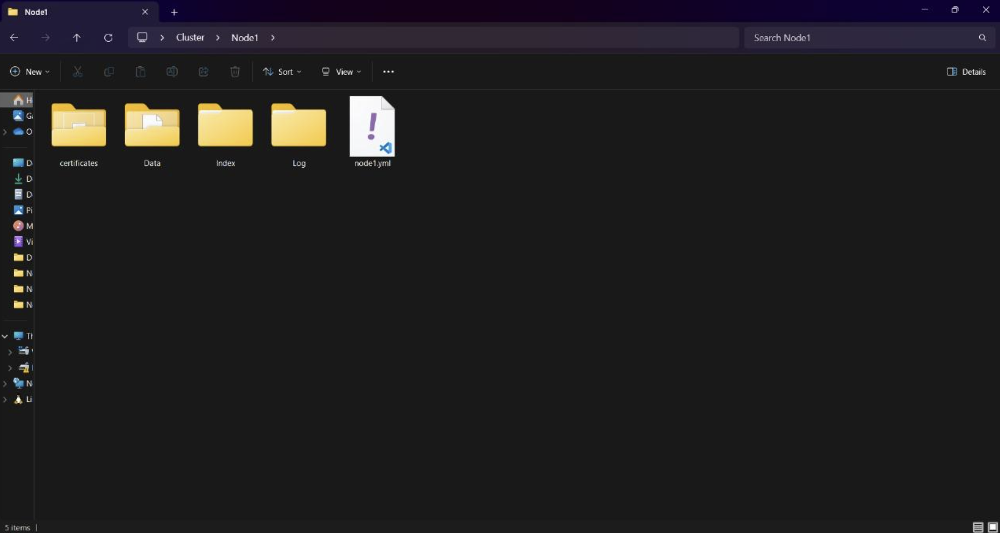

# Guide to setting up a 3-node cluster

Welcome to the quick start guide for setting up a 3-node cluster using EventStoreDB. This guide covers how to prepare the environment, generate the required certificates, and how to configure and run the cluster.

## Preparing the environment

1. Create a folder named 'Cluster' on the desktop. 
    - For production use, place the 'Cluster' folder in the root directory (C:).
2. In 'Cluster', create subfolders: 'Node1', 'Node2', 'Node3'.
3. Within each node, create these subfolders:
    - 'Certificates' for storing the certificate and private key. 
    - 'Data' for all data files.
    - 'Index' for node indexes.
    - 'Logs' for log files.
4. Add a configuration file (.yml or .txt) in each node folder. For example:



## Generating the certificates

1. Create a 'Generate_Certificate' folder on the desktop. 
2. Download the latest version of the certificate generator from [EventStore es-gencert-cli-releases](https://github.com/EventStore/es-gencert-cli/releases) and unzip it into 'Generate_Certificate'.
3. In a terminal, change to the es-gencert-cli directory: 

`C:\Path\To\Folder\Generate_Certificate\es-gencert-cli_[Version]_Windows-x86_64`

- Run this command to generate the root certificate and root private key: 
`.\es-gencert-cli create-ca -out [Your Generate_Certificate Path]\ca`
`C:\Path\To\Folder\Generate_Certificate\es-gencert-cli_[Version]_Windows-x86_64\ca`

4. In the 'Generate_Certificate' directory, run the following commands one at a time for each node (change the path and node number as needed) to generate the certificate and private keys for each node.

For example, if the certificate generator version is 1.2.1 and we’re generating the certificate and private keys for 'Node1':

`.\es-gencert-cli create-node -ca-certificate C:\Path\To\Folder\Generate_Certificate\es-gencert-cli_1.2.1_Windows-x86_64\ca\ca.crt -ca-key`
 `C:\Path\To\Folder\Generate_Certificate\es-gencert-cli_1.2.1_Windows-x86_64\ca\ca.key -out` 
 `C:\Path\To\Folder\Cluster\Node1\certificates  -ip-addresses 127.0.0.1`

Each command will automatically generate the security certificate and the private key for each node in their respective certificates file:
`C:\Path\To\Folder\Cluster\Node1\certificates`

**Note:** Include CA certificate and key paths in each node's configuration file. Below is an example of a complete configuration for 'Node1':

``` # Paths
Db: C:\Path\To\Folder\Cluster\Node1\Data
Index: C:\Path\To\Folder\Cluster\Node1\Index
Log: C:\Path\To\Folder\Cluster\Node1\Log
# Network configuration
IntIp: 127.0.0.1
ExtIp: 127.0.0.1
HttpPort: 21131
IntTcpPort: 11121
ExtTcpPort: 11131
EnableExternalTcp: true
EnableAtomPubOverHTTP: true
# Cluster gossip
ClusterSize: 3
DiscoverViaDns: false
GossipSeed: 127.0.0.1:21132,127.0.0.1:21133
# Projections configuration
RunProjections: All
# Certificates configuration
CertificateFile: C:\Path\To\Folder\Cluster\Node1\certificates\node.crt
CertificatePrivateKeyFile: C:\Path\To\Folder\Cluster\Node1\certificates\node.key
TrustedRootCertificatesPath: C:\Path\To\Folder\Generate_Certificate\es-gencert-cli_1.2.1_Windows-x86_64\ca
```

## Running nodes

1. Download and unzip ESDB.
2. To start the nodes, navigate to the ESDB directory `C:\Path\To\Folder\ESDB_Version`
3. Run each node individually using the following command (change the path and node number as needed):

`.\EventStore.ClusterNode –config C:\Path\To\Folder\Cluster\Node1\node1.yml` 


