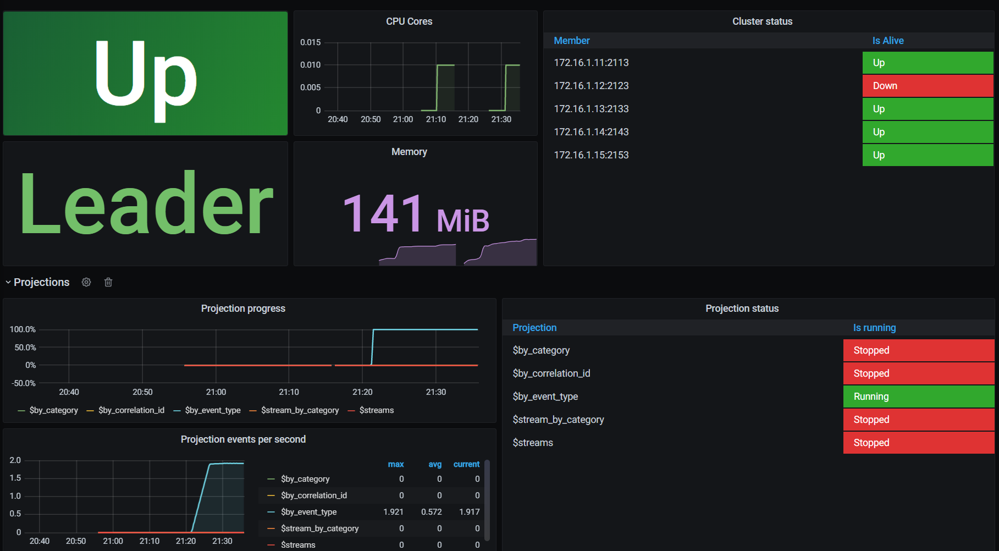

# Diagnostics

EventStoreDB provides several ways to diagnose and troubleshoot issues.

- [Logging](#logging): structured or plain-text logs on the console and in log files.
- [Stats](#statistics): stats collection and HTTP endpoint.
- [Histograms](#histograms): metrics collection and HTTP endpoints.

You can also use external tools to measure the performance of EventStoreDB and monitor the cluster health.

- [Vector](#vector): collect metrics and logs to your APM tool using Vector.
- [Prometheus exporter](#prometheus): collect metrics in Prometheus.
- [Datadog integration](#datadog): monitor and measure the cluster with Datadog.

## Logging

EventStoreDB logs its internal operations to the console (stdout) and to log files. The default location of
the log files and the way to change it is described [below](#logs-location).

There are a few options to change the way how EventStoreDB produces logs and how detailed the logs should be.

### Log format

EventStoreDB uses the structured logging in JSON format that is more machine-friendly and can be ingested by
vendor-specific tools like Logstash or Datadog agent.

Here is how the structured log looks like:

```json
{
  "PID": "6940",
  "ThreadID": "23",
  "Date": "2020-06-16T16:14:02.052976Z",
  "Level": "Debug",
  "Logger": "ProjectionManager",
  "Message": "PROJECTIONS: Starting Projections Manager. (Node State : {state})",
  "EventProperties": {
    "state": "Master"
  }
}
{
  "PID": "6940",
  "ThreadID": "15",
  "Date": "2020-06-16T16:14:02.052976Z",
  "Level": "Info",
  "Logger": "ClusterVNodeController",
  "Message": "========== [{internalHttp}] Sub System '{subSystemName}' initialized.",
  "EventProperties": {
    "internalHttp": "127.0.0.1:2112",
    "subSystemName": "Projections"
  }
}
{
  "PID": "6940",
  "ThreadID": "23",
  "Date": "2020-06-16T16:14:02.052976Z",
  "Level": "Debug",
  "Logger": "MultiStreamMessageWriter",
  "Message": "PROJECTIONS: Resetting Worker Writer",
  "EventProperties": {}
}
{
  "PID": "6940",
  "ThreadID": "23",
  "Date": "2020-06-16T16:14:02.055000Z",
  "Level": "Debug",
  "Logger": "ProjectionCoreCoordinator",
  "Message": "PROJECTIONS: SubComponent Started: {subComponent}",
  "EventProperties": {
    "subComponent": "EventReaderCoreService"
  }
}
```

This format is aligned with [Serilog Compact JSON format](https://github.com/serilog/serilog-formatting-compact).

### Logs location

Log files are located in `/var/log/eventstore` for Linux and macOS, and in the `logs` subdirectory of the
EventStoreDB installation directory on Windows. You can change the log files location using the `Log`
configuration option.

::: tip 
Moving logs to a separate storage might improve the database performance if you keep the default
verbose log level.
:::

| Format               | Syntax           |
| :------------------- | :--------------- |
| Command line         | `--log`          |
| YAML                 | `Log`            |
| Environment variable | `EVENTSTORE_LOG` |

For example, adding this line to the `eventstore.conf` file will force writing logs to
the `/tmp/eventstore/logs` directory:

```text:no-line-numbers
Log: /tmp/eventstore/logs
```

### Log level

You can change the level using the `LogLevel` setting:

| Format               | Syntax                 |
| :------------------- | :--------------------- |
| Command line         | `--log-level`          |
| YAML                 | `LogLevel`             |
| Environment variable | `EVENTSTORE_LOG_LEVEL` |

Acceptable values are: `Default`, `Verbose`, `Debug`, `Information`, `Warning`, `Error`, and `Fatal`.

### Logging options

You can tune the EventStoreDB logging further by using the logging options described below.

#### Log configuration file

Specifies the location of the file which configures the logging levels of various components.

| Format               | Syntax                  |
| :------------------- | :---------------------- |
| Command line         | `--log-config`          |
| YAML                 | `LogConfig`             |
| Environment variable | `EVENTSTORE_LOG_CONFIG` |

By default, the application directory (and `/etc/eventstore` on Linux and Mac) are checked. You may specify a
full path.

#### HTTP requests logging

EventStoreDB can also log all the incoming HTTP requests, like many HTTP servers do. Requests are logged
before being processed, so unsuccessful requests are logged too.

Use one of the following ways to enable the HTTP requests logging:

| Format               | Syntax                         |
| :------------------- | :----------------------------- |
| Command line         | `--log-http-requests`          |
| YAML                 | `LogHttpRequests`              |
| Environment variable | `EVENTSTORE_LOG_HTTP_REQUESTS` |

**Default**: `false`, logging HTTP requests is disabled by default.

#### Log failed authentication

For security monitoring, you can enable logging failed authentication attempts by
setting `LogFailedAuthenticationAttempts` setting to true.

| Format               | Syntax                                          |
| :------------------- | :---------------------------------------------- |
| Command line         | `--log-failed-authentication-attempts`          |
| YAML                 | `LogFailedAuthenticationAttempts`               |
| Environment variable | `EVENTSTORE_LOG_FAILED_AUTHENTICATION_ATTEMPTS` |

**Default**: `false`

#### Log console format

The format of the console logger. Use `Json` for structured log output.

| Format               | Syntax                          |
| :------------------- | :------------------------------ |
| Command line         | `--log-console-format`          |
| YAML                 | `LogConsoleFormat`              |
| Environment variable | `EVENTSTORE_LOG_CONSOLE_FORMAT` |

Acceptable values are: `Plain`, `Json`

**Default**: `Plain`

#### Log file size

The maximum size of each log file, in bytes.

| Format               | Syntax                     |
| :------------------- | :------------------------- |
| Command line         | `--log-file-size`          |
| YAML                 | `LogFileSize`              |
| Environment variable | `EVENTSTORE_LOG_FILE_SIZE` |

**Default**: `1GB`

#### Log file interval

How often to rotate logs.

| Format               | Syntax                         |
| :------------------- | :----------------------------- |
| Command line         | `--log-file-interval`          |
| YAML                 | `LogFileInterval`              |
| Environment variable | `EVENTSTORE_LOG_FILE_INTERVAL` |

Acceptable values are: `Minute`, `Hour`, `Day`, `Week`, `Month`, `Year`

**Default**: `Day`

#### Log file retention count

How many log files to hold on to.

| Format               | Syntax                           |
| :------------------- | :------------------------------- |
| Command line         | `--log-file-retention-count`     |
| YAML                 | `LogFileRetentionCount`          |
| Environment variable | `EVENTSTORE_LOG_RETENTION_COUNT` |

**Default**: `31`

#### Disable log file

You can completely disable logging to a file by changing the `DisableLogFile` option.

| Format               | Syntax                        |
| :------------------- | :---------------------------- |
| Command line         | `--disable-log-file`          |
| YAML                 | `DisableLogFile`              |
| Environment variable | `EVENTSTORE_DISABLE_LOG_FILE` |

**Default**: `false`

## Statistics

EventStoreDB servers collect internal statistics and make it available via HTTP over
the `https://<host>:2113/stats` in JSON format. Here, `2113` is the default HTTP port. Monitoring applications
and metric collectors can use this endpoint to gather the information about the cluster node. The `stats`
endpoint only exposes information about the node where you fetch it from and doesn't contain any cluster
information.

What you see in the `stats` endpoint response is the last collected state of the server. The server collects
this information using events that are appended to the statistics stream. Each node has one. We use a reserved
name for the stats stream, `$stats-<host:port>`. For example, for a single node running locally the stream
name would be `$stats-127.0.0.1:2113`.

As all other events, stats events are also linked in the `$all` stream. These events have a reserved event
type `$statsCollected`.

::: details Click here to see an example of a stats event

```json
{
  "proc-startTime": "2020-06-25T10:13:26.8281750Z",
  "proc-id": 5465,
  "proc-mem": 118648832,
  "proc-cpu": 2.44386363,
  "proc-cpuScaled": 0.152741477,
  "proc-threadsCount": 10,
  "proc-contentionsRate": 0.9012223,
  "proc-thrownExceptionsRate": 0.0,
  "sys-cpu": 100.0,
  "sys-freeMem": 25100288,
  "proc-gc-allocationSpeed": 0.0,
  "proc-gc-gen0ItemsCount": 8,
  "proc-gc-gen0Size": 0,
  "proc-gc-gen1ItemsCount": 2,
  "proc-gc-gen1Size": 0,
  "proc-gc-gen2ItemsCount": 0,
  "proc-gc-gen2Size": 0,
  "proc-gc-largeHeapSize": 0,
  "proc-gc-timeInGc": 0.0,
  "proc-gc-totalBytesInHeaps": 0,
  "proc-tcp-connections": 0,
  "proc-tcp-receivingSpeed": 0.0,
  "proc-tcp-sendingSpeed": 0.0,
  "proc-tcp-inSend": 0,
  "proc-tcp-measureTime": "00:00:19.0534210",
  "proc-tcp-pendingReceived": 0,
  "proc-tcp-pendingSend": 0,
  "proc-tcp-receivedBytesSinceLastRun": 0,
  "proc-tcp-receivedBytesTotal": 0,
  "proc-tcp-sentBytesSinceLastRun": 0,
  "proc-tcp-sentBytesTotal": 0,
  "es-checksum": 1613144,
  "es-checksumNonFlushed": 1613144,
  "sys-drive-/System/Volumes/Data-availableBytes": 545628151808,
  "sys-drive-/System/Volumes/Data-totalBytes": 2000481927168,
  "sys-drive-/System/Volumes/Data-usage": "72%",
  "sys-drive-/System/Volumes/Data-usedBytes": 1454853775360,
  "es-queue-Index Committer-queueName": "Index Committer",
  "es-queue-Index Committer-groupName": "",
  "es-queue-Index Committer-avgItemsPerSecond": 0,
  "es-queue-Index Committer-avgProcessingTime": 0.0,
  "es-queue-Index Committer-currentIdleTime": "0:00:00:29.9895180",
  "es-queue-Index Committer-currentItemProcessingTime": null,
  "es-queue-Index Committer-idleTimePercent": 100.0,
  "es-queue-Index Committer-length": 0,
  "es-queue-Index Committer-lengthCurrentTryPeak": 0,
  "es-queue-Index Committer-lengthLifetimePeak": 0,
  "es-queue-Index Committer-totalItemsProcessed": 0,
  "es-queue-Index Committer-inProgressMessage": "<none>",
  "es-queue-Index Committer-lastProcessedMessage": "<none>",
  "es-queue-MainQueue-queueName": "MainQueue",
  "es-queue-MainQueue-groupName": "",
  "es-queue-MainQueue-avgItemsPerSecond": 14,
  "es-queue-MainQueue-avgProcessingTime": 0.0093527972027972021,
  "es-queue-MainQueue-currentIdleTime": "0:00:00:00.8050567",
  "es-queue-MainQueue-currentItemProcessingTime": null,
  "es-queue-MainQueue-idleTimePercent": 99.986616840364917,
  "es-queue-MainQueue-length": 0,
  "es-queue-MainQueue-lengthCurrentTryPeak": 3,
  "es-queue-MainQueue-lengthLifetimePeak": 6,
  "es-queue-MainQueue-totalItemsProcessed": 452,
  "es-queue-MainQueue-inProgressMessage": "<none>",
  "es-queue-MainQueue-lastProcessedMessage": "Schedule",
  "es-queue-MonitoringQueue-queueName": "MonitoringQueue",
  "es-queue-MonitoringQueue-groupName": "",
  "es-queue-MonitoringQueue-avgItemsPerSecond": 0,
  "es-queue-MonitoringQueue-avgProcessingTime": 1.94455,
  "es-queue-MonitoringQueue-currentIdleTime": "0:00:00:19.0601186",
  "es-queue-MonitoringQueue-currentItemProcessingTime": null,
  "es-queue-MonitoringQueue-idleTimePercent": 99.980537727681721,
  "es-queue-MonitoringQueue-length": 0,
  "es-queue-MonitoringQueue-lengthCurrentTryPeak": 0,
  "es-queue-MonitoringQueue-lengthLifetimePeak": 0,
  "es-queue-MonitoringQueue-totalItemsProcessed": 14,
  "es-queue-MonitoringQueue-inProgressMessage": "<none>",
  "es-queue-MonitoringQueue-lastProcessedMessage": "GetFreshTcpConnectionStats",
  "es-queue-PersistentSubscriptions-queueName": "PersistentSubscriptions",
  "es-queue-PersistentSubscriptions-groupName": "",
  "es-queue-PersistentSubscriptions-avgItemsPerSecond": 1,
  "es-queue-PersistentSubscriptions-avgProcessingTime": 0.010400000000000001,
  "es-queue-PersistentSubscriptions-currentIdleTime": "0:00:00:00.8052015",
  "es-queue-PersistentSubscriptions-currentItemProcessingTime": null,
  "es-queue-PersistentSubscriptions-idleTimePercent": 99.998954276430226,
  "es-queue-PersistentSubscriptions-length": 0,
  "es-queue-PersistentSubscriptions-lengthCurrentTryPeak": 0,
  "es-queue-PersistentSubscriptions-lengthLifetimePeak": 0,
  "es-queue-PersistentSubscriptions-totalItemsProcessed": 32,
  "es-queue-PersistentSubscriptions-inProgressMessage": "<none>",
  "es-queue-PersistentSubscriptions-lastProcessedMessage": "PersistentSubscriptionTimerTick",
  "es-queue-Projection Core #0-queueName": "Projection Core #0",
  "es-queue-Projection Core #0-groupName": "Projection Core",
  "es-queue-Projection Core #0-avgItemsPerSecond": 0,
  "es-queue-Projection Core #0-avgProcessingTime": 0.0,
  "es-queue-Projection Core #0-currentIdleTime": "0:00:00:29.9480513",
  "es-queue-Projection Core #0-currentItemProcessingTime": null,
  "es-queue-Projection Core #0-idleTimePercent": 100.0,
  "es-queue-Projection Core #0-length": 0,
  "es-queue-Projection Core #0-lengthCurrentTryPeak": 0,
  "es-queue-Projection Core #0-lengthLifetimePeak": 0,
  "es-queue-Projection Core #0-totalItemsProcessed": 2,
  "es-queue-Projection Core #0-inProgressMessage": "<none>",
  "es-queue-Projection Core #0-lastProcessedMessage": "SubComponentStarted",
  "es-queue-Projections Master-queueName": "Projections Master",
  "es-queue-Projections Master-groupName": "",
  "es-queue-Projections Master-avgItemsPerSecond": 0,
  "es-queue-Projections Master-avgProcessingTime": 0.0,
  "es-queue-Projections Master-currentIdleTime": "0:00:00:29.8467445",
  "es-queue-Projections Master-currentItemProcessingTime": null,
  "es-queue-Projections Master-idleTimePercent": 100.0,
  "es-queue-Projections Master-length": 0,
  "es-queue-Projections Master-lengthCurrentTryPeak": 0,
  "es-queue-Projections Master-lengthLifetimePeak": 3,
  "es-queue-Projections Master-totalItemsProcessed": 10,
  "es-queue-Projections Master-inProgressMessage": "<none>",
  "es-queue-Projections Master-lastProcessedMessage": "RegularTimeout",
  "es-queue-Storage Chaser-queueName": "Storage Chaser",
  "es-queue-Storage Chaser-groupName": "",
  "es-queue-Storage Chaser-avgItemsPerSecond": 94,
  "es-queue-Storage Chaser-avgProcessingTime": 0.0043385023898035047,
  "es-queue-Storage Chaser-currentIdleTime": "0:00:00:00.0002530",
  "es-queue-Storage Chaser-currentItemProcessingTime": null,
  "es-queue-Storage Chaser-idleTimePercent": 99.959003031702224,
  "es-queue-Storage Chaser-length": 0,
  "es-queue-Storage Chaser-lengthCurrentTryPeak": 0,
  "es-queue-Storage Chaser-lengthLifetimePeak": 0,
  "es-queue-Storage Chaser-totalItemsProcessed": 2835,
  "es-queue-Storage Chaser-inProgressMessage": "<none>",
  "es-queue-Storage Chaser-lastProcessedMessage": "ChaserCheckpointFlush",
  "es-queue-StorageReaderQueue #1-queueName": "StorageReaderQueue #1",
  "es-queue-StorageReaderQueue #1-groupName": "StorageReaderQueue",
  "es-queue-StorageReaderQueue #1-avgItemsPerSecond": 0,
  "es-queue-StorageReaderQueue #1-avgProcessingTime": 0.22461000000000003,
  "es-queue-StorageReaderQueue #1-currentIdleTime": "0:00:00:00.9863988",
  "es-queue-StorageReaderQueue #1-currentItemProcessingTime": null,
  "es-queue-StorageReaderQueue #1-idleTimePercent": 99.988756844383616,
  "es-queue-StorageReaderQueue #1-length": 0,
  "es-queue-StorageReaderQueue #1-lengthCurrentTryPeak": 0,
  "es-queue-StorageReaderQueue #1-lengthLifetimePeak": 0,
  "es-queue-StorageReaderQueue #1-totalItemsProcessed": 15,
  "es-queue-StorageReaderQueue #1-inProgressMessage": "<none>",
  "es-queue-StorageReaderQueue #1-lastProcessedMessage": "ReadStreamEventsBackward",
  "es-queue-StorageReaderQueue #2-queueName": "StorageReaderQueue #2",
  "es-queue-StorageReaderQueue #2-groupName": "StorageReaderQueue",
  "es-queue-StorageReaderQueue #2-avgItemsPerSecond": 0,
  "es-queue-StorageReaderQueue #2-avgProcessingTime": 8.83216,
  "es-queue-StorageReaderQueue #2-currentIdleTime": "0:00:00:00.8051068",
  "es-queue-StorageReaderQueue #2-currentItemProcessingTime": null,
  "es-queue-StorageReaderQueue #2-idleTimePercent": 99.557874170777851,
  "es-queue-StorageReaderQueue #2-length": 0,
  "es-queue-StorageReaderQueue #2-lengthCurrentTryPeak": 0,
  "es-queue-StorageReaderQueue #2-lengthLifetimePeak": 0,
  "es-queue-StorageReaderQueue #2-totalItemsProcessed": 16,
  "es-queue-StorageReaderQueue #2-inProgressMessage": "<none>",
  "es-queue-StorageReaderQueue #2-lastProcessedMessage": "ReadStreamEventsForward",
  "es-queue-StorageReaderQueue #3-queueName": "StorageReaderQueue #3",
  "es-queue-StorageReaderQueue #3-groupName": "StorageReaderQueue",
  "es-queue-StorageReaderQueue #3-avgItemsPerSecond": 0,
  "es-queue-StorageReaderQueue #3-avgProcessingTime": 6.4189888888888893,
  "es-queue-StorageReaderQueue #3-currentIdleTime": "0:00:00:02.8228372",
  "es-queue-StorageReaderQueue #3-currentItemProcessingTime": null,
  "es-queue-StorageReaderQueue #3-idleTimePercent": 99.710808119472517,
  "es-queue-StorageReaderQueue #3-length": 0,
  "es-queue-StorageReaderQueue #3-lengthCurrentTryPeak": 0,
  "es-queue-StorageReaderQueue #3-lengthLifetimePeak": 0,
  "es-queue-StorageReaderQueue #3-totalItemsProcessed": 14,
  "es-queue-StorageReaderQueue #3-inProgressMessage": "<none>",
  "es-queue-StorageReaderQueue #3-lastProcessedMessage": "ReadStreamEventsForward",
  "es-queue-StorageReaderQueue #4-queueName": "StorageReaderQueue #4",
  "es-queue-StorageReaderQueue #4-groupName": "StorageReaderQueue",
  "es-queue-StorageReaderQueue #4-avgItemsPerSecond": 0,
  "es-queue-StorageReaderQueue #4-avgProcessingTime": 0.36447,
  "es-queue-StorageReaderQueue #4-currentIdleTime": "0:00:00:01.8144419",
  "es-queue-StorageReaderQueue #4-currentItemProcessingTime": null,
  "es-queue-StorageReaderQueue #4-idleTimePercent": 99.981747643099709,
  "es-queue-StorageReaderQueue #4-length": 0,
  "es-queue-StorageReaderQueue #4-lengthCurrentTryPeak": 0,
  "es-queue-StorageReaderQueue #4-lengthLifetimePeak": 0,
  "es-queue-StorageReaderQueue #4-totalItemsProcessed": 14,
  "es-queue-StorageReaderQueue #4-inProgressMessage": "<none>",
  "es-queue-StorageReaderQueue #4-lastProcessedMessage": "ReadStreamEventsForward",
  "es-queue-StorageWriterQueue-queueName": "StorageWriterQueue",
  "es-queue-StorageWriterQueue-groupName": "",
  "es-queue-StorageWriterQueue-avgItemsPerSecond": 0,
  "es-queue-StorageWriterQueue-avgProcessingTime": 0.0,
  "es-queue-StorageWriterQueue-currentIdleTime": "0:00:00:29.9437790",
  "es-queue-StorageWriterQueue-currentItemProcessingTime": null,
  "es-queue-StorageWriterQueue-idleTimePercent": 100.0,
  "es-queue-StorageWriterQueue-length": 0,
  "es-queue-StorageWriterQueue-lengthCurrentTryPeak": 0,
  "es-queue-StorageWriterQueue-lengthLifetimePeak": 0,
  "es-queue-StorageWriterQueue-totalItemsProcessed": 6,
  "es-queue-StorageWriterQueue-inProgressMessage": "<none>",
  "es-queue-StorageWriterQueue-lastProcessedMessage": "WritePrepares",
  "es-queue-Subscriptions-queueName": "Subscriptions",
  "es-queue-Subscriptions-groupName": "",
  "es-queue-Subscriptions-avgItemsPerSecond": 1,
  "es-queue-Subscriptions-avgProcessingTime": 0.057019047619047622,
  "es-queue-Subscriptions-currentIdleTime": "0:00:00:00.8153708",
  "es-queue-Subscriptions-currentItemProcessingTime": null,
  "es-queue-Subscriptions-idleTimePercent": 99.993992971356,
  "es-queue-Subscriptions-length": 0,
  "es-queue-Subscriptions-lengthCurrentTryPeak": 0,
  "es-queue-Subscriptions-lengthLifetimePeak": 0,
  "es-queue-Subscriptions-totalItemsProcessed": 31,
  "es-queue-Subscriptions-inProgressMessage": "<none>",
  "es-queue-Subscriptions-lastProcessedMessage": "CheckPollTimeout",
  "es-queue-Timer-queueName": "Timer",
  "es-queue-Timer-groupName": "",
  "es-queue-Timer-avgItemsPerSecond": 14,
  "es-queue-Timer-avgProcessingTime": 0.038568989547038329,
  "es-queue-Timer-currentIdleTime": "0:00:00:00.0002752",
  "es-queue-Timer-currentItemProcessingTime": null,
  "es-queue-Timer-idleTimePercent": 99.94364205726194,
  "es-queue-Timer-length": 17,
  "es-queue-Timer-lengthCurrentTryPeak": 17,
  "es-queue-Timer-lengthLifetimePeak": 17,
  "es-queue-Timer-totalItemsProcessed": 419,
  "es-queue-Timer-inProgressMessage": "<none>",
  "es-queue-Timer-lastProcessedMessage": "ExecuteScheduledTasks",
  "es-queue-Worker #1-queueName": "Worker #1",
  "es-queue-Worker #1-groupName": "Workers",
  "es-queue-Worker #1-avgItemsPerSecond": 2,
  "es-queue-Worker #1-avgProcessingTime": 0.076058695652173922,
  "es-queue-Worker #1-currentIdleTime": "0:00:00:00.8050943",
  "es-queue-Worker #1-currentItemProcessingTime": null,
  "es-queue-Worker #1-idleTimePercent": 99.982484504768721,
  "es-queue-Worker #1-length": 0,
  "es-queue-Worker #1-lengthCurrentTryPeak": 0,
  "es-queue-Worker #1-lengthLifetimePeak": 0,
  "es-queue-Worker #1-totalItemsProcessed": 73,
  "es-queue-Worker #1-inProgressMessage": "<none>",
  "es-queue-Worker #1-lastProcessedMessage": "ReadStreamEventsForwardCompleted",
  "es-queue-Worker #2-queueName": "Worker #2",
  "es-queue-Worker #2-groupName": "Workers",
  "es-queue-Worker #2-avgItemsPerSecond": 2,
  "es-queue-Worker #2-avgProcessingTime": 0.19399347826086957,
  "es-queue-Worker #2-currentIdleTime": "0:00:00:00.8356863",
  "es-queue-Worker #2-currentItemProcessingTime": null,
  "es-queue-Worker #2-idleTimePercent": 99.955350254886739,
  "es-queue-Worker #2-length": 0,
  "es-queue-Worker #2-lengthCurrentTryPeak": 0,
  "es-queue-Worker #2-lengthLifetimePeak": 0,
  "es-queue-Worker #2-totalItemsProcessed": 69,
  "es-queue-Worker #2-inProgressMessage": "<none>",
  "es-queue-Worker #2-lastProcessedMessage": "PurgeTimedOutRequests",
  "es-queue-Worker #3-queueName": "Worker #3",
  "es-queue-Worker #3-groupName": "Workers",
  "es-queue-Worker #3-avgItemsPerSecond": 2,
  "es-queue-Worker #3-avgProcessingTime": 0.068475555555555567,
  "es-queue-Worker #3-currentIdleTime": "0:00:00:00.8356754",
  "es-queue-Worker #3-currentItemProcessingTime": null,
  "es-queue-Worker #3-idleTimePercent": 99.984583460721979,
  "es-queue-Worker #3-length": 0,
  "es-queue-Worker #3-lengthCurrentTryPeak": 0,
  "es-queue-Worker #3-lengthLifetimePeak": 0,
  "es-queue-Worker #3-totalItemsProcessed": 68,
  "es-queue-Worker #3-inProgressMessage": "<none>",
  "es-queue-Worker #3-lastProcessedMessage": "PurgeTimedOutRequests",
  "es-queue-Worker #4-queueName": "Worker #4",
  "es-queue-Worker #4-groupName": "Workers",
  "es-queue-Worker #4-avgItemsPerSecond": 2,
  "es-queue-Worker #4-avgProcessingTime": 0.040221428571428575,
  "es-queue-Worker #4-currentIdleTime": "0:00:00:00.8356870",
  "es-queue-Worker #4-currentItemProcessingTime": null,
  "es-queue-Worker #4-idleTimePercent": 99.99154911144629,
  "es-queue-Worker #4-length": 0,
  "es-queue-Worker #4-lengthCurrentTryPeak": 0,
  "es-queue-Worker #4-lengthLifetimePeak": 0,
  "es-queue-Worker #4-totalItemsProcessed": 65,
  "es-queue-Worker #4-inProgressMessage": "<none>",
  "es-queue-Worker #4-lastProcessedMessage": "PurgeTimedOutRequests",
  "es-queue-Worker #5-queueName": "Worker #5",
  "es-queue-Worker #5-groupName": "Workers",
  "es-queue-Worker #5-avgItemsPerSecond": 2,
  "es-queue-Worker #5-avgProcessingTime": 0.17759268292682928,
  "es-queue-Worker #5-currentIdleTime": "0:00:00:00.8052165",
  "es-queue-Worker #5-currentItemProcessingTime": null,
  "es-queue-Worker #5-idleTimePercent": 99.9635548548067,
  "es-queue-Worker #5-length": 0,
  "es-queue-Worker #5-lengthCurrentTryPeak": 0,
  "es-queue-Worker #5-lengthLifetimePeak": 0,
  "es-queue-Worker #5-totalItemsProcessed": 70,
  "es-queue-Worker #5-inProgressMessage": "<none>",
  "es-queue-Worker #5-lastProcessedMessage": "IODispatcherDelayedMessage",
  "es-writer-lastFlushSize": 0,
  "es-writer-lastFlushDelayMs": 0.0134,
  "es-writer-meanFlushSize": 0,
  "es-writer-meanFlushDelayMs": 0.0134,
  "es-writer-maxFlushSize": 0,
  "es-writer-maxFlushDelayMs": 0.0134,
  "es-writer-queuedFlushMessages": 0,
  "es-readIndex-cachedRecord": 676,
  "es-readIndex-notCachedRecord": 0,
  "es-readIndex-cachedStreamInfo": 171,
  "es-readIndex-notCachedStreamInfo": 32,
  "es-readIndex-cachedTransInfo": 0,
  "es-readIndex-notCachedTransInfo": 0
}
```

:::

Stats stream has the max time-to-live set to 24 hours, so all the events that are older than 24 hours will be
deleted.

### Stats period

Using this setting you can control how often stats events are generated. By default, the node will produce one
event in 30 seconds. If you want to decrease network pressure on subscribers to the `$all` stream, you can
tell EventStoreDB to produce stats less often.

| Format               | Syntax                        |
| :------------------- | :---------------------------- |
| Command line         | `--stats-period-sec`          |
| YAML                 | `StatsPeriodSec`              |
| Environment variable | `EVENTSTORE_STATS_PERIOD_SEC` |

**Default**: `30`

### Write stats to database

As mentioned before, stats events are quite large and whilst it is sometimes beneficial to keep the stats
history, it is most of the time not necessary. Therefore, we do not write stats events to the database by
default. When this option is set to `true`, all the stats events will be persisted.

As mentioned before, stats events have a TTL of 24 hours and when writing stats to the database is enabled,
you'd need to scavenge more often to release the disk space.

| Format               | Syntax                         |
| :------------------- | :----------------------------- |
| Command line         | `--write-stats-to-db`          |
| YAML                 | `WriteStatsToDb`               |
| Environment variable | `EVENTSTORE_WRITE_STATS_TO_DB` |

**Default**: `false`

## Histograms

Histograms give a distribution in percentiles of the time spent on several metrics. This can be used to
diagnose issues in the system. It is not recommended enabling this in production environment. When enabled,
histogram stats are available at their corresponding http endpoints.

For example, you could ask for a stream reader histograms like this:

```bash:no-line-numbers
curl http://localhost:2113/histogram/reader-streamrange -u admin:changeit
```

That would give a response with the stats distributed across histogram buckets:

```
   Value     Percentile TotalCount 1/(1-Percentile)

   0.022 0.000000000000          1           1.00
   0.044 0.100000000000         30           1.11
   0.054 0.200000000000         59           1.25
   0.074 0.300000000000         88           1.43
   0.092 0.400000000000        118           1.67
   0.108 0.500000000000        147           2.00
   0.113 0.550000000000        162           2.22
   0.127 0.600000000000        176           2.50
   0.140 0.650000000000        191           2.86
   0.155 0.700000000000        206           3.33
   0.168 0.750000000000        220           4.00
   0.179 0.775000000000        228           4.44
   0.197 0.800000000000        235           5.00
   0.219 0.825000000000        242           5.71
   0.232 0.850000000000        250           6.67
   0.277 0.875000000000        257           8.00
   0.327 0.887500000000        261           8.89
   0.346 0.900000000000        264          10.00
   0.522 0.912500000000        268          11.43
   0.836 0.925000000000        272          13.33
   0.971 0.937500000000        275          16.00
   1.122 0.943750000000        277          17.78
   1.153 0.950000000000        279          20.00
   1.217 0.956250000000        281          22.86
   2.836 0.962500000000        283          26.67
   2.972 0.968750000000        284          32.00
   3.607 0.971875000000        285          35.56
   4.964 0.975000000000        286          40.00
   8.536 0.978125000000        287          45.71
  11.035 0.981250000000        288          53.33
  11.043 0.984375000000        289          64.00
  11.043 0.985937500000        289          71.11
  34.013 0.987500000000        290          80.00
  34.013 0.989062500000        290          91.43
  41.812 0.990625000000        292         106.67
  41.812 0.992187500000        292         128.00
  41.812 0.992968750000        292         142.22
  41.812 0.993750000000        292         160.00
  41.812 0.994531250000        292         182.86
  41.812 0.995312500000        292         213.33
  41.812 0.996093750000        292         256.00
  41.812 0.996484375000        292         284.44
  41.878 0.996875000000        293         320.00
  41.878 1.000000000000        293

#[Mean = 0.854, StdDeviation = 4.739]
#[Max = 41.878, Total count = 293]
#[Buckets = 20, SubBuckets = 2048]
```

### Reading histograms

The histogram response tells you some useful metrics like mean, max, standard deviation and also that in 99%
of cases reads take about 41.8ms, as in the example above.

### Using histograms

You can enable histograms in a development environment and run a specific task to see how it affects the
database, telling you where and how the time is spent.

Execute a `GET` HTTP call to a cluster node using the `http://<node>:2113/histogram/<metric>` path to get a
response. Here `2113` is the default external HTTP port.

### Available metrics

| Endpoint                         | Measures time spent                                       |
| :------------------------------- | :-------------------------------------------------------- |
| `reader-streamrange`             | `ReadStreamEventsForward` and `ReadStreamEventsBackwards` |
| `writer-flush`                   | Flushing to disk in the storage writer service            |
| `chaser-wait` and `chaser-flush` | Storage chaser                                            |
| `reader-readevent`               | Checking the stream access and reading an event           |
| `reader-allrange`                | `ReadAllEventsForward` and `ReadAllEventsBackward`        |
| `request-manager`                | ---                                                       |
| `tcp-send`                       | Sending messages over TCP                                 |
| `http-send`                      | Sending messages over HTTP                                |

### Enabling histograms

Use the option described below to enable histograms. Because collecting histograms uses CPU resources, they
are disabled by default.

| Format               | Syntax                         |
| :------------------- | :----------------------------- |
| Command line         | `--enable-histograms`          |
| YAML                 | `EnableHistograms`             |
| Environment variable | `EVENTSTORE_ENABLE_HISTOGRAMS` |

**Default**: `false`

## Vector

> Vector is a lightweight and ultra-fast tool for building observability pipelines.
> (from Vector website)

You can use [Vector] for extracting metrics or logs from your self-managed EventStore server.

It's also possible to collect metrics from the Event Store Cloud managed cluster or instance, as long as the
Vector agent is running on a machine that has a direct connection to the EventStoreDB server. You cannot,
however, fetch logs from Event Store Cloud using your own Vector agent.

### Installation

Follow the [installation instructions](https://vector.dev/docs/setup/installation/) provided by Vector to
deploy the agent. You can deploy and run it on the same machine where you run EventStoreDB server. If you run
EventStoreDB in Kubernetes, you can run Vector as a sidecar for each of the EventStoreDB pods.

### Configuration

Each Vector instance needs to be configured with sources and sinks. When configured properly, it will collect
information from each source, apply the necessary transformation (if needed), and send the transformed
information to the configured sink.

[Vector] provides [many different sinks], you most probably will find your preferred monitoring platform among
those sinks.

#### Collecting metrics

There is an official [EventStoreDB source] that you can use to pull relevant metrics from your database.

Below you can find an example that you can use in your `vector.toml` configuration file:

```toml
[sources.eventstoredb_metrics]
type = "eventstoredb_metrics"
endpoint = "https://{hostname}:{http_port}/stats"
scrape_interval_secs = 3
```

Here `hostname` is the EventStoreDB node hostname or the cluster DNS name, and `http_port` is the configured
HTTP port, which is `2113` by default.

#### Collecting logs

To collect logs, you can use the [file source] and configure it to target EventStoreDB log file. For log
collection, Vector must run on the same machine as EventStoreDB server as it collects the logs from files on
the local file system.

```toml
[sources.eventstoredb_logs]
type = "file"
# If you changed the default log location, please update the filepath accordingly.
include = ["/var/log/eventstore"]
read_from = "end"
```

#### Example

In this example, Vector runs on the same machine as EventStoreDB, collects metrics and logs, and then sends them to Datadog. Notice that despite the EventStoreDB HTTP is, in theory, accessible via `localhost`, it won't work if the server SSL certificate doesn't have `localhost` in the certificate CN or SAN.

```toml
[sources.eventstoredb_metrics]
type = "eventstoredb_metrics"
endpoint = "https://node1.esdb.acme.company:2113/stats"
scrape_interval_secs = 10

[sources.eventstoredb_logs]
type = "file"
include = ["/var/log/eventstore"]
read_from = "end"

[sinks.dd_metrics]
type = "datadog_metrics"
inputs = ["eventstoredb_metrics"]
api_key = "${DD_API_KEY}"
default_namespace = "service"

[sinks.dd_logs]
type = "datadog_logs"
inputs = ["sources.eventstoredb_logs"]
default_api_key = "${DD_API_KEY}"
compression = "gzip"
```

## Prometheus

You can export EventStoreDB metrics to Prometheus and configure Grafana dashboards to monitor your deployment.

::: card

:::

Event Store doesn't provide Prometheus support out of the box, but you can use the community-supported
exporter available in the [GitHub repository](https://github.com/marcinbudny/eventstore_exporter).

## Datadog

Event Store doesn't provide Datadog integration out of the box, but you can use the community-supported
integration to collect EventStoreDB logs and metrics in Datadog.

Find out more details about the integration
in [Datadog documentation](https://docs.datadoghq.com/integrations/eventstore/).


[Vector]: https://vector.dev/docs/

[EventStoreDB source]: https://vector.dev/docs/reference/configuration/sources/eventstoredb_metrics/

[file source]: https://vector.dev/docs/reference/configuration/sources/file/

[many different sinks]: https://vector.dev/docs/reference/configuration/sinks/

[Console]: https://vector.dev/docs/reference/configuration/sinks/console/

## Elastic

Elastic Stack is one of the most popular tools for ingesting and analyzing logs and statistics:
- [Elasticsearch](https://www.elastic.co/guide/en/elasticsearch/reference/8.2/index.html) was built for advanced filtering and text analysis. 
- [Filebeat](https://www.elastic.co/guide/en/beats/filebeat/8.2/index.html) allow tailing files efficiently. 
- [Logstash](https://www.elastic.co/guide/en/logstash/current/getting-started-with-logstash.html) enables log transformations and processing pipelines. 
- [Kibana](https://www.elastic.co/guide/en/kibana/8.2/index.html) is a dashboard and visualization UI for Elasticsearch data.

EventStoreDB exposes structured information through its logs and statistics, allowing straightforward integration with mentioned tooling.

### Logstash

Logstash is the plugin based data processing component of the Elastic Stack which sends incoming data to Elasticsearch. It's excellent for building a text-based processing pipeline. It can also gather logs from files (although Elastic recommends now Filebeat for that, see more in the following paragraphs). Logstash needs to either be installed on the EventStoreDB node or have access to logs storage. The processing pipeline can be configured through the configuration file (e.g. `logstash.conf`). This file contains the three essential building blocks:
- input - source of logs, e.g. log files, system output, Filebeat.
- filter - processing pipeline, e.g. to modify, enrich, tag log data,
- output - place where we'd like to put transformed logs. Typically that contains Elasticsearch configuration.

See the sample Logstash 8.2 configuration file. It shows how to take the EventStoreDB log files, split them based on the log type (regular and stats) and output them to separate indices to Elasticsearch:

```ruby
#######################################################
#  EventStoreDB logs file input
#######################################################
input {
  file {
    path => "/var/log/eventstore/*/log*.json"
    start_position => "beginning"
    codec => json
  }
}

#######################################################
#  Filter out stats from regular logs
#  add respecting field with log type
#######################################################
filter {
  # check if log path includes "log-stats"
  # so pattern for stats
  if [log][file][path] =~ "log-stats" {
    mutate {
      add_field => {
        "log_type" => "stats"
      }
    }
  }
  else {
    mutate {
      add_field => {
        "log_type" => "logs"
      }
    }
  }
}

#######################################################
#  Send logs to Elastic
#  Create separate indexes for stats and regular logs
#  using field defined in the filter transformation
#######################################################
output {
  elasticsearch {
    hosts => [ "elasticsearch:9200" ]
    index => 'eventstoredb-%{[log_type]}'
  }
}
```

You can play with such configuration through the [sample docker-compose](https://github.com/EventStore/samples/blob/2829b0a90a6488e1eee73fad0be33a3ded7d13d2/Logging/Elastic/Logstash/docker-compose.yml).

### Filebeat

Logstash was an initial attempt by Elastic to provide a log harvester tool. However, it appeared to have performance limitations. Elastic came up with the [Beats family](https://www.elastic.co/beats/), which allows gathering data from various specialized sources (files, metrics, network data, etc.). Elastic recommends Filebeat as the log collection and shipment tool off the host servers. Filebeat uses a backpressure-sensitive protocol when sending data to Logstash or Elasticsearch to account for higher volumes of data.

Filebeat can pipe logs directly to Elasticsearch and set up a Kibana data view.

Filebeat needs to either be installed on the EventStoreDB node or have access to logs storage. The processing pipeline can be configured through the configuration file (e.g. `filebeat.yml`). This file contains the three essential building blocks:
- input - configuration for file source, e.g. if stored in JSON format.
- output - place where we'd like to put transformed logs, e.g. Elasticsearch, Logstash,
- setup - additional setup and simple transformations (e.g. Elasticsearch indices template, Kibana data view).

See the sample Filebeat 8.2 configuration file. It shows how to take the EventStoreDB log files, output them to Elasticsearch prefixing index with `eventstoredb` and create a Kibana data view:

```yml
#######################################################
#  EventStoreDB logs file input
#######################################################
filebeat.inputs:
  - type: log
    paths:
      - /var/log/eventstore/*/log*.json
    json.keys_under_root: true
    json.add_error_key: true

#######################################################
#  ElasticSearch direct output
#######################################################
output.elasticsearch:
  index: "eventstoredb-%{[agent.version]}"
  hosts: ["elasticsearch:9200"]

#######################################################
#  ElasticSearch dashboard configuration
#  (index pattern and data view)
#######################################################
setup.dashboards:
  enabled: true
  index: "eventstoredb-*"

setup.template:
  name: "eventstoredb"
  pattern: "eventstoredb-%{[agent.version]}"

#######################################################
#  Kibana dashboard configuration
#######################################################
setup.kibana:
  host: "kibana:5601"

```

You can play with such configuration through the [sample docker-compose](https://github.com/EventStore/samples/blob/2829b0a90a6488e1eee73fad0be33a3ded7d13d2/Logging/Elastic/Filebeat/docker-compose.yml).

### Filebeat with Logstash

Even though Filebeat can pipe logs directly to Elasticsearch and do a basic Kibana setup, you'd like to have more control and expand the processing pipeline. That's why for production, it's recommended to use both. Multiple Filebeat instances (e.g. from different EventStoreDB clusters) can collect logs and pipe them to Logstash, which will play an aggregator role. Filebeat can output logs to Logstash, and Logstash can receive and process these logs with the Beats input. Logstash can transform and route logs to Elasticsearch instance(s). 

In that configuration, Filebeat should be installed on the EventStoreDB node (or have access to file logs) and define Logstash as output. See the sample Filebeat 8.2 configuration file.

```yml
#######################################################
#  EventStoreDB logs file input
#######################################################
filebeat.inputs:
  - type: log
    paths:
      - /var/log/eventstore/*/log*.json
    json.keys_under_root: true
    json.add_error_key: true

#######################################################
#  Logstash output to transform and prepare logs
#######################################################
output.logstash:
  hosts: ["logstash:5044"]
```

Then the sample Logstash 8.2 configuration file will look like the below. It shows how to take the EventStoreDB logs from Filebeat, split them based on the log type (regular and stats) and output them to separate indices to Elasticsearch:

```ruby
#######################################################
#  Filebeat input 
#######################################################
input {
  beats {
    port => 5044
  }
}

#######################################################
#  Filter out stats from regular logs
#  add respecting field with log type
#######################################################
filter {
  # check if log path includes "log-stats"
  # so pattern for stats
  if [log][file][path] =~ "log-stats" {
    mutate {
      add_field => {
        "log_type" => "stats"
      }
    }
  }
  else {
    mutate {
      add_field => {
        "log_type" => "logs"
      }
    }
  }
}

#######################################################
#  Send logs to Elastic
#  Create separate indexes for stats and regular logs
#  using field defined in the filter transformation
#######################################################
output {
  elasticsearch {
    hosts => [ "elasticsearch:9200" ]
    index => 'eventstoredb-%{[log_type]}'
  }
}
```

You can play with such configuration through the [sample docker-compose](https://github.com/EventStore/samples/blob/2829b0a90a6488e1eee73fad0be33a3ded7d13d2/Logging/Elastic/FilebeatWithLogstash/docker-compose.yml).