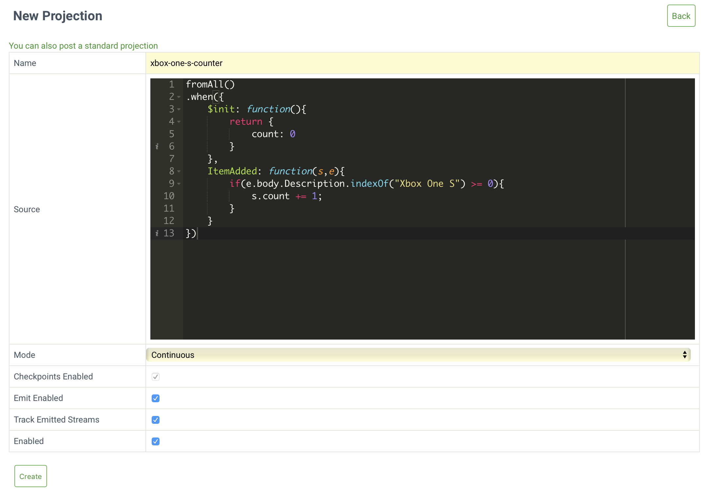

# Projections

You can also query the state of all projections using the HTTP API.

@[code](@httpapi/projections/list-all-projections.sh)

The response is a list of all known projections and useful information about them.

@[code](@httpapi/projections/list-all-projections.json)

## Add sample data

Download the following files that contain sample data used throughout this step of the getting started guide.

- [shoppingCart-b989fe21-9469-4017-8d71-9820b8dd1164.json](@httpapi/data/shoppingCart-b989fe21-9469-4017-8d71-9820b8dd1164.json)
- [shoppingCart-b989fe21-9469-4017-8d71-9820b8dd1165.json](@httpapi/data/shoppingCart-b989fe21-9469-4017-8d71-9820b8dd1165.json)
- [shoppingCart-b989fe21-9469-4017-8d71-9820b8dd1166.json](@httpapi/data/shoppingCart-b989fe21-9469-4017-8d71-9820b8dd1166.json)
- [shoppingCart-b989fe21-9469-4017-8d71-9820b8dd1167.json](@httpapi/data/shoppingCart-b989fe21-9469-4017-8d71-9820b8dd1167.json)

Add the sample data to four different streams:

@[code](@httpapi/add-sample-data.sh)

## Creating your first projection

::: tip Next steps
Read [this guide](#projections-api) to find out more about the user defined projection's API.
:::

The projection counts the number of 'XBox One S's that customers added to their shopping carts.

A projection starts with a selector, in this case `fromAll()`. Another possibility is `fromCategory({category})` which this step discusses later, but for now, `fromAll` should do.

The second part of a projection is a set of filters. There is a special filter called `$init` that sets up an initial state. You want to start a counter from 0 and each time EventStoreDB observes an `ItemAdded` event for an 'Xbox One S,' increment the counter.

Here is the projection code:

@[code](@httpapi/xbox-one-s-counter.js)

You create a projection by calling the projection API and providing it with the definition of the projection. Here you decide how to run the projection, declaring that you want the projection to start from the beginning and keep running. You can create a projection using the Admin UI by opening the _Projections_ tab, clicking the _New Projection_ button and filling in the details of your projection.

You can also create projections programmatically. Pass the projection JSON file as a parameter of your request, along with any other settings:

@[code](@httpapi/projections/create-projection.sh)

::: tip Next steps
[Read here](api.md) for more information on creating projections with the HTTP API and the parameters available, or [our projections section](projections.md) for details on projection syntax.
:::

## Querying for the state of the projection

Now the projection is running, you can query the state of the projection. As this projection has a single state, query it with the following request:

@[code](@httpapi/projections/query-state.sh)

The server will send a response similar to this:

@[code](@httpapi/projections/query-state.json)

## Appending to streams from projections

The above gives you the correct result but requires you to poll for the state of a projection. What if you wanted EventStoreDB to notify you about state updates via subscriptions?

### Output state

Update the projection to output the state to a stream by calling the `outputState()` method on the projection which by default produces a `$projections-{projection-name}-result` stream.

Below is the updated projection:

@[code](@httpapi/xbox-one-s-counter-outputState.js)

To update the projection, edit the projection definition in the Admin UI, or issue the following request:

@[code](@httpapi/xbox-one-s-counter-outputState.sh)

Then reset the projection you created above:

@[code](@httpapi/projections/reset-projection.sh)

You should get a response similar to the one below:

@[code](@httpapi/projections/reset-projection.json)

You can now read the events in the result stream by issuing a read request.

@[code](@httpapi/projections/read-projection-events.sh)

And you'll get a response like this:

@[code](@httpapi/projections/reset-projection.json)

## Configure projection properties

You can configure properties of the projection by updating values of the `options` object. For example, the following projection changes the name of the results stream:

@[code{2}](@httpapi/projections/update-projection-options.js)

Then send the update to the projection:

@[code](@httpapi/projections/update-projection-options.sh)

::: tip
You can find all the options available in the [user-defined projections guide](@server/projections.md#user-defined-projections).
:::

Now you can read the result as above, but use the new stream name:

@[code](@httpapi/projections/read-projection-events-renamed.sh)

## The number of items per shopping cart

The example in this step so far relied on a global state for the projection, but what if you wanted a count of the number of items in the shopping cart per shopping cart.

EventStoreDB has a built-in `$by_category` projection that lets you select events from a particular list of streams. Enable this projection with the following command.

@[code](@httpapi/projections/enable-by-category.sh)

The projection links events from existing streams to new streams by splitting the stream name by a separator. You can configure the projection to specify the position of where to split the stream `id` and provide a separator.

By default, the category splits the stream `id` by a dash. The category is the first string.

| Stream Name        | Category                               |
|--------------------|----------------------------------------|
| shoppingCart-54    | shoppingCart                           |
| shoppingCart-v1-54 | shoppingCart                           |
| shoppingCart       | _No category as there is no separator_ |

You want to define a projection that produces a count per stream for a category, but the state needs to be per stream. To do so, use `$by_category` and its `fromCategory` API method.

Below is the projection:

@[code](@httpapi/projections/shopping-cart-counter.js)

Create the projection with the following request:

@[code](@httpapi/projections/shopping-cart-counter.sh)

#### Querying for the state of the projection by partition

Querying for the state of the projection is different due to the partitioning of the projection. You have to specify the partition and the name of the stream.

@[code](@httpapi/projections/read-state-partition.sh)

The server then returns the state for the partition:

@[code](@httpapi/projections/read-state-partition.json)

## Projections API

| URI                                                                | Description                                                                                                      | HTTP verb |
|:-------------------------------------------------------------------|:-----------------------------------------------------------------------------------------------------------------|:----------|
| `/projections/any`                                                 | Returns all known projections.                                                                                   | GET       |
| `/projections/all-non-transient`                                   | Returns all known non ad-hoc projections.                                                                        | GET       |
| `/projections/transient`                                           | Returns all known ad-hoc projections.                                                                            | GET       |
| `/projections/onetime`                                             | Returns all known one-time projections.                                                                          | GET       |
| `/projections/continuous`                                          | Returns all known continuous projections.                                                                        | GET       |
| `/projections/transient?name={name}&type={type}&enabled={enabled}` | Create an ad-hoc projection. This type of projection runs until completion and automatically deleted afterwards. | POST      |

#### Parameters

* `name`: Name of the projection
* `type`: JS or Native. (JavaScript or native. At this time, EventStoreDB only supports JavaScript)
* `enabled`: Enable the projection (true/false)

| URI                                                                                                                                              | Description                                                                                 | HTTP verb |
|:-------------------------------------------------------------------------------------------------------------------------------------------------|:--------------------------------------------------------------------------------------------|:----------|
| `/projections/onetime?name={name}&type={type}&enabled={enabled}&checkpoints={checkpoints}&emit={emit}&trackemittedstreams={trackemittedstreams}` | Create a one-time projection. This type of projection runs until completion and then stops. | POST      |

#### Parameters

* `name`: Name of the projection
* `type`: JS or Native. (JavaScript or native. At this time, EventStoreDB only supports JavaScript)
* `enabled`: Enable the projection (true/false)
* `checkpoints`: Enable checkpoints (true/false)
* `emit`: Enable the ability for the projection to append to streams (true/false)
* `trackemittedstreams`: Write the name of the streams the projection is managing to a separate stream. $projections-{projection-name}-emittedstreams (true/false)

| URI                                                                                                                       | Description                                                                                                                                              | HTTP verb |
|:--------------------------------------------------------------------------------------------------------------------------|:---------------------------------------------------------------------------------------------------------------------------------------------------------|:----------|
| `/projections/continuous?name={name}&type={type}&enabled={enabled}&emit={emit}&trackemittedstreams={trackemittedstreams}` | Create a continuous projection. This type of projection will, if enabled will continuously run unless disabled or an unrecoverable error is encountered. | POST      |

#### Parameters

* `name`: Name of the projection
* `type`: JS or Native. (JavaScript or native. At this time, EventStoreDB only supports JavaScript)
* `enabled`: Enable the projection (true/false)
* `emit`: Allow the projection to append to streams (true/false)
* `trackemittedstreams`: Write the name of the streams the projection is managing to a separate stream. $projections-{projection-name}-emittedstreams (true/false)

`/projection/{name}/query?config={config}` | Returns the definition query and if config is set to true, will return the configuration. | GET

#### Parameters

* `name`: Name of the projection
* `config`: Return the definition of the projection (true/false)

| URI                                                | Description                  | HTTP verb |
|:---------------------------------------------------|:-----------------------------|:----------|
| `/projection/{name}/query?type={type}&emit={emit}` | Update a projection's query. | PUT       |

#### Parameters

* `name`: Name of the projection
* `type`: JS or Native. (JavaScript or native. At this time, EventStoreDB only supports JavaScript)
* `emit`: Allow the projection to write to streams (true/false)
* `trackemittedstreams`: Write the name of the streams the projection is managing to a separate stream. $projections-{projection-name}-emittedstreams (true/false)

| URI                                                                                                                                                    | Description                                                                                     | HTTP verb |
|:-------------------------------------------------------------------------------------------------------------------------------------------------------|:------------------------------------------------------------------------------------------------|:----------|
| `/projection/{name}`                                                                                                                                   | Returns information for a projection.                                                           | GET       |
| `/projection/{name}?deleteStateStream={deleteStateStream}&deleteCheckpointStream={deleteCheckpointStream}&deleteEmittedStreams={deleteEmittedStreams}` | Delete a projection, optionally delete the streams that were created as part of the projection. | DELETE    |

#### Parameters

* `name`: Name of the projection
* `deleteStateStream`: Delete the state stream (true/false)
* `deleteCheckpointStream`: Delete the checkpoint stream (true/false)
* `deleteEmittedStreams`: Delete the emitted streams stream (true/false)

| URI                             | Description                                    | HTTP verb |
|:--------------------------------|:-----------------------------------------------|:----------|
| `/projection/{name}/statistics` | Returns detailed information for a projection. | GET       |

#### Parameters

* name: Name of the projection

| URI                                              | Description                          | HTTP verb |
|:-------------------------------------------------|:-------------------------------------|:----------|
| `/projection/{name}/state?partition={partition}` | Query for the state of a projection. | GET       |

#### Parameters

* `name`: Name of the projection
* `partition`: The partition

| URI                                               | Description                           | HTTP verb |
|:--------------------------------------------------|:--------------------------------------|:----------|
| `/projection/{name}/result?partition={partition}` | Query for the result of a projection. | GET       |

#### Parameters

* `name`: Name of the projection
* `partition`: The partition

| URI                                                            | Description           | HTTP verb |
|:---------------------------------------------------------------|:----------------------|:----------|
| `/projection/{name}/command/disable?enableRunAs={enableRunAs}` | Disable a projection. | POST      |

#### Parameters

* `name`: Name of the projection
* `enableRunAs`: Enables the projection to run as the user who issued the request.

| URI                                                           | Description          | HTTP verb |
|:--------------------------------------------------------------|:---------------------|:----------|
| `/projection/{name}/command/enable?enableRunAs={enableRunAs}` | Enable a projection. | POST      |

#### Parameters

* `name`: Name of the projection
* `enableRunAs`: Enables the projection to run as the user who issued the request.

| URI                                                          | Description                                                                                                                | HTTP verb |
|:-------------------------------------------------------------|:---------------------------------------------------------------------------------------------------------------------------|:----------|
| `/projection/{name}/command/reset?enableRunAs={enableRunAs}` | Reset a projection. (This will re-emit events, streams that are written to from the projection will also be soft deleted). | POST      |

#### Parameters

* `name`: Name of the projection
* `enableRunAs`: Enables the projection to run as the user who issued the request.

| URI                                                          | Description         | HTTP verb |
|:-------------------------------------------------------------|:--------------------|:----------|
| `/projection/{name}/command/abort?enableRunAs={enableRunAs}` | Abort a projection. | POST      |

#### Parameters

* `name`: Name of the projection
* `enableRunAs`: Enables the projection to run as the user who issued th 
