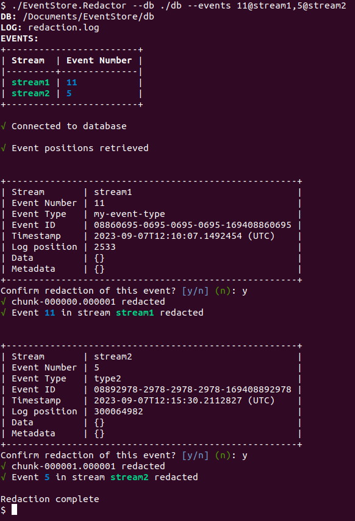
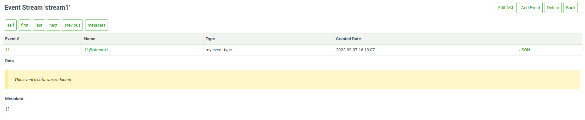

# Maintenance

EventStoreDB requires regular maintenance with two operational concerns:

- [Scavenging](#scavenging-events) for freeing up space after deleting events
- [Backup and restore](#backup-and-restore) for disaster recovery

You might also be interested learning about EventStoreDB [diagnostics](diagnostics.md)
and [indexes](./indexes.md), which might require some Ops attention.

## Scavenging

In EventStoreDB, events are no longer present in stream reads or subscriptions after they have been deleted, or they have expired according to the metadata of the stream.

The events are, however, still present in the database and will be visible in reads and subscriptions to `$all`.

To remove these events from the database, which may be necessary for GDPR, you need to run a 'scavenge' on each of your nodes.

A scavenge operation removes events and reclaims disk space by creating a copy of the relevant chunk, minus those events, and
then deleting the old chunk. The scavenged events are also removed from the index.

::: warning 
Scavenging is destructive. Once a scavenge has run, you cannot recover any deleted events except from a backup.
:::

### Starting a scavenge

You start a scavenge by issuing an empty `POST` request to the HTTP API with the credentials of an `admin`
or `ops` user:

@[code{curl}](@samples/scavenge.sh)

You can also start scavenges from the _Admin_ page of the Admin UI.

::: card

:::

Each node in a cluster has its own independent copy of the database. As such, when you run a scavenge, you need to issue a
scavenge request to each node. The scavenges can be run concurrently, but can also be run in series to spread the load.

### Getting the current scavenge ID

Get the ID of the currently running scavenge, if there is one, by issuing a `GET` with an ID of `current`

```bash:no-line-numbers
curl -i -X GET http://127.0.0.1:2113/admin/scavenge/current -u "admin:changeit"
```

### Stopping a scavenge

Stop a running scavenge operation by issuing a `DELETE` request to the HTTP API with the credentials of
an `admin` or `ops` user and the ID of the scavenge you want to stop:

```bash:no-line-numbers
curl -i -X DELETE http://localhost:2113/admin/scavenge/{scavengeId} -u "admin:changeit"
```

Or stop the currently running scavenge by specifying an ID of `current`:

```bash:no-line-numbers
curl -i -X DELETE http://localhost:2113/admin/scavenge/current -u "admin:changeit"
```

A 200 response is returned after the scavenge has stopped.

You can also stop scavenges from the _Admin_ page of the Admin UI.

::: tip 
A scavenge can be stopped at any time. Next time a scavenge is started it will then resume from the place that the stopped scavenge had reached.
:::

### Viewing progress

The logs contain detailed information about the progress of the scavenge.

The current state of the scavenge can also be tracked in the [metrics](metrics.md).

The [execution phase](#execution-phase) of the scavenge emits events into streams.
Each scavenge operation will generate a new stream and the stream will contain events related to that
operation.
Refer to the `$scavenges` [stream documentation](streams.md#scavenges) to learn how you can use it to observe
the scavenging operation progress and status.

## Scavenging best practices

### Backups

Do not take [file-copy](#regular-file-copy) backups while scavenge is running. Stop the scavenge and resume it after the backup.

[Disk snapshot](#disk-snapshotting) backups can be taken while scavenge is running.

### How often to scavenge

This depends on:
- How often you delete streams.
- How you set `$maxAge`, `$maxCount` or `$tb` metadata on your streams.
- How important freeing the disk space is to you.
- Your requirements around GDPR.

You can tell from the scavenge output in the logs and streams how much data it is removing. This can help guide how frequently to scavenge.

You can set up a scheduled task, for example using cron or Windows Scheduler, to trigger a scavenge as often as you need.

### Spreading the load

Scavenging does place extra load on the server, especially in terms of disk IO. If this is a concern, consider spreading the load with the following:

- Run scavenge on one node at a time.
- Run scavenge on the Follower nodes to avoid adding load on the Leader. Then resign the Leader node and perform scavenging on that node.
- Stop the scavenge during peak times and resume it afterwards.
- Use the [throttle](#throttle-percent) and [threshold](#threshold) options.

## Scavenging algorithm

Central to the scavenging process is the concept of _scavenge points_. Physically these are log records in the transaction log, each containing the following information:

- The position in the log that the scavenge will run up to.
- A number unique to the scavenge point (counting from 0).
- The time ("EffectiveNow") used to determine whether the maxAge of an event has been exceeded.
- The threshold that a chunk's weight must reach to be executed.

Any run of the scavenge process is associated with a single scavenge point, and it scavenges the log up to that point.
Log records after that scavenge point do not exist as far as that scavenge is concerned.

In this way, scavenge can be run on the first node, creating a scavenge point. Then it can be run (potentially later) on other nodes, to scavenge up to the same point, producing the same effect on the log.


The scavenging algorithm itself consists of several phases:

### Beginning

When a scavenge is started, it first checks to see if a previous scavenge was stopped. If so, it resumes from where the previous scavenge got up to. Otherwise it begins a fresh scavenge.

When beginning a fresh scavenge, it checks to see if there already exists a scavenge point that this node has not already scavenged up to. If so, it begins scavenging up to that point. Otherwise it writes a new scavenge point to the log (which is replicated to the other nodes) and then begins a scavenge up to there. Writing a new scavenge point also causes the active chunk to be completed so that it can be scavenged.

### Accumulation phase

During the accumulation phase, the scavenging process reads through the chunks that have been added since the previous scavenge, up to the current scavenge point.
It finds necessary information (such as tombstones and metadata records) and stores it in the scavenge database.

In this way, any particular chunk is only accumulated once, regardless of how many times scavenge is run.

::: tip
The first time the scavenge is run it needs to accumulate all the chunks. Typically this makes the first scavenge take longer than subsequent scavenges.
:::

### Calculation phase

During the calculation phase, the scavenging process calculates, for each stream that it accumulated tombstones or metadata for, which events can be discarded, and which chunks they are located in. It assigns weight to those chunks.

### Execution phase

The execution phase uses the data from the calculation phase to remove events from the chunks and indexes. Small chunks are then merged together.

Only chunks whose weight meets the threshold will be executed.

### Cleaning phase

The final phase removes data from the scavenge database that is no longer needed.

## Scavenging HTTP options

When starting a scavenge, the following options are available.

### Threads

Specify the number of threads to use for running the scavenging process. The default value is 1.

Example:
```bash:no-line-numbers
curl -i -X POST http://127.0.0.1:2113/admin/scavenge?threads=2 -u "admin:changeit"
```

### Threshold

By default, all chunks that have events to be removed are scavenged.

Setting this option allows you to scavenge only the chunks that have a sufficiently large number of events expected to be removed. This allows scavenge to run more quickly by focusing on the chunks that would benefit from it most. The weights of the chunks that are being scavenged or skipped can be found in the log files by searching for the term "with weight". The weight of a chunk is approximately twice the number of records that can be removed from it.

Possible values for the threshold:

- `-1`: Scavenge all chunks, even if there are no event to remove. This should not be necessary in practice.
- `0`: Default value. Scavenges every chunk that has events to remove.
- `> 0`: The minimum weight a chunk must have in order to be scavenged.

Example:
```bash:no-line-numbers
curl -i -X POST http://127.0.0.1:2113/admin/scavenge?threshold=2000 -u "admin:changeit"
```

::: tip
Setting a positive threshold means that not all deleted and expired events will be removed. This may be important to consider with respect to GDPR.
:::

### Throttle percent

The scavenging process can be time-consuming and resource-intensive. You can control the speed and resource usage of the scavenge process using the throttlePercent option. When set to 100 (default value), the scavenge process runs at full speed. Setting it to 50 makes the process take twice as long by pausing regularly.

A scavenge can be stopped and restarted with a different throttlePercent

_Throttle percent must be between 1 and 100._

_Throttle percent must be 100 for a multi-threaded scavenge._

Example:
```bash:no-line-numbers
curl -i -X POST http://127.0.0.1:2113/admin/scavenge?throttlePercent=50 -u "admin:changeit"
```

### Sync Only

This option is a boolean value and is false by default. When set to true, it prevents the creation of a new scavenge point and will only run the scavenge if there is an existing scavenge point that has not yet been scavenged to. After running a scavenge on one node, this flag can be used to ensure that a subsequent node scavenges to that same point.

Example:
```bash:no-line-numbers
curl -i -X POST http://127.0.0.1:2113/admin/scavenge?syncOnly=true -u "admin:changeit"
```

### Start From Chunk

This option is deprecated. It is ignored and will be removed.

## Scavenging database options

Below you can find some options that change the way how scavenging works on the server node.

### Disable chunk merging

Scavenged chunks may be small enough to be merged into a single physical chunk file of approximately 256 MB. This behaviour can be disabled with this option.

| Format               | Syntax                                |
|:---------------------|:--------------------------------------|
| Command line         | `--disable-scavenge-merging`          |
| YAML                 | `DisableScavengeMerging`              |
| Environment variable | `EVENTSTORE_DISABLE_SCAVENGE_MERGING` | 

**Default**: `false`, small scavenged chunks are merged together.

### Scavenge history

Each scavenge operation gets an id and creates a stream. You might want to look at these streams to see the
scavenge history, see how much time each operation took and how much disk space was reclaimed. However, you
might not want to keep this history forever. Use the following option to limit how long the scavenge history
stays in the database:

| Format               | Syntax                                |
|:---------------------|:--------------------------------------|
| Command line         | `--scavenge-history-max-age`          |
| YAML                 | `ScavengeHistoryMaxAge`               |
| Environment variable | `EVENTSTORE_SCAVENGE_HISTORY_MAX_AGE` | 

**Default**: `30` (days)

### Always keep scavenged (_Deprecated_)

This option ensures that the newer chunk from a scavenge operation is always kept.

| Format               | Syntax                             |
|:---------------------|:-----------------------------------|
| Command line         | `--always-keep-scavenged`          |
| YAML                 | `AlwaysKeepScavenged`              |
| Environment variable | `EVENTSTORE_ALWAYS_KEEP_SCAVENGED` |

### Scavenge backend page size

Specify the page size of the scavenge database. The default value is 16 KiB.

| Format               | Syntax                                  |
|:---------------------|:----------------------------------------|
| Command line         | `--scavenge-backend-page-size`          |
| YAML                 | `ScavengeBackendPageSize`               |
| Environment variable | `EVENTSTORE_SCAVENGE_BACKEND_PAGE_SIZE` | 

### Scavenge backend cache size

Specify the amount of memory, in bytes, to use for backend caching during scavenging. The default value is 64 MiB.

| Format               | Syntax                                   |
|:---------------------|:-----------------------------------------|
| Command line         | `--scavenge-backend-cache-size`          |
| YAML                 | `ScavengeBackendCacheSize`               |
| Environment variable | `EVENTSTORE_SCAVENGE_BACKEND_CACHE_SIZE` |                       

### Scavenge hash users cache capacity

Specify the number of stream hashes to remember when checking for collisions.
If the accumulation phase is reporting a lot of cache misses, it may benefit from increasing this number.

The default value is 100000.

| Format               | Syntax                                          |
|:---------------------|:------------------------------------------------|
| Command line         | `--scavenge-hash-users-cache-capacity`          |
| YAML                 | `ScavengeHashUsersCacheCapacity`                |
| Environment variable | `EVENTSTORE_SCAVENGE_HASH_USERS_CACHE_CAPACITY` |

## Redaction

In EventStoreDB, events are immutable and cannot be changed after they are written. Usually when you have an event with data that needs to be deleted you should take the following steps:

- Rewrite the stream to a new stream without the data to be removed
- Delete the old stream
- Run a scavenge to remove the data from disk on each node in turn

If this procedure is impractical in your use case, then you can use the redaction tool (the "redactor") to blank out the data of specific events.

::: warning 
Use the redactor as a last resort and only if you know what you're doing. Redacting events may lead to unintended consequences in your subscriptions and projections!
:::

### Prerequisites

Using redaction has the following prerequisites:
- A commercial licence
- EventStoreDB version 23.6.0 or above. If running on Windows, Windows Server 2019 or above is required.
- Server configuration option: `EnableUnixSocket: True`
- The redactor tool (see steps below on how to get it)

### Getting the redactor
Redaction requires a commercial licence. Due to its sensitive nature, the tool is available only upon request. Please [contact us here](https://www.eventstore.com/contact) if you do not have commercial support, or reach out to our support team if you do.

### Running the redactor

The binary needs to be extracted and run locally on an EventStoreDB node. Similar to scavenging, redaction affects only the node where it's running. Thus, it must be run once on each node of the cluster.

The redactor takes the following mandatory parameters as input:
- `--db` the path to the database directory containing the chunk files
- `--events` a comma-separated list of events to be redacted in the format: `eventNumber@streamName`

Specify `--help` to see the full list of options.

The redactor will blank out the data section of the specified events with one bits (0xFF bytes) keeping the data size exactly the same as it was before. It will also set a flag (`IsRedacted`) on the event's record to indicate that the event has been redacted. All other properties of the event such as the event type, event metadata and timestamp will remain unchanged.

::: card

:::

If you read the data of a redacted event from an external client, you should see data composed of only 0xFF bytes. The UI will also label redacted events.

::: card

:::

::: tip
The redactor is not an offline tool. The EventStoreDB server must be running as the redactor needs to communicate with it to obtain information about the events to be redacted and to also replace the chunk files with the redacted ones.
:::

### How the redactor works
The redactor follows these steps:

1. Establish a connection to the database via a unix domain socket located in the database directory

2. Fetch information about the events to be redacted from the server via an RPC call. This information includes the chunk file the event is in and the event's position in the chunk.

3. Build up a list of chunk files containing events to be redacted

4. For each chunk in the list:
    - copy it to a file with a .tmp extension in the database directory
    - redact the event(s) in the .tmp chunk file
    - atomically switch the .tmp chunk into the database via an RPC call on the server.

## Backup and restore
Backing up an EventStoreDB database is straightforward but relies on carrying out the steps below in the
correct order.

### Types of backups

There are two main ways to perform backups:

#### Disk snapshotting

If your infrastructure is virtualized, disk _snapshots_ is an option and the easiest to perform backup and
restore operations.

#### Regular file copy

- Simple full backup: when the DB size is small and the frequency of appends is low.
- Differential backup: when the DB size is large or the system has a high append frequency.

### Considerations for backup and restore procedures

Backing up one node is recommended. However, ensure that the node chosen as a target for the backup is:

- up to date
- connected to the cluster.

For additional safety, you can also back up at least a quorum of nodes.

Do not back up a node with file copy at the same time as running a scavenge operation.

[Read-only replica](./cluster.md#read-only-replica) nodes may be used as backup source.

When either running a backup or restoring, do not mix backup files of different nodes.

The restore must happen on a _stopped_ node.

The restore process can happen on any node of a cluster.

You can restore any number of nodes in a cluster from the same backup source. It means, for example, in the
event non-recoverable three nodes cluster, that the same backup source can be used to restore a completely new
three nodes cluster.

When you restore a node that was the backup source, perform a full backup after recovery.

### Database files information

By default, there are two directories containing data that needs to be included in the backup:

- `db\ ` where the data is located
- `index\ ` where the indexes are kept.

The exact name and location are dependent on your configuration.

- `db\ ` contains:
    - the chunks files named `chk-X.Y` where `X` is the chunk number and `Y` the version.
    - the checkpoints files `*.chk` (`chaser.chk`, `epoch.chk`, `proposal.chk`, `truncate.chk`, `writer.chk`)
- `index\ ` contains:
    - the index map: `indexmap`
    - the indexes: UUID named files , e.g `5a1a8395-94ee-40c1-bf93-aa757b5887f8`

### Disks snapshot

If the `db\ ` and `index\ ` directories are on the same volume, a snapshot of that volume is enough.

However, if they are on different volumes, take first a snapshot of the volume containing the `index\ `
directory and then a snapshot of the volume containing the `db\ ` directory.

### Simple full backup & restore

#### Backup

1. Copy any index checkpoint files (`<index directory>\**\*.chk`) to your backup location.
2. Copy the other index files to your backup location (the rest of `<index directory>`, excluding the
   checkpoints).
3. Copy the database checkpoint files (`*.chk`) to your backup location.
4. Copy the chunk files (`chunk-X.Y`) to your backup location.

For example, with a database in `data` and index in `data/index`:

``` bash:no-line-numbers
rsync -aIR data/./index/**/*.chk backup
rsync -aI --exclude '*.chk' data/index backup
rsync -aI data/*.chk backup
rsync -a data/*.0* backup
```

#### Restore

1. Ensure the EventStoreDB process is stopped. Restoring a database on running instance is not possible and,
   in most cases, will lead to data corruption.
2. Copy all files to the desired location.
3. Create a copy of `chaser.chk` and call it `truncate.chk`. This effectively overwrites the
   restored `truncate.chk`.

### Differential backup & restore

The following procedure is designed to minimize the backup storage space, and can be used to do a full and
differential backup.

#### Backup

First backup the index

1. If there are no files in the index directory (apart from directories), go to step 7.
2. Copy the `index/indexmap` file to the backup. If the source file does not exist, repeat until it does.
3. Make a list `indexFiles` of all the `index/<GUID>` and `index/<GUID>.bloomfilter` files in the source.
4. Copy the files listed in `indexFiles` to the backup, skipping file names already in the backup.
5. Compare the contents of the `indexmap` file in the source and the backup. If they are different (i.e. the
   indexmap file has changed since step 2, or no longer exists), go back to step 2.
6. Remove `index/<GUID>` and `index/<GUID>.bloomfilter` files from the backup that are not listed
   in `indexFiles`.
7. Copy the `index/stream-existence/streamExistenceFilter.chk` file (if present) to the backup.
8. Copy the `index/stream-existence/streamExistenceFilter.dat` file (if present) to the backup.
9. Copy the `index/scavenging/scavenging.db` file (if present) to the backup. It should be the only file in the directory.

Then backup the log

1. Rename the last chunk in the backup to have a `.old` suffix. e.g. rename `chunk-000123.000000`
   to `chunk-000123.000000.old`
2. Copy `chaser.chk` to the backup.
3. Copy `epoch.chk` to the backup.
4. Copy `writer.chk` to the backup.
5. Copy `proposal.chk` to the backup.
6. Make a list `chunkFiles` of all chunk files (`chunk-X.Y`) in the source.
7. Copy the files listed in `chunkFiles` to the backup, skipping file names already in the backup. All files
   should copy successfully - none should have been deleted since scavenge is not running.
8. Remove any chunks from the backup that are not in the `chunksFiles` list. This will include the `.old`
   file from step 1.

#### Restore

1. Ensure the Event Store DB process is stopped. Restoring a database on running instance is not possible and,
   in most cases, will lead to data corruption.
2. Copy all files to the desired location.
3. Create a copy of `chaser.chk` and call it `truncate.chk`.

### Other options

There are other options available for ensuring data recovery, that are not strictly related to backups.

#### Additional node (aka Hot Backup)

Increase the cluster size from 3 to 5 to keep further copies of data. This increase in the cluster size will
slow the cluster's writing performance as two follower nodes will need to confirm each write.

Alternatively, you can use a [read-only replica](./cluster.md#read-only-replica) node, which is not a part of
the cluster. In this case, the write performance will be minimally impacted.

#### Alternative storage

Set up a durable subscription that writes all events to another storage mechanism such as a key/value or
column store. These methods would require a manual set up for restoring a cluster node or group.

#### Backup cluster

Use a second EventStoreDB cluster as a backup. Such a strategy is known as a primary/secondary back up scheme.

The primary cluster asynchronously pushes data to the second cluster using a durable subscription. The second
cluster is available in case of a disaster on the primary cluster.

If you are using this strategy, we recommend you only support manual fail over from primary to secondary as
automated strategies risk causing a [split brain](http://en.wikipedia.org/wiki/Split-brain_%28computing%29)
problem.
