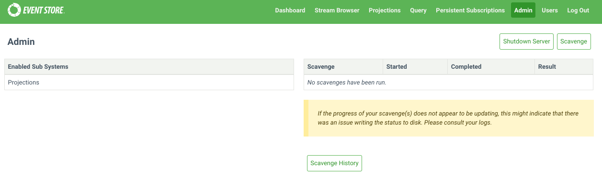

# Maintenance

EventStoreDB requires regular maintenance with three operational concerns:

- [Scavenging](#scavenging) for freeing up space after deleting events.
- [Backup and restore](#backup-and-restore) for disaster recovery.
- [Certificate update](#certificate-update-upon-expiry) to renew certificates.

You might also be interested learning about EventStoreDB [diagnostics](diagnostics.md)
and [indexes](./indexes.md), which might require some Ops attention.

## Scavenging

In EventStoreDB, events are no longer present in stream reads or subscriptions after they have been deleted or they have expired according to the metadata of the stream.

The events are, however, still present in the database and will be visible in reads and subscriptions to the `$all` stream.

To remove these events from the database, which may be necessary for GDPR, you need to run a 'scavenge' on each of your nodes.

A scavenge operation removes events and reclaims disk space by creating a copy of the relevant chunk, minus those events, and
then deleting the old chunk. The scavenged events are also removed from the index.

::: warning
Scavenging is destructive. Once a scavenge has run, you cannot recover any deleted events except from a backup.
:::

### Starting a scavenge

You start a scavenge by issuing an empty `POST` request to the HTTP API with the credentials of an `admin`
or `ops` user:

@[code{curl}](@samples/scavenge.sh)

You can also start scavenges from the _Admin_ page of the Admin UI.

::: card

:::

Each node in a cluster has its own independent copy of the database. As such, when you run a scavenge, you need to issue a
scavenge request to each node. The scavenges can be run concurrently, but can also be run in series to spread the load.

### Getting the current scavenge ID

Get the ID of the currently running scavenge, if there is one, by issuing a `GET` request to the following HTTP API endpoint with the `admin` or `ops` credentials.

```bash:no-line-numbers
curl -i -X GET http://127.0.0.1:2113/admin/scavenge/current -u "admin:changeit"
```

### Stopping a scavenge

Stop a running scavenge operation by issuing a `DELETE` request to the HTTP API with the credentials of
an `admin` or `ops` user and the ID of the scavenge you want to stop:

```bash:no-line-numbers
curl -i -X DELETE http://localhost:2113/admin/scavenge/{scavengeId} -u "admin:changeit"
```

Or stop the currently running scavenge by specifying an ID of `current`:

```bash:no-line-numbers
curl -i -X DELETE http://localhost:2113/admin/scavenge/current -u "admin:changeit"
```

A 200 response is returned after the scavenge has stopped.

You can also stop scavenges from the _Admin_ page of the Admin UI.

::: tip
A scavenge can be stopped at any time. The next time a scavenge is started, it will resume from the place the previous scavenge stopped.
:::

### Viewing progress

The logs contain detailed information about the progress of the scavenge.

The current state of the scavenge can also be tracked in the [metrics](metrics.md).

The [execution phase](#execution-phase) of the scavenge emits events into streams.
Each scavenge operation will generate a new stream and the stream will contain events related to that
operation.
Refer to the `$scavenges` [stream documentation](streams.md#scavenges) to learn how you can use it to observe
the scavenging operation progress and status.

## Scavenging best practices

### Backups

Do not take [file-copy](#types-of-backups) backups while scavenge is running. Stop the scavenge and resume it after the backup.

[Disk snapshot](#types-of-backups) backups can be taken while scavenge is running.

### How often to scavenge

This depends on:

- How often you delete streams.
- How you set `$maxAge`, `$maxCount` or `$tb` metadata on your streams.
- How important freeing the disk space is to you.
- Your requirements around GDPR.

You can tell from the scavenge output in the logs and streams how much data it is removing. This can help guide how frequently to scavenge.

You can set up a scheduled task, for example using cron on Linux or [Windows Task Scheduler](https://learn.microsoft.com/en-us/windows/win32/taskschd/task-scheduler-start-page), to trigger a scavenge as often as you need.

### Spreading the load

Scavenging does place extra load on the server, especially in terms of disk IO. If this is a concern, consider spreading the load with the following:

- Run scavenge on one node at a time.
- Run scavenge on the Follower nodes to avoid adding load on the Leader. Then resign the Leader node and perform scavenging on that node.
- Stop the scavenge during peak times and resume it afterwards.
- Use the [throttle](#throttle-percent) and [threshold](#threshold) options.

## Scavenging algorithm

Central to the scavenging process is the concept of _scavenge points_. Physically, these are log records in the transaction log, each containing the following information:

- the position in the log that the scavenge will run up to
- a number unique to the scavenge point (counting from 0)
- the time (`EffectiveNow`) used to determine whether the `maxAge` of an event has been exceeded
- the threshold that a chunk's weight must reach to be executed

Any run of the scavenge process is associated with a single scavenge point, and it scavenges the log up to that point.
Log records after that scavenge point do not exist as far as that scavenge is concerned.

In this way, a scavenge can be run on the first node, creating a scavenge point. Then it can be run (potentially later) on other nodes, to scavenge up to the same point, producing the same effect on the log.

The scavenging algorithm itself consists of several phases:

### Beginning

When a scavenge is started, it first checks to see if a previous scavenge was stopped. If so, it resumes from where the previous scavenge stopped. Otherwise it begins a fresh scavenge.

When beginning a fresh scavenge, it checks to see if a scavenge point already exists that has not been reached by previous scavenges. If so, it begins scavenging up to that point. Otherwise, it writes a new scavenge point to the log (which is replicated to the other nodes) and then begins a scavenge up to there. Writing a new scavenge point also causes the active chunk to be completed so that it can be scavenged.

### Accumulation phase

During the accumulation phase, the scavenging process reads through the chunks that have been added since the previous scavenge, up to the current scavenge point.
It finds necessary information (such as tombstones and metadata records) and stores it in the scavenge database.

In this way, any particular chunk is only accumulated once, regardless of how many times scavenge is run.

::: tip
The first time the scavenge is run it needs to accumulate all the chunks. Typically, this makes the first scavenge take longer than subsequent scavenges.
:::

### Calculation phase

During the calculation phase, the scavenging process calculates which events can be discarded and which chunks they are located in for each stream that it accumulated tombstones or metadata for. It assigns weight to those chunks.

### Execution phase

The execution phase uses the data from the calculation phase to remove events from the chunks and indexes. Small chunks are then merged together.

Only chunks whose weight meets the threshold will be executed.

### Cleaning phase

This final phase removes data from the scavenge database that is no longer needed.

## Starting a scavenge

When starting a scavenge with an HTTP POST request, the following options are available.

### Threads

Specify the number of threads to use for running the scavenging process. The default value is 1.

Example:

```bash:no-line-numbers
curl -i -X POST http://127.0.0.1:2113/admin/scavenge?threads=2 -u "admin:changeit"
```

### Threshold

By default, all chunks that have events to be removed are scavenged.

Setting this option allows you to scavenge only the chunks that have a sufficiently large number of events expected to be removed. This allows scavenge to run more quickly by focusing on the chunks that would benefit from it most. The weights of the chunks that are being scavenged or skipped can be found in the log files by searching for the term "with weight". The weight of a chunk is approximately twice the number of records that can be removed from it.

Possible values for the threshold:

- `-1`: Scavenge all chunks, even if there are no event to remove. This should not be necessary in practice.
- `0`: Default value. Scavenges every chunk that has events to remove.
- `> 0`: The minimum weight a chunk must have in order to be scavenged.

Example:

```bash:no-line-numbers
curl -i -X POST http://127.0.0.1:2113/admin/scavenge?threshold=2000 -u "admin:changeit"
```

::: tip
Setting a positive threshold means that not all deleted and expired events will be removed. This may be important to consider with respect to GDPR.
:::

### Throttle percent

The scavenging process can be time-consuming and resource-intensive. You can control the speed and resource usage of the scavenge process using the `throttlePercent` option. When set to 100 (default value), the scavenge process runs at full speed. Setting it to 50 makes the process take twice as long by pausing regularly.

A scavenge can be stopped and restarted with a different `throttlePercent`.

For `throttlePercent` values:

- Throttle percent must be between 1 and 100.

- Throttle percent must be 100 for a multi-threaded scavenge.

Example:

```bash:no-line-numbers
curl -i -X POST http://127.0.0.1:2113/admin/scavenge?throttlePercent=50 -u "admin:changeit"
```

### Sync Only

The `syncOnly` option is a boolean value and is false by default. When true, it prevents the creation of a new scavenge point and will only run the scavenge if there is an existing scavenge point that has not yet been reached in a previous scavenged. After running a scavenge on one node, this flag can be used to ensure that a subsequent node scavenges to that same point.

Example:

```bash:no-line-numbers
curl -i -X POST http://127.0.0.1:2113/admin/scavenge?syncOnly=true -u "admin:changeit"
```

### Start From Chunk

This option is deprecated. It is ignored and will be removed.

## Scavenging database options

Below you can find some options that change the way how scavenging works on the server node.

### Disable chunk merging

Scavenged chunks may be small enough to be merged into a single physical chunk file of approximately 256 MB. This behaviour can be disabled with this option.

| Format               | Syntax                                |
| :------------------- | :------------------------------------ |
| Command line         | `--disable-scavenge-merging`          |
| YAML                 | `DisableScavengeMerging`              |
| Environment variable | `EVENTSTORE_DISABLE_SCAVENGE_MERGING` |

**Default**: `false`, small scavenged chunks are merged together.

### Scavenge history

Each scavenge operation is assigned a unique ID and creates a corresponding stream. These streams provide valuable insights into the scavenge history, including the duration of each operation and the amount of disk space reclaimed. However, retaining this history indefinitely may not be necessary. To manage this, you can limit the duration for which scavenge history is stored in the database using this option.

| Format               | Syntax                                |
| :------------------- | :------------------------------------ |
| Command line         | `--scavenge-history-max-age`          |
| YAML                 | `ScavengeHistoryMaxAge`               |
| Environment variable | `EVENTSTORE_SCAVENGE_HISTORY_MAX_AGE` |

**Default**: `30` (days)

### Always keep scavenged (_Deprecated_)

This option ensures that the newer chunk from a scavenge operation is always kept.

| Format               | Syntax                             |
| :------------------- | :--------------------------------- |
| Command line         | `--always-keep-scavenged`          |
| YAML                 | `AlwaysKeepScavenged`              |
| Environment variable | `EVENTSTORE_ALWAYS_KEEP_SCAVENGED` |

### Scavenge backend page size

Specify the page size of the scavenge database. The default value is 16 KiB.

| Format               | Syntax                                  |
| :------------------- | :-------------------------------------- |
| Command line         | `--scavenge-backend-page-size`          |
| YAML                 | `ScavengeBackendPageSize`               |
| Environment variable | `EVENTSTORE_SCAVENGE_BACKEND_PAGE_SIZE` |

**Default**: `16` (KiB)

### Scavenge backend cache size

Specify the amount of memory, in bytes, to use for backend caching during scavenging. The default value is 64 MiB.

| Format               | Syntax                                   |
| :------------------- | :--------------------------------------- |
| Command line         | `--scavenge-backend-cache-size`          |
| YAML                 | `ScavengeBackendCacheSize`               |
| Environment variable | `EVENTSTORE_SCAVENGE_BACKEND_CACHE_SIZE` |

### Scavenge hash users cache capacity

Specify the number of stream hashes to remember when checking for collisions.
If the accumulation phase is reporting a lot of cache misses, it may benefit from increasing this number.

The default value is 100000.

| Format               | Syntax                                          |
| :------------------- | :---------------------------------------------- |
| Command line         | `--scavenge-hash-users-cache-capacity`          |
| YAML                 | `ScavengeHashUsersCacheCapacity`                |
| Environment variable | `EVENTSTORE_SCAVENGE_HASH_USERS_CACHE_CAPACITY` |

## Backup and restore

Backing up an EventStoreDB database is straightforward but relies on carrying out the steps below in the
correct order.

### Types of backups

There are two main ways to perform backups:

- **Disk snapshots**: If your infrastructure is virtualized, [disk snapshots](#disks-snapshot) are an option and the easiest way to perform backup and
  restore operations.

- **Regular file copy**:

  - [Simple full backup](#simple-full-backup--restore): when the DB size is small and the frequency of appends is low.
  - [Differential backup](#differential-backup--restore): when the DB size is large or the system has a high append frequency.

### Backup and restore best practices

- Backing up one node is recommended. However, ensure that the node you choose to back up is **up to date** and **connected to the cluster**.

- For additional safety, you can also back up at least a quorum of nodes.

- Do not attempt to back up a node using file copy at the same time a scavenge operation is running.

- [Read-only replica](./cluster.md#read-only-replica) nodes may be used as a backup source.

- When either running a backup or restoring, do not mix backup files of different nodes.

- A restore must happen on a _stopped_ node.

- The restore process can happen on any node of a cluster.

- You can restore any number of nodes in a cluster from the same backup source. It means, for example, in the
  event of a non-recoverable three node cluster, that the same backup source can be used to restore a completely new
  three node cluster.

- When you restore a node that was the backup source, perform a full backup after recovery.

### Database files information

By default, there are two directories containing data that needs to be included in the backup:

- `db/ ` where the data is located
- `index/ ` where the indexes are kept

The exact name and location are dependent on your configuration.

- `db/ ` contains:
  - the chunks files named `chk-X.Y` where `X` is the chunk number and `Y` the version.
  - the checkpoints files `*.chk` (`chaser.chk`, `epoch.chk`, `proposal.chk`, `truncate.chk`, `writer.chk`)
- `index/ ` contains:
  - the index map: `indexmap`
  - the indexes: UUID named files , e.g `5a1a8395-94ee-40c1-bf93-aa757b5887f8`

### Disks snapshot

If the `db/ ` and `index/ ` directories are on the same volume, a snapshot of that volume is enough.

However, if they are on different volumes, take first a snapshot of the volume containing the `index/ `
directory and then a snapshot of the volume containing the `db/ ` directory.

### Simple full backup & restore

#### Backup

1. Copy any index checkpoint files (`<index directory>/**/*.chk`) to your backup location.
2. Copy the other index files to your backup location (the rest of `<index directory>`, excluding the checkpoints).
3. Copy the database checkpoint files (`*.chk`) to your backup location.
4. Copy the chunk files (`chunk-X.Y`) to your backup location.

For example, with a database in `data` and index in `data/index`:

```bash:no-line-numbers
rsync -aIR data/./index/**/*.chk backup
rsync -aI --exclude '*.chk' data/index backup
rsync -aI data/*.chk backup
rsync -a data/*.0* backup
```

#### Restore

1. Ensure the EventStoreDB process is stopped. Restoring a database on running instance is not possible and,
   in most cases, will lead to data corruption.
2. Copy all files to the desired location.
3. Create a copy of `chaser.chk` and call it `truncate.chk`. This effectively overwrites the
   restored `truncate.chk`.

### Differential backup & restore

The following procedure is designed to minimize the backup storage space, and can be used to do a full and
differential backup.

#### Backup

First backup the index:

1. If there are no files in the index directory (apart from directories), go to step 7.
2. Copy the `index/indexmap` file to the backup. If the source file does not exist, repeat until it does.
3. Make a list `indexFiles` of all the `index/<GUID>` and `index/<GUID>.bloomfilter` files in the source.
4. Copy the files listed in `indexFiles` to the backup, skipping file names already in the backup.
5. Compare the contents of the `indexmap` file in the source and the backup. If they are different (i.e. the
   `indexmap` file has changed since step 2 or no longer exists), go back to step 2.
6. Remove `index/<GUID>` and `index/<GUID>.bloomfilter` files from the backup that are not listed
   in `indexFiles`.
7. Copy the `index/stream-existence/streamExistenceFilter.chk` file (if present) to the backup.
8. Copy the `index/stream-existence/streamExistenceFilter.dat` file (if present) to the backup.
9. Copy the `index/scavenging/scavenging.db` file (if present) to the backup. It should be the only file in the `scavenging` directory.

Then backup the log:

1. Rename the last chunk in the backup to have a `.old` suffix. e.g. rename `chunk-000123.000000`
   to `chunk-000123.000000.old`.
2. Copy `chaser.chk` to the backup.
3. Copy `epoch.chk` to the backup.
4. Copy `writer.chk` to the backup.
5. Copy `proposal.chk` to the backup.
6. Make a list `chunkFiles` of all chunk files (`chunk-X.Y`) in the source.
7. Copy the files listed in `chunkFiles` to the backup, skipping file names already in the backup. All files
   should copy successfully. None should have been deleted since scavenge is not running.
8. Remove any chunks from the backup that are not in the `chunksFiles` list. This will include the `.old`
   file from step 1.

#### Restore

1. Ensure the Event Store DB process is stopped. Restoring a database on running instance is not possible and,
   in most cases, will lead to data corruption.
2. Copy all files to the desired location.
3. Create a copy of `chaser.chk` and call it `truncate.chk`.

### Other options for data recovery

#### Additional node (aka Hot Backup)

Increase the cluster size from 3 to 5 to keep further copies of data. This increase in the cluster size will
slow the cluster's writing performance as two follower nodes will need to confirm each write.

Alternatively, you can use a [read-only replica](./cluster.md#read-only-replica) node, which is not a part of
the cluster. In this case, the write performance will be minimally impacted.

#### Alternative storage

Set up a durable subscription that writes all events to another storage mechanism such as a key/value or
column store. These methods would require a manual set up for restoring a cluster node or group.

#### Backup cluster

Use a second EventStoreDB cluster as a backup. Such a strategy is known as a primary/secondary back up scheme.

The primary cluster asynchronously pushes data to the second cluster using a durable subscription. The second
cluster is available in case of a disaster on the primary cluster.

If you are using this strategy, we recommend you only support manual fail over from primary to secondary as
automated strategies risk causing a [split brain](http://en.wikipedia.org/wiki/Split-brain_%28computing%29)
problem.

## Certificate update upon expiry

In EventStoreDB, the certificates require updating when they have expired or are going to expire soon. Follow the steps below to perform a rolling certificate update.

### Step 1: Generate new certificates

The new certificates can be created in the same manner as you generated the existing certificates.
You can use the EventStore [es-gencert-cli](https://github.com/EventStore/es-gencert-cli) tool to generate the CA and node certificates.
You can also follow the [Configurator](https://configurator.eventstore.com/) to create commands for generating the certificates based on your cluster's configuration.

::: tip
As of version 23.10.0, it is possible to do a rolling update with new certificates having a Common Name (CN) that's different from the original certificates. If `CertificateReservedNodeCommonName` was set in your configuration, any changes to its value will be taken into consideration during a config reload.
:::

### Step 2: Replace the certificates

The next step is to replace the outdated certificates with the newly generated certificates.

If you are using symlinks, then you can update the symlink to point it to the new certificates.

#### Linux OS

We normally have a symlink that points to the existing certificates:

ca -> `/etc/eventstore/certs/ca`
node.crt -> `/etc/eventstore/certs/node.crt`
node.key -> `/etc/eventstore/certs/node.key`

Update the symlink so that the link points to the new certificates:

ca -> `/etc/eventstore/newCerts/ca`
node.crt -> `/etc/eventstore/newCerts/node.crt`
node.key -> `/etc/eventstore/newCerts/node.key`

In the above example we have the links in a folder at path `/home/ubuntu/links`.

### Step 3: Reload the configuration

You can reload the certificate configuration without restarting the node by issuing the following curl command.

```bash:no-line-numbers
curl -k -X POST --basic https://{nodeAddress}:{HttpPort}/admin/reloadconfig -u {username}:{Password}
```

For Example:

```bash:no-line-numbers
curl -k -X POST --basic https://127.0.0.1:2113/admin/reloadconfig -u admin:changeit
```

#### Linux OS

Linux users can also send the SIGHUP signal to the EventStoreDB to reload the certificates.

For Example:

```
kill -s SIGHUP 38956
```

Here "38956" is the Process ID (PID) of EventStoreDB on our local machine. To find the PID, use the following command in the Linux terminal.

```
pidof eventstored
```

Once the configuration has been reloaded successfully, the server logs will look something like:

```
[108277,30,14:46:07.453,INF] Reloading the node's configuration since a request has been received on /admin/reloadconfig.
[108277,29,14:46:07.457,INF] Loading the node's certificate(s) from file: "/home/ubuntu/links/node.crt"
[108277,29,14:46:07.488,INF] Loading the node's certificate. Subject: "CN=eventstoredb-node", Previous thumbprint: "05526714107700C519E24794E8964A3B30EF9BD0", New thumbprint: "BE6D5CD681D7B9281D60A5969B5A7E31AF775E9F"
[108277,29,14:46:07.488,INF] Loading intermediate certificate. Subject: "CN=EventStoreDB Intermediate CA 78ae8d5a159b247568039cf64f4b04ad, O=Event Store Ltd, C=UK", Thumbprint: "ED4AA0C5ED4AD120DDEE2FA8B3B0CCC5A30B81E3"
[108277,29,14:46:07.489,INF] Loading trusted root certificates.
[108277,29,14:46:07.490,INF] Loading trusted root certificate file: "/home/ubuntu/links/ca/ca.crt"
[108277,29,14:46:07.491,INF] Loading trusted root certificate. Subject: "CN=EventStoreDB CA c39fece76b4efcb65846145c942c037c, O=Event Store Ltd, C=UK", Thumbprint: "5F020804E8D7C419F9FC69ED3B4BC72DD79A5996"
[108277,29,14:46:07.493,INF] Certificate chain verification successful.
[108277,29,14:46:07.493,INF] All certificates successfully loaded.
[108277,29,14:46:07.494,INF] The node's configuration was successfully reloaded
```

::: tip
If there are any errors during loading certificates, the new configuration changes will not take effect.
:::

The server logs the following error when the node certificate is not available at the path specified in the EventStore configuration file.

```
[108277,30,14:49:47.481,INF] Reloading the node's configuration since a request has been received on /admin/reloadconfig.
[108277,29,14:49:47.488,INF] Loading the node's certificate(s) from file: "/home/ubuntu/links/node.crt"
[108277,29,14:49:47.489,ERR] An error has occurred while reloading the configuration
System.IO.FileNotFoundException: Could not find file '/home/ubuntu/links/node.key'.
```

### Step 4: Update the other nodes

Now update the certificates on the other nodes.

### Step 5: Monitor the cluster

The connection between nodes in EventStoreDB reset every 10 minutes so the new configuration won’t take immediate effect. Use this time to update the certificates on all of the nodes. It is advisable to monitor the cluster after this timeframe to make sure everything is working as expected.
The EventStoreDB will log certificate errors if the certificates are not reloaded on all of the nodes before the connection resets.

```
[108277,29,14:59:47.489,ERR] eventstoredb-node : A certificate chain could not be built to a trusted root authority.
[108277,29,14:59:47.489,ERR] Client certificate validation error: "The certificate (CN=eventstoredb-node) provided by the client failed validation with the following error(s): RemoteCertificateChainErrors (PartialChain)"
```

The above error indicates that there is some issue with the certificate because the reload process is not yet completed on all the nodes. The error can be safely ignored during the duration of the reloading certificate process, but the affected nodes will not be able to communicate with each other until the certificates have been updated on all the nodes.

::: warning
It can take up to 10 minutes for certificate changes to take effect. Certificates on all nodes should be updated within this window to avoid connection issues.
:::
