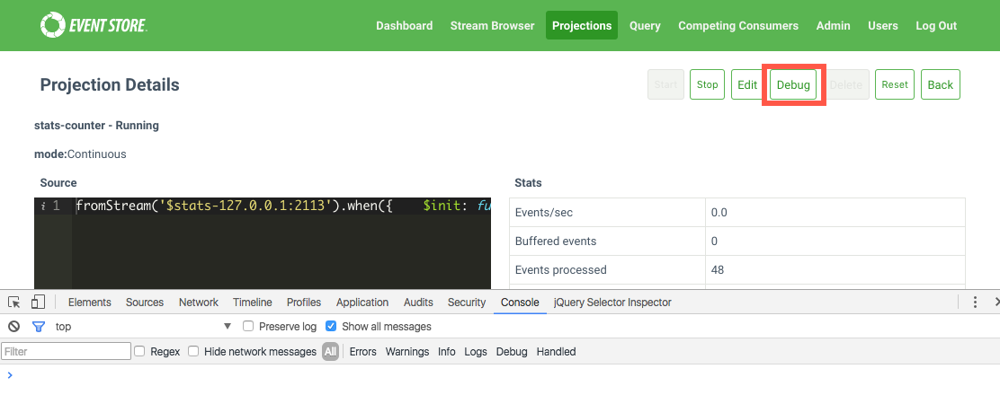
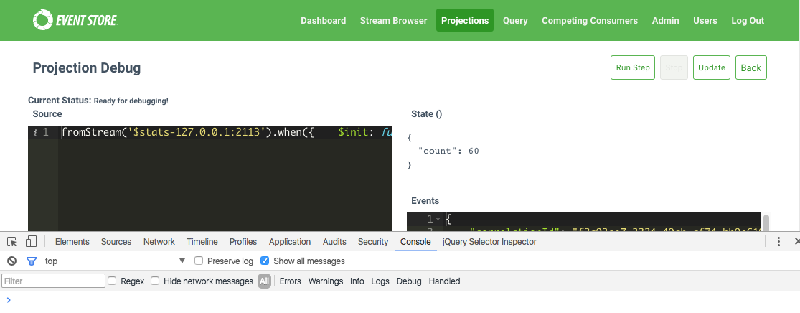
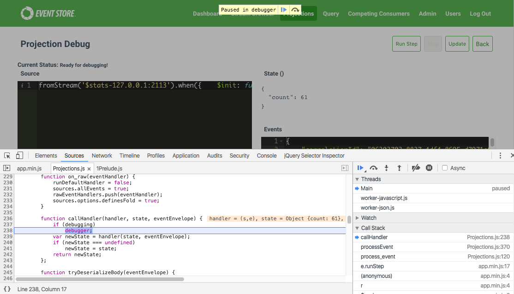

# Debugging

[User projections you create in JavaScript](user-defined-projections.md) have a bonus that debugging is easier via any browser that ships with debugging capabilities. The screenshots in this document show the use of Chrome, but we have tested debugging with all major browsers including Firefox, Edge and Safari.

## Logging from within a projection

For debugging purposes, projections includes a log method which, when called, sends messages to the configured EventStoreDB logger (the default is `NLog`, to a file, and `stdout`).

You might find printing out the structure of the event body for inspection useful.

For example:

```javascript
fromStream('$stats-127.0.0.1:2113')
.when({
    $any: function(s,e){
        log(JSON.stringify(e));
    }
})
```

## Creating a sample projection for debugging purposes

Filename: _stats-counter.json_

Contents:

```javascript
fromStream('$stats-127.0.0.1:2113')
.when({
    $init: function(){
        return {
            count: 0
        }
    },
    $any: function(s,e){
        s.count += 1;
    }
})
```

You create the projection by making a call to the API and providing it with the definition of the projection.

```bash
curl -i -d@stats-counter.json \
  http://localhost:2113/projections/continuous?name=stats-counter%26type=js%26enabled=true%26emit=true%26trackemittedstreams=true \
  -u admin:changeit
```

## Debugging your first projection

Once the projection is running, open your browser and enable the developer tools. Once you have the developer tools open, visit your projection URL and you should see a button labelled _Debug_.

::: card 

:::

After clicking the projection "Debug" button, you see the debugging interface with the definition of the projection and information about the events the projection is processing on the right hand side.

At the top there are couple of buttons to take note of, specifically the _Run Step_ and _Update_ buttons. You use _Run Step_ to step through the event waiting in the queue, placing you in projection debugging mode. The _Update_ button provides you with a way to update the projection definition without having to go back to the projection itself and leave the context of the debugger.

::: card 

:::

If the _Run Step_ button is not greyed out and you click it, the browser has hit a breakpoint.

::: card 

:::

You are now able to step through the projection, the important method to step into is the `handler(state, eventEnvelope)` method.
