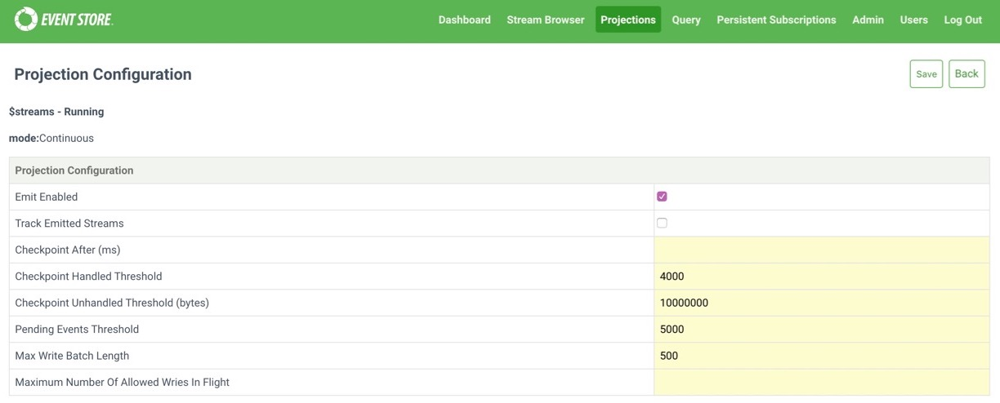

# Configuring projections

By changing these settings, you can lessen the amount of pressure projections put on an EventStoreDB node or improve projection performance. You can change these settings on a case-by-case basis, and monitor potential improvements.

::: warning
You can only change the configuration of a stopped projection.
:::

You change the configuration of a projection by setting the relevant key and value in a request, or when you create a projection with the web admin interface.



<!-- TODO: Further explanation here -->

@[code{curl}](../samples/projections/create-projection.sh)

## Emit options

These options control how projections append events.

In busy systems, projections can put a lot of extra pressure on the master node. This is especially true for EventStoreDB servers that also have persistent subscriptions running, which only the master node can process. If you see a lot of commit timeouts and slow writes from your projections and other clients, then start with these settings.

### Emit enabled

The `emit` boolean setting determines whether a projection can emit events and any projection that calls `emit()` or `linkTo()` requires it. If this option is not set and a projection attempts to emit events, you see an error message like the following:

<!-- TODO: Is it emit or emitenabled? Or are .NET and HTTP different -->

```bash
'emit' is not allowed by the projection/configuration/mode
```

EventStoreDB disables this setting by default, and is usually set when you create the projection and if you need the projection to emit events.

### Track emitted streams

The `trackemittedstreams` boolean setting enables tracking of a projection's emitted streams. It only has an affect if the projection has `EmitEnabled` enabled.

Tracking emitted streams enables you to delete a projection and all the streams that it has created. You should only the setting if you intend to delete a projection and create new ones that project to the same stream.

::: warning
By default, EventStoreDB disables the `trackemittedstreams` setting for projections. When enabled, an event appended records the stream name (in `$projections-{projection_name}-emittedstreams`) of each event emitted by the projection. This means that write amplification is a possibility, as each event that the projection emits appends a separate event. As such, this option is not recommended for projections that emit a lot of events, and you should enable only where necessary.
:::

::: tip
Between EventStoreDB versions 3.8.0 and 4.0.2, this option was enabled by default when a projection was created through the UI. If you have any projections created during this time frame, it's worth checking whether this option is enabled.
:::

### Max allowed writes in flight

<!-- TODO: Why is this not in the GUI for new projection? -->

The `MaxAllowedWritesInFlight` setting sets the maximum number of writes to allow for a projection. Because a projection can write to multiple different streams, it's possible for the projection to send multiple writes at the same time. This option sets the number of concurrent writes that a projection can perform.

By default, projections try to perform writes as quickly as they come. This can add a lot of pressure to a node, especially for projections that emit to many different streams. If you see your projections causing frequent commit timeouts or slow reads, you can try lowering this value to see if there is any improvement.

::: tip
Lower values may cause the projection to slow down as the number of writes are throttled, but the trade off for this is cleaner logs and fewer commit timeouts.
:::

By default, this is unbounded, allowing a projection to write as fast as it can.

### Max write batch length

<!-- TODO: Why is this not in the GUI for new projection? -->

The `MaxWriteBatchLength` setting sets the maximum number of events the projection can write in a batch at a time.

**Default:** `500` (events).

## Checkpoint options

Checkpoints store how far along a projection is in the streams it is processing from. There is a performance overhead with writing a checkpoint, as it does more than append an event, and writing them too often can slow projections down.

We recommend you try other methods of improving projections before changing these values, as checkpoints are an important part of running projections.

### Checkpoint after Ms

The `CheckpointAfterMs` setting prevents a new checkpoint from being written within a certain time frame from the previous one.
The setting is to keep a projection from writing too many checkpoints too quickly, something that can happen in a busy system.

The default setting is 0 seconds, which means there is no limit to how quickly checkpoints can be written.

### Checkpoint handled threshold

The `CheckpointHandledThreshold` setting controls the number of events that a projection can handle before attempting to write a checkpoint. An event is considered handled if it actually passed through the projection's filter. If the projection is set to checkpoint every 4,000 events, but it only reads from the `foo` stream, the projection only checkpoints every 4,000 `foo` events.

**Default:** `4000` (events).

### Checkpoint unhandled bytes threshold

The `CheckpointUnhandledBytesThreshold` setting specifies the number of bytes a projection can process before attempting to write a checkpoint. Unhandled bytes are the events that are not processed by the projection itself.

For example, if the projection reads from the `foo` stream, but writes from the `bar` stream comes through, a checkpoint is written after this number of bytes have been processed. This prevents the projection from having to read through a potentially large number of unrelated events again because none of them passed its filter.

**Default:** `10` (MiB).

## Processing options

### Pending events threshold

The `PendingEventsThreshold` setting determines the number of events that can be pending before the projection is paused.
Pausing the projection stops the projection from reading, allowing it to finish with the current events that are waiting to be processed. Once the pending queue has drained to half the threshold, the projection starts reading again.

**Default:** `5000` (events).
