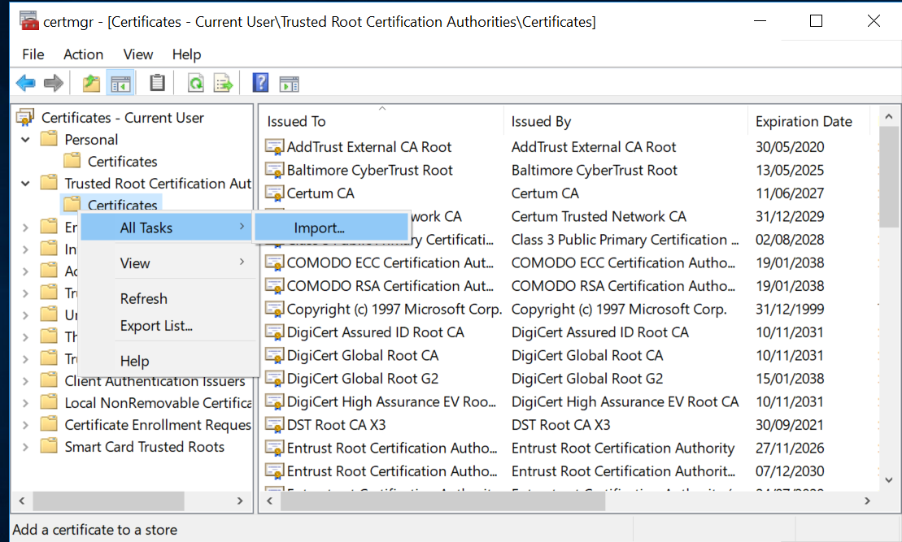

# Security

For production use it is important to configure EventStoreDB security features to prevent unauthorised access to your data.

Security features of EventStoreDB include:
 
- [User management](#authentication) for allowing users with different roles to access the database
- [Access Control Lists](#access-control-lists) to restrict access to specific event streams
- Encryption in-flight using HTTPS and TLS

## Protocol security

EventStoreDB supports the proprietary TCP protocol for high-throughput real-time communication, and the more traditional HTTP REST API for read and append operations, as well as for the management operations like scavenging, creating projections and so on. EventStoreDB also uses HTTP for the gossip seed endpoint, both internally for the cluster gossip, and internally for clients that connect to the cluster using discovery mode.

Both those protocols support encryption with TLS and SSL. Each protocol has its own security configuration, but you can only use one set of certificates for both TLS and HTTPS.

The process of creating certificates and instructing EventStoreDB to use them is different per platform. Please follow the platform-specific guidelines for setting up SSL and TLS:

- [Setting up SSL on Linux](#setting-up-ssl-on-linux)
- [Setting up SSL on Windows](#setting-up-ssl-on-windows)
- [Setting up SSL for Docker](#setting-up-ssl-for-docker)

These guidelines also include some platform-specific configuration settings, so you should be able to run a secure cluster after completing the steps described there.

### Setting up SSL on Linux

::: tip
This guide uses the latest Ubuntu LTS (18.04)
:::

#### Generate a certificate

First, create a private key and a self-signed certificate request (only for testing purposes):

```bash
openssl req \
  -x509 -sha256 -nodes -days 365 -subj "/CN=eventstore.com" \
  -newkey rsa:2048 -keyout eventstore.pem -out eventstore.csr
```

Export the p12 file from the certificate request. You will need this file when starting EventStoreDB:

```bash
openssl pkcs12 -export -inkey eventstore.pem -in eventstore.csr -out eventstore.p12
```

#### Trust the certificate

You need to add the certificate to Ubuntu's trusted certificates. Copy the cert to the _ca-certificates_ folder and update the certificates:

```bash
sudo cp eventstore.csr /usr/local/share/ca-certificates/eventstore.crt

sudo update-ca-certificates
```

The Mono framework has its own separate certificate store which you need to sync with the changes you made to Ubuntu certificates.

You first need to install `mono-devel` version 5.16.0 :

```bash
sudo apt install gnupg ca-certificates
sudo apt-key adv --keyserver hkp://keyserver.ubuntu.com:80 --recv-keys 3FA7E0328081BFF6A14DA29AA6A19B38D3D831EF
# Update "bionic" to match your Ubuntu version
echo "deb https://download.mono-project.com/repo/ubuntu stable-bionic/snapshots/5.16.0 main" | sudo tee /etc/apt/sources.list.d/mono-official-stable.list
sudo apt update

sudo apt-get install mono-devel
```

This process installs `cert-sync`, the tool you need for updating Mono certificate store with the new certificate:

```bash
sudo cert-sync eventstore.csr
```

#### Configure the server

Start EventStoreDB with the following configuration in the `eventstore.conf` file:

```yaml
CertificateFile: eventstore.p12
ExtSecureTcpPort: 1115
```

Read more about server security settings on [this page](configuration.md).

#### Connect to secure node

::::: tabs
:::: tab .NET API
When connecting to the secure node, you need to tell the client to use the secure connection.

```csharp
var settings = ConnectionSettings
    .Create()
    .UseSslConnection("eventstore.com", true);

using var conn = EventStoreConnection
    .Create(settings, new IPEndPoint(IPAddress.Loopback, 1115));

await conn.ConnectAsync();
```
::::
:::: tab HTTP API
When calling an HTTP endpoint, which uses a self-signed certificate, you'd need to tell the HTTP client to use the certificate, so it can ensure the SSL connection is legit. It is not required, if the certificate CA is trusted on the client machine.

```bash
curl -vk --cert <PATH_TO_CERT> --key <PATH_TO_KEY> -i -d "@event.json" "http://127.0.0.1:2113/streams/newstream" -H "Content-Type:application/vnd.eventstore.events+json"
```

::::
:::::

### Setting up SSL on Windows

Follow this guide to add a self-signed certificate to EventStoreDB.

#### Generate a certificate

First, create a certificate using PowerShell, and copy the thumbprint from the output:

```powershell
New-SelfSignedCertificate -DnsName eventstore.org, localhost -CertStoreLocation cert:\CurrentUser\My
```

The `cert:\CurrentUser\My` certificate location contains values to be used for `CertificateStoreLocation` (`CurrentUser`) and `CertificateStoreName` (`My`) settings.

The `eventstore.org` value should be used for the `CertificateSubjectName` setting, and `localhost` is the default value for the `SslTargetHost` setting.

#### Trust the certificate

To trust the new certificate, you have to import the certificate into the Trusted Root Certification Authorities:

1.  Press `WindowsKey + R`, and enter `certmgr.msc`.

::: card


:::

2.  Navigate to _Certificates -> Current User -> Personal -> Certificates_.

3.  Locate the certificate 'eventstore.com'.

::: card


:::

4.  _Right click_ on the certificate and click on _All Tasks -> Export_. Follow the prompts.

::: card


:::

5.  Navigate to _Certificates -> Current User -> Trusted Root Certification Authorities -> Certificates_.
6.  _Right click_ on the Certificates folder menu item and click _All Tasks -> Import_. Follow the prompts.

::: card



:::

#### Configure the server

Start EventStoreDB with the following configuration in the `eventstore.conf` file:

```yaml
CertificateStoreLocation: CurrentUser
CertificateStoreName: My
CertificateThumbPrint: {Insert Thumb Print from Step 1}
CertificateSubjectName: CN=eventstore.com
ExtSecureTcpPort: 1115
```

Read more about server security settings on [this page](configuration.md).

#### Connect to secure node

:::: tabs
::: tab .NET API
When connecting to the secure node, you need to tell the client to use the secure connection.

```csharp
var settings = ConnectionSettings
    .Create()
    .UseSslConnection("eventstore.com", true);

using var conn = EventStoreConnection
    .Create(settings, new IPEndPoint(IPAddress.Loopback, 1115));
await conn.ConnectAsync();
```
:::
::: tab HTTP API
When calling an HTTP endpoint, which uses a self-signed certificate, you'd need to tell the HTTP client to use the certificate, so it can ensure the SSL connection is legit. It is not required, if the certificate CA is trusted on the client machine.

```bash
curl -vk --cert <PATH_TO_CERT> --key <PATH_TO_KEY> -i -d "@event.json" "http://127.0.0.1:2113/streams/newstream" -H "Content-Type:application/vnd.eventstore.events+json"
```
:::
::::

### Setting up SSL for Docker

This example shows how to build own Docker image based on the original EventStoreDB image with a built-in self-signed certificate. The example should be modified before going to production by using real certificate.

Create file `Dockerfile` with following content:

```dockerfile
FROM eventstore/eventstore:release-5.0.11
RUN apt-get update -y \
  && apt-get install -y openssl \
  && openssl req -x509 -sha256 -nodes -days 3650 -subj "/CN=eventstore.org" -newkey rsa:2048 -keyout eventstore.pem -out eventstore.csr \
  && openssl pkcs12 -export -inkey eventstore.pem -in eventstore.csr -out eventstore.p12 -passout pass: \
  && openssl pkcs12 -export -inkey eventstore.pem -in eventstore.csr -out eventstore.pfx -passout pass: \
  && mkdir -p /usr/local/share/ca-certificates \
  && cp eventstore.csr /usr/local/share/ca-certificates/eventstore.crt \
  && update-ca-certificates \
  && apt-get autoremove \
  && apt-get clean \
  && rm -rf /var/lib/apt/lists/* /tmp/* /var/tmp/*
```

Build the image:

```bash
docker build -t eventstore/eventstore:with-cert-local --no-cache .
```

Run the container:

```bash
docker run --name eventstore-node -it -p 1113:1113 -p 1115:1115 -p 2113:2113 -e EVENTSTORE_CERTIFICATE_FILE=eventstore.p12 -e EVENTSTORE_EXT_SECURE_TCP_PORT=1115 eventstore/eventstore:with-cert-local
```

Notice we use port `1115` instead of default `1113`.

Use the following connection string for the TCP client:

```
"ConnectTo=tcp://localhost:1115;DefaultUserCredentials=admin:changeit;UseSslConnection=true;TargetHost=eventstore.org;ValidateServer=false",
```

Notice `ValidateServer` is set to `false` because we use a self-signed certificate. For production always use `ValidateServer=true`.

## Authentication

EventStoreDB supports authentication based on usernames and passwords out of the box. The Enterprise version also supports LDAP as the authentication source.

Authentication is applied to all HTTP endpoints, except `/info`, `/ping`, `/stats`, `/elections` (only `GET`), `/gossip` (only `GET`) and static web content.

### Default users

EventStoreDB provides two default users, `$ops` and `$admin`.

`$admin` has full access to everything in EventStoreDB. It can read and write to protected streams, which is any stream that starts with \$, such as `$projections-master`. Protected streams are usually system streams, for example, `$projections-master` manages some of the projections' states. The `$admin` user can also run operational commands, such as scavenges and shutdowns on EventStoreDB.

An `$ops` user can do everything that an `$admin` can do except manage users and read from system streams (except for `$scavenges` and `$scavenges-streams`).

### New users

New users created in EventStoreDB are standard non-authenticated users. Non-authenticated users are allowed `GET` access to the `/info`, `/ping`, `/stats`, `/elections`, and `/gossip` system streams.

`POST` access to the `/elections` and `/gossip` system streams is only allowed on the internal HTTP service.

By default, any user can read any non-protected stream unless there is an ACL preventing that.

### Externalised authentication

You can also use the trusted intermediary header for externalized authentication that allows you to integrate almost any authentication system with EventStoreDB. Read more about [the trusted intermediary header](#trusted-intermediary).

### Disable HTTP authentication

It is possible to disable authentication on all protected HTTP endpoints by setting the `DisableFirstLevelHttpAuthorization` setting to `true`. The setting is set to `false` by default. When enabled, the setting will force EventStoreDB to use the supplied credentials only to check the stream access using [ACLs](#access-control-lists). 

## Access Control Lists

By default, authenticated users have access to the whole EventStoreDB database. In addition to that, it allows you to use Access Control Lists (ACLs) to set up more granular access control. In fact, the default access level is also controlled by a special ACL, which is called the [default ACL](#default-acl).

### Stream ACL

EventStoreDB keeps the ACL of a stream in the streams metadata as JSON with the below definition:

```json
{
  "$acl": {
    "$w": "$admins",
    "$r": "$all",
    "$d": "$admins",
    "$mw": "$admins",
    "$mr": "$admins"
  }
}
```

These fields represent the following:

- `$w` The permission to write to this stream.
- `$r` The permission to read from this stream.
- `$d` The permission to delete this stream.
- `$mw` The permission to write the metadata associated with this stream.
- `$mr` The permission to read the metadata associated with this stream.

You can update these fields with either a single string or an array of strings representing users or groups (`$admins`, `$all`, or custom groups). It's possible to put an empty array into one of these fields, and this has the effect of removing all users from that permission.

::: tip
We recommend you don't give people access to `$mw` as then they can then change the ACL.
:::

### Default ACL

The `$settings` stream has a special ACL used as the default ACL. This stream controls the default ACL for streams without an ACL and also controls who can create streams in the system, the default state of these is shown below:

```json
{
  "$userStreamAcl": {
    "$r": "$all",
    "$w": "$all",
    "$d": "$all",
    "$mr": "$all",
    "$mw": "$all"
  },
  "$systemStreamAcl": {
    "$r": "$admins",
    "$w": "$admins",
    "$d": "$admins",
    "$mr": "$admins",
    "$mw": "$admins"
  }
}
```

You can rewrite these to the `$settings` stream with the following request:

@[code{curl}](@samples/default-settings.sh)

The `$userStreamAcl` controls the default ACL for user streams, while all system streams use the `$systemStreamAcl` as the default.

::: tip
The `$w` in `$userStreamAcl` also applies to the ability to create a stream. Members of `$admins` always have access to everything, you cannot remove this permission.
:::

When you set a permission on a stream, it overrides the default values. However, it's not necessary to specify all permissions on a stream. It's only necessary to specify those which differ from the default.

Here is an example of the default ACL that has been changed:

```json
{
  "$userStreamAcl": {
    "$r": "$all",
    "$w": "ouro",
    "$d": "ouro",
    "$mr": "ouro",
    "$mw": "ouro"
  },
  "$systemStreamAcl": {
    "$r": "$admins",
    "$w": "$admins",
    "$d": "$admins",
    "$mr": "$admins",
    "$mw": "$admins"
  }
}
```

This default ACL gives `ouro` and `$admins` create and write permissions on all streams, while everyone else can read from them. Be careful allowing default access to system streams to non-admins as they would also have access to `$settings` unless you specifically override it.

Refer to the documentation of the HTTP API or SDK of your choice for more information about changing ACLs programmatically.

## Trusted intermediary

The trusted intermediary header helps EventStoreDB to support a common security architecture. There are thousands of possible methods for handling authentication and it is impossible for us to support them all. The header allows you to configure a trusted intermediary to handle the authentication instead of EventStoreDB.

A sample configuration is to enable OAuth2 with the following steps:

- Configure EventStoreDB to run on the local loopback.
- Configure nginx to handle OAuth2 authentication.
- After authenticating the user, nginx rewrites the request and forwards it to the loopback to EventStoreDB that serves the request.

The header has the form of `{user}; group, group1` and the EventStoreDB ACLs use the information to handle security.

```http
ES-TrustedAuth: "root; admin, other"
```

Use the following option to enable this feature:

| Format               | Syntax                            |
|:---------------------|:----------------------------------|
| Command line         | `--enable-trusted-auth`           |
| YAML                 | `EnableTrustedAuth`               |
| Environment variable | `EVENTSTORE_ENABLE_TRUSTED_AUTH ` |

**Default**: none

## Security options

On this page you find all the configuration options related to in-flight security of EventStoreDB.

### Certificates configuration

SSL certificates can be created with a common name that includes the machine DNS name or IP address. You can instruct EventStoreDB to check the incoming connection certificate to have such a common name, so the node can be sure that it's another cluster node, which is trying to connect.

| Format               | Syntax                       |
|:---------------------|:-----------------------------|
| Command line         | `--ssl-target-host`          |
| YAML                 | `SslTargetHost`              |
| Environment variable | `EVENTSTORE_SSL_TARGET_HOST` |

**Default**: n/a

The certificate validation setting tells EventStoreDB to ensure that the incoming connection uses the trusted certificate. This setting should normally be set to `true` for production environments. It will only work if the cluster nodes use certificated signed by the trusted public CA. In case of self-signed certificates, the CA certificate needs to be added to the trusted certificate store of the machine.

| Format               | Syntax                           |
|:---------------------|:---------------------------------|
| Command line         | `--ssl-validate-server`          |
| YAML                 | `SslValidateServer`              |
| Environment variable | `EVENTSTORE_SSL_VALIDATE_SERVER` |

**Default**: `true`, so the server will only accept connection that use trusted certificates.

It is possible to configure cluster nodes to check if the connecting party is another node by setting the expected common name of the certificate. When the EventStoreDB server receives the incoming connection with a matching CN, it will assume it is another cluster node. Omitting this setting increases the risk of malicious actors connecting to the cluster and pretending to be cluster nodes.

| Format               | Syntax                                |
|:---------------------|:--------------------------------------|
| Command line         | `--certificate-subject-name`          |
| YAML                 | `CertificateSubjectName`              |
| Environment variable | `EVENTSTORE_CERTIFICATE_SUBJECT_NAME` |

Other certificate settings determine the location of the certificate to be used by the cluster node. Configuration for the certificate location is platform-specific.

#### Windows

Check the [SSL on Windows](#setting-up-ssl-on-windows) guidelines for detailed instructions.

The certificate store location is the location of the Windows certificate store, for example `CurrentUser`.

| Format               | Syntax                                  |
|:---------------------|:----------------------------------------|
| Command line         | `--certificate-store-location`          |
| YAML                 | `CertificateStoreLocation`              |
| Environment variable | `EVENTSTORE_CERTIFICATE_STORE_LOCATION` |

The certificate store name is the name of the Windows certificate store, for example `My`.

| Format               | Syntax                              |
|:---------------------|:------------------------------------|
| Command line         | `--certificate-store-name`          |
| YAML                 | `CertificateStoreName`              |
| Environment variable | `EVENTSTORE_CERTIFICATE_STORE_NAME` |

You need to add the certificate thumbprint setting on Windows so the server can ensure that it's using the correct certificate found in the certificates store.

| Format               | Syntax                              |
|:---------------------|:------------------------------------|
| Command line         | `--certificate-thumbprint`          |
| YAML                 | `CertificateThumbprint`             |
| Environment variable | `EVENTSTORE_CERTIFICATE_THUMBPRINT` |

#### Linux

Check the [SSL on Linux](#setting-up-ssl-on-linux) guidelines for detailed instructions.

The `CertificateFile` setting needs to point to the certificate file, which will be used by the cluster node.

| Format               | Syntax                        |
|:---------------------|:------------------------------|
| Command line         | `--certificate-file`          |
| YAML                 | `CertificateFile`             |
| Environment variable | `EVENTSTORE_CERTIFICATE_FILE` |

If the certificate file is protected by password, you'd need to set the `CertificatePassword` value accordingly, so the server can load the certificate.

| Format               | Syntax                            |
|:---------------------|:----------------------------------|
| Command line         | `--certificate-password`          |
| YAML                 | `CertificatePassword`             |
| Environment variable | `EVENTSTORE_CERTIFICATE_PASSWORD` |

### Protocol configuration

EventStoreDB supports encryption for both TCP and HTTP. Each protocol can be made secure on its own.

Unlike HTTP, which will use the internal HTTP port setting for SSL connections, secure TCP port needs to be specified explicitly.

| Format               | Syntax                           |
|:---------------------|:---------------------------------|
| Command line         | `--int-secure-tcp-port`          |
| YAML                 | `IntSecureTcpPort`               |
| Environment variable | `EVENTSTORE_INT_SECURE_TCP_PORT` |

**Default**: `0`, you need to specify the port for secure TCP to work.

If you use some kind of port mapping between the actual internal TCP port and the port, which is exposed to other machines in the subnet, you can use the `IntSecureTcpPortAdvertiseAs` setting to instruct EventStoreDB cluster node to use a different port value for the internal gossip.

| Format               | Syntax                                        |
|:---------------------|:----------------------------------------------|
| Command line         | `--int-secure-tcp-port-advertise-as`          |
| YAML                 | `IntSecureTcpPortAdvertiseAs`                 |
| Environment variable | `EVENTSTORE_INT_SECURE_TCP_PORT_ADVERTISE_AS` |

**Default**: `0`, the internal secure TCP port will be advertised using the value of the `IntSecureTcpPort` setting.

For external clients to connect over the secure TLS channel, you'd need to set the `ExtSecureTcpPort` setting. Use the port value in the connection settings of your applications.

| Format               | Syntax                           |
|:---------------------|:---------------------------------|
| Command line         | `--ext-secure-tcp-port`          |
| YAML                 | `ExtSecureTcpPort`               |
| Environment variable | `EVENTSTORE_EXT_SECURE_TCP_PORT` |

**Default**: `0`, the setting must be set when enabling TLS.

As for the `InternalTcpPortAdvertiseAs`, the same can be done for the external TCP port if the exposed port on the machine doesn't match the port exposed to the outside world. The setting value will be used for the gossip endpoint response for connecting clients.

| Format               | Syntax        |
|:---------------------|:--------------|
| Command line         | `--`          |
| YAML                 | ``            |
| Environment variable | `EVENTSTORE_` |

**Default**: `0`, so the external gossip endpoint will advertise the value specified in the `ExtSecureTcpPort`

You can fully disable insecure TCP connection by setting `DisableInsecureTCP` to `false`. By default, even if TLS is enabled, it would be still possible to connect via TCP without using TLS, unless this setting is changed.

| Format               | Syntax                            |
|:---------------------|:----------------------------------|
| Command line         | `--disable-insecure-tcp=VALUE`    |
| YAML                 | `DisableInsecureTCP`              |
| Environment variable | `EVENTSTORE_DISABLE_INSECURE_TCP` |

**Default**: `false`, so clients can connect via insecure TCP.

### Internal secure communication

By default, cluster nodes use internal HTTP and TCP ports and communicate without applying any transport security. This can be changed by setting the `UseInternalSsl` setting to `true`.

| Format               | Syntax                        |
|:---------------------|:------------------------------|
| Command line         | `--use-internal-ssl`          |
| YAML                 | `UseInternalSsl`              |
| Environment variable | `EVENTSTORE_USE_INTERNAL_SSL` |

**Default**: `false`, nodes within the cluster communicate over plain HTTP and TCP


