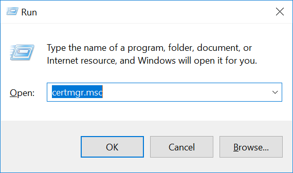
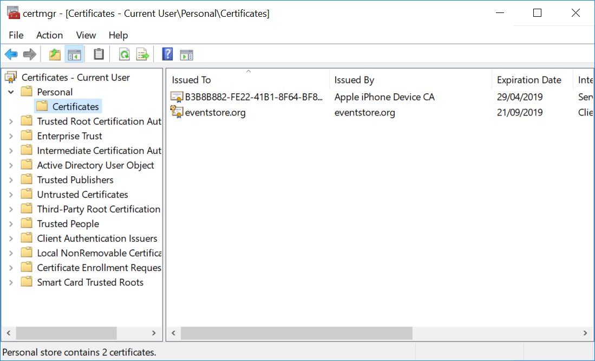

# Setting up SSL on Windows

Follow this guide to add a self-signed certificate to EventStoreDB.

## Generate a certificate

First, create a certificate using PowerShell, and copy the thumbprint from the output:

```powershell
New-SelfSignedCertificate -DnsName eventstore.org, localhost -CertStoreLocation cert:\CurrentUser\My
```

The `cert:\CurrentUser\My` certificate location contains values to be used for `CertificateStoreLocation` (`CurrentUser`) and `CertificateStoreName` (`My`) settings.

The `eventstore.org` value should be used for the `CertificateSubjectName` setting, and `localhost` is the default value for the `SslTargetHost` setting.

## Trust the certificate

To trust the new certificate, you have to import the certificate into the Trusted Root Certification Authorities:

1.  Press `WindowsKey + R`, and enter `certmgr.msc`.

::: card



:::

2.  Navigate to _Certificates -> Current User -> Personal -> Certificates_.

3.  Locate the certificate 'eventstore.com'.

::: card



:::

4.  _Right click_ on the certificate and click on _All Tasks -> Export_. Follow the prompts.

::: card


:::

5.  Navigate to _Certificates -> Current User -> Trusted Root Certification Authorities -> Certificates_.
6.  _Right click_ on the Certificates folder menu item and click _All Tasks -> Import_. Follow the prompts.

::: card


:::

## Configure the server

Start EventStoreDB with the following configuration in the `eventstore.conf` file:

```yaml
CertificateStoreLocation: CurrentUser
CertificateStoreName: My
CertificateThumbPrint: {Insert Thumb Print from Step 1}
CertificateSubjectName: CN=eventstore.com
ExtSecureTcpPort: 1115
```

Read more about server security settings on [this page](configuration.md).

## Connect to secure node

:::: tabs
::: tab .NET API
When connecting to the secure node, you need to tell the client to use the secure connection.

```csharp
var settings = ConnectionSettings
    .Create()
    .UseSslConnection("eventstore.com", true);

using var conn = EventStoreConnection
    .Create(settings, new IPEndPoint(IPAddress.Loopback, 1115));
await conn.ConnectAsync();
```
:::
::: tab HTTP API
When calling an HTTP endpoint, which uses a self-signed certificate, you'd need to tell the HTTP client to use the certificate, so it can ensure the SSL connection is legit. It is not required, if the certificate CA is trusted on the client machine.

```bash
curl -vk --cert <PATH_TO_CERT> --key <PATH_TO_KEY> -i -d "@event.json" "http://127.0.0.1:2113/streams/newstream" -H "Content-Type:application/vnd.eventstore.events+json"
```
:::
::::
