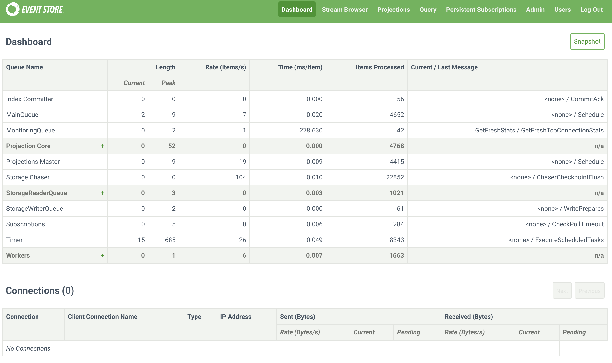
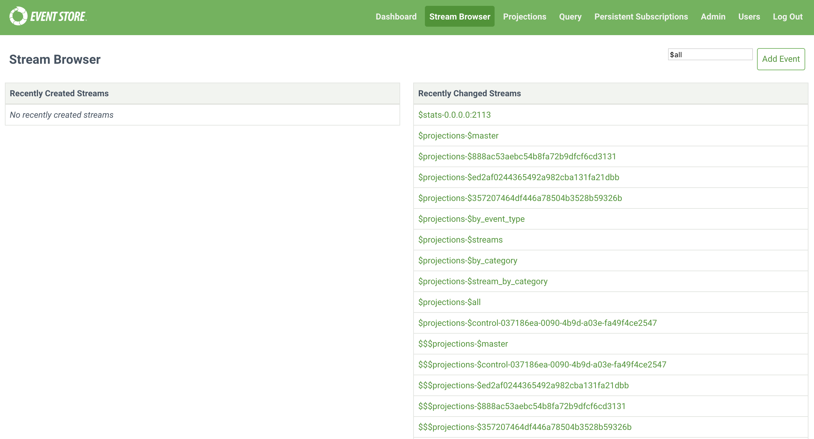
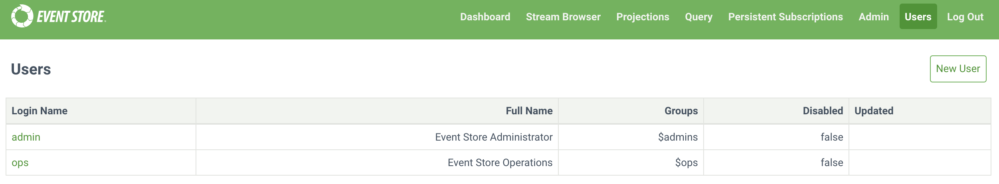

# Admin UI

The KurrentDB Admin UI is available at _SERVER_IP:2113_ and helps you interact with and visually manage a cluster. This guide explains the interface's tabs and their functions.

::: tip
The embedded EventStoreDB web interface is reaching its end of life. We are working on a replacement, and you can try using the Early Preview of [Event Store Navigator](https://navigator.kurrent.io/) app instead. It doesn't have full feature parity with the embedded web UI, but it already has usability improvements compared to it.
:::

## Dashboard

The _Dashboard_ tab shows an overview of active queues with associated statistics in the top half. The _+_ icon indicates a queue group; click it to reveal the queues in that group.

The second half of the tab shows active connections to KurrentDB and information about them.

Click the _Snapshot_ button in the top right to output a snapshot of all queue statistics at the time you clicked the button.

## Stream browser

The _Stream Browser_ tab gives an overview of recently created and changed streams, clicking on an individual stream shows details about the individual stream.

### Event stream

Each stream shows pages of the events in a stream with an overview of the event. Click the _Name_ to see the EventId, and _JSON_ to see the event data. The buttons above change depending on what you are viewing in the interface. The _Back_ button takes you to the parent screen.

The buttons on the top right when you are viewing an event stream are:

- _Pause_: Stop showing events arriving into this stream.
- _Resume_: Resume showing events arriving into this stream.
- _Edit ACL_: Edit [the access control lists](../security/user-authorization.md#access-control-lists) for a stream.
- _Add Event_: [Add a new event](@clients/grpc/appending-events.md) to the stream.
- _Delete_: [Delete a stream](@clients/grpc/delete-stream.md#soft-delete) to the stream.
- _Query_:

The buttons on the left above the events when you are viewing an event stream are:

- _self_: Takes you to the overview of the stream.
- _first_: Takes you to the first page of events in a stream.
- _previous_: Takes you to the previous page of events in a stream.
- _metadata_: Shows the metadata of a stream.
  - On the metadata screen, click _Add New Like This_ to add a new event to the stream.

## Projections

The _Projections_ tab shows system and user-created projections defined in KurrentDB. The buttons above the list do the following:

- _Disable All_: Disable all running projections.
- _Enable All_: Enable all stopped projections.
- _Include Queries_: Toggle displaying queries in the Projections table.
- _New Projection_: [Create a user-defined projection](projections/custom.md) with the Admin UI.

Clicking an individual projection shows further details.

On the left is the projection definition. On the right are the stats, results, and projection state. The buttons above the details do the following:

- _Start_: Start a stopped projection.
- _Stop_: Stop a running projection.
- _Edit_: Edit the projection definition.
- _Config_: [Set configuration options](projections/custom.md#configuring-projections) for a projection.
- _Debug_: Opens [the debugging interface](projections/custom.md#debugging) to debug what effect a projection has on events.
- _Delete_: Delete a projection.
- _Reset_: Reset a projection.
- _Back_: Returns you to the parent screen.

## Query

The _Query_ tab has a code editor field where you can create transient and short-lived projections to analyze your event streams quickly.

## Persistent subscriptions

The _Persistent Subscriptions_ tab shows an overview of [persistent subscriptions](persistent-subscriptions.md) configured on streams. The button above the list does the following:

- _New Subscription_: Create a new subscription.

Clicking the _+_ icon next to a stream name reveals the subscription name and more buttons. The _Back_ button takes you to the parent screen.

- _Edit_: Edit the subscription.
- _Delete_: Delete the subscription.
- _Detail_: Shows the subscription configuration options.
- _Replay Parked Messages_: Replay events in subscription to return state.

## Admin

The _Admin_ tab shows subsystems enabled (currently only [projections](projections/README.md)) on KurrentDB and [scavenges](../operations/scavenge.md) run. You can start a new scavenge operation by clicking the _Scavenge_ button, and shut KurrentDB down by clicking the _Shutdown Server_ button.

## Users

The _Users_ tab shows [the users defined in KurrentDB](../security/user-authentication.md). Clicking an individual user displays a JSON representation of that user's details.

## Log out

Logs you out of the Admin UI interface.
