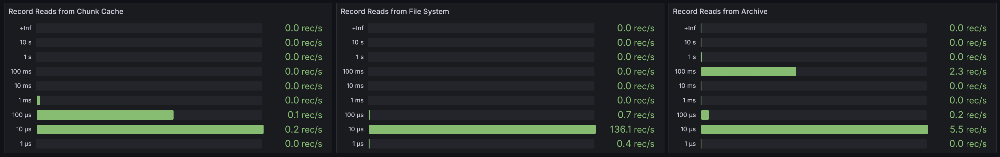

# Archiving

## Introducing Archiving

KurrentDB 25.0 introduces the initial release of Archiving: a new major feature to reduce costs and increase scalability of a KurrentDB cluster.

Future releases of KurrentDB will build on and improve this feature.

A [license key](../quick-start/installation.md#license-keys) is required to use this feature.

## Motivation

KurrentDB databases can become very large. Typical KurrentDB deployments require low latency, high throughput access to the data, and so employ large, expensive volumes attached to each node in the cluster. The size of the database can be controlled by deleting data, but only if that data is no longer needed. Often, a large proportion of the data can become old enough that, although it is still required for occasional reads, it is not read frequently, and need not be read quickly. Until now, this 'cold' data has necessarily been stored on the same volumes as the hot data, taking up space and adding to the expense of running a high performance cluster.

With the new Archiving feature, data is uploaded to cheaper storage such as Amazon S3 and then can be removed from the volumes attached to the cluster nodes. The volumes can be correspondingly smaller and cheaper. The nodes are all able to read the archive, and when a read request from a client requires data that is stored in the archive, the node retrieves that data from the archive transparently to the client.

The extra copy of the data in S3 also acts as a backup that is kept up to date as each chunk of data is written to the log.

## Operation

### Summary

- Data written to the database is replicated to all nodes in the deployment as normal.
- A designated _Archiver Node_ is responsible for uploading chunk files into the _archive_.
- Nodes can then remove chunks from their local volumes to save space according to a _retention policy.
- Read requests read transparently through to the archive as necessary.

### Populating the Archive

- A designated _Archiver Node_ uploads chunk files to the archive as they are completed. The contents of each chunk file are the same as they were locally, except that merged chunks are unmerged for upload to make them trivial to locate.
- Only chunk files are uploaded. PTables, Scavenge.db etc remain local to each node.
- The Archiver Node stores an archive checkpoint in the archive indicating how much of the log has been uploaded to the archive.
- The Archiver Node is also a _Read-only Replica_ and does not participate in cluster elections/replication criteria. At the moment Read-only replicas can only be used in 3+ node clusters, and not single node deployments.

### Removal of data from node volumes

- All nodes can delete chunks from their local volumes.
- The removal is performed during the Scavenge operation.
- Chunks are removed only after they have been uploaded to the archive.
- Chunks are removed only after they no longer meet the simple user defined retention policy.

## Configuration

Sample configuration:

The following can be placed on all nodes (including the Archiver Node)

```yaml
Licensing:
  LicenseKey: <your key>

Archive:
  Enabled: true

  RetainAtLeast:
    Days: 30
    LogicalBytes: 500000000

  StorageType: S3
  S3:
    Region: eu-west-1
    Bucket: kurrentdb-cluster-123-archive
```

Additionally this can be placed on the Archiver Node to designate it as the Archive Node.

```yaml
ReadOnlyReplica: true
Archiver: true
```

The Archiver Node is a read-only replica and does not participate in quorum activities. It must be a separate node to the main cluster nodes. e.g. If you have a three node cluster, you will need a fourth node to be the archiver. If you already have a read-only replica as a forth node then it is possible to use it as the Archiver Node.

`RetainAtLeast` is the retention policy for what to retain in the local volume for each node. It does not affect which chunks are uploaded to the archive by the Archiver Node (which will upload all completed chunks). If a chunk contains any data less than `RetainAtLeast:Days` old, then it will not be removed locally. If a chunk contains any data that is within `RetainAtLeast:LogicalBytes` of the tail of the log (strictly: the `scavenge point` of the current scavenge) then it will not be removed locally.

`StorageType` must currently be set to `S3`. Other cloud providers may be supported in the future, please contact us if you are interested.

::: warning
Do not use the same archive bucket for multiple clusters, and do not run more than one Archiver node in a single cluster.
:::

### Credentials

This section is a work in progress. Access to the archive will work if the AWS CLI is set up on the machine. Other scenarios are in progress.

## Metrics

The metrics relevant to Archiving in particular are `eventstore_logical_chunk_read_distribution_bucket` and `eventstore_io_record_read_duration_seconds_bucket` described in the [metrics](../diagnostics/metrics.md#events) documentation.

The panels are available in the `Events Served` section of the [miscellaneous panels](https://grafana.com/grafana/dashboards/19461-eventstore-panels/) dashboard.




## Limitations

This initial release has several limitations that we intend to improve in future releases.

Work on the following items is about to begin / has begun:
- The headers of archived chunks are read on startup, just for local chunks. This will increase startup times when there are a lot of chunks in the archive.
- Once uploaded to the archive, the chunks there are not scavenged.
- Clients cannot yet opt out of their read reading from the archive.
- Repeated reads of the same part of the archive are not cached locally.

Work on the following items may be added according to demand

- At the moment only S3 is supported. A local file-system based archive exists for development/testing purposes. Other cloud providers could be supported later.
