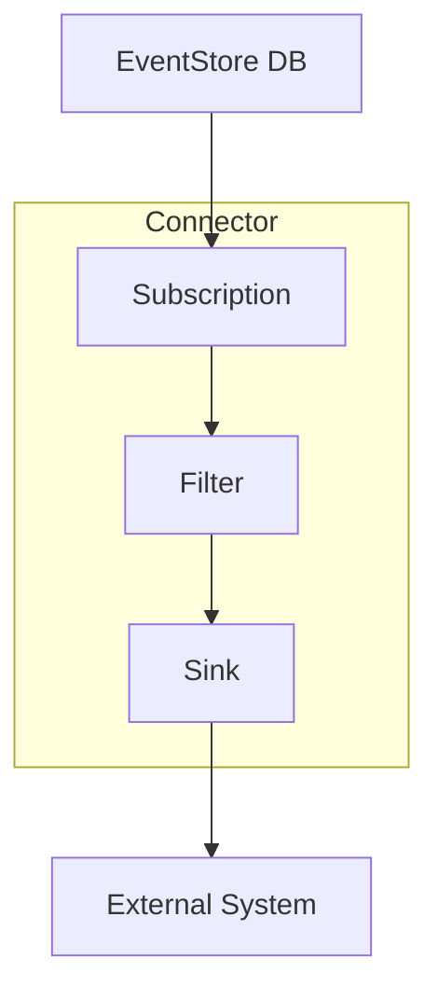
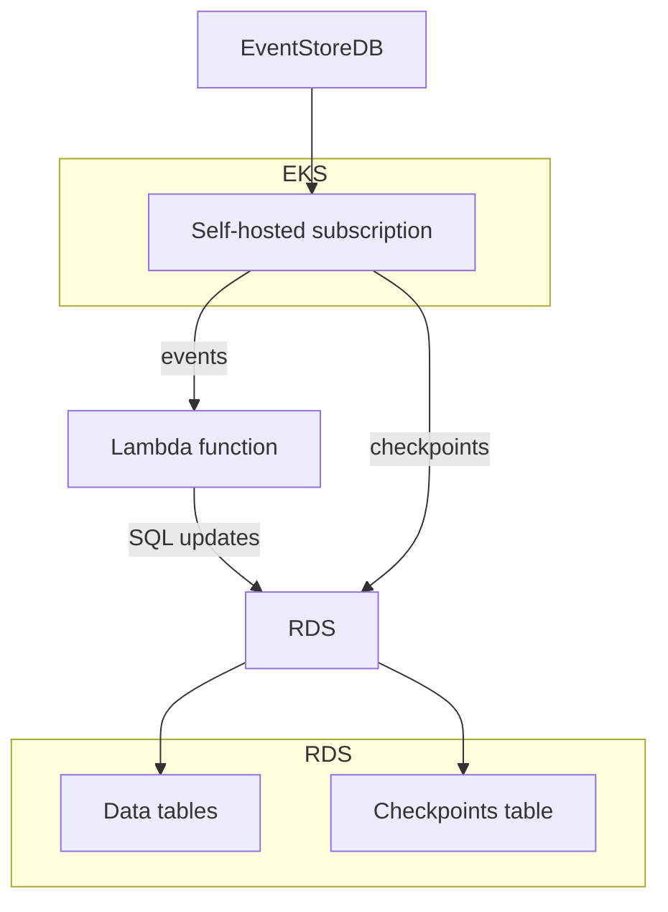
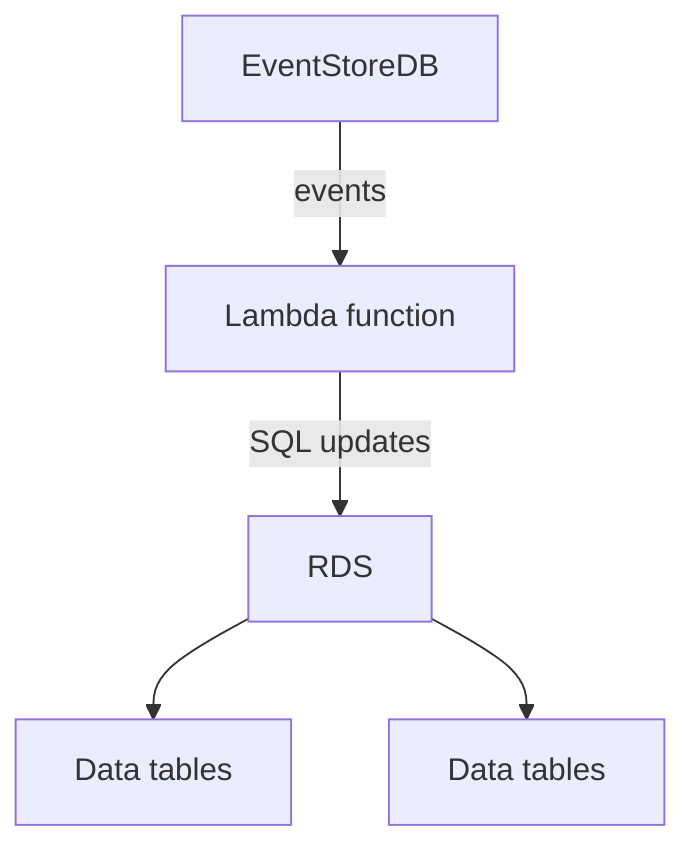

---
dir:
  text: "Connectors"
  order: 1
---

# Understanding Connectors

Connectors make it easy to integrate EventStoreDB data into other systems.

Each connector runs on the server-side and uses a catch-up subscription to receive events, filter or transform them, and push them to an external system via a [sink](https://en.wikipedia.org/wiki/Sink_(computing)).

<!-- 
 -->

This reduces the amount of work needed to process data from EventStoreDB instances and makes it easy to create data pipelines to implement complex use cases.

::: info
The Connector plugin is pre-installed in all EventStoreDB binaries and is enabled by default.
:::

## Motivation

Currently, a pain point that users experience is that, on one hand, they have a convenient EventStoreDB cloud service, on the other hand, they have a convenient downstream database or processing engine, but there's nothing in between.
As a result, users need to host and maintain their own solution in their own infrastructure for subscribing to EventStoreDB and sending the events to a downstream service.
This solution in the middle often needs to be highly available and needs to manage its own checkpoints: this quickly becomes cumbersome.

EventStore Connectors remove the need for users to develop, host and maintain such a solution.

As an example, a developer want to send events to a lambda function, which projects events to an RDS instance.

Without connectors, it requires the developer to implement a subscription service. Such service then needs to be hosted, observed, and maintained. It also needs to manage its own checkpoints.

In addition, the subscription service that uses a catch-up subscription would need to run as a single instance to ensure ordered event processing. As a consequence, it becomes a single point of failure.

<!-- 
 -->

With connectors, the subscription service is provided natively by EventStoreDB and the lambda function acts as the sink. For this particular example, the lambda function requires an accessible HTTP endpoint, or to be exposed via the AWS API Gateway.

<!-- 
 -->

