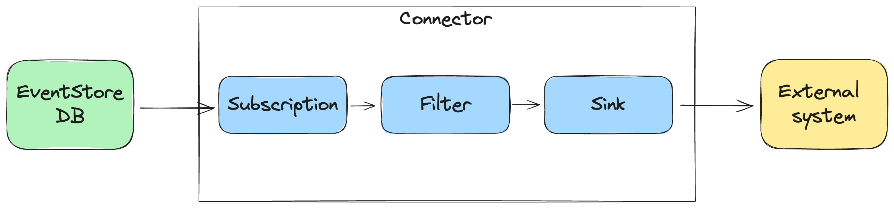
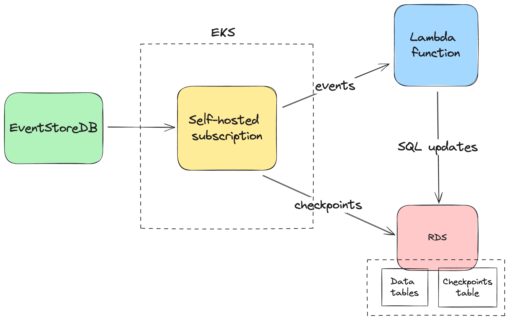
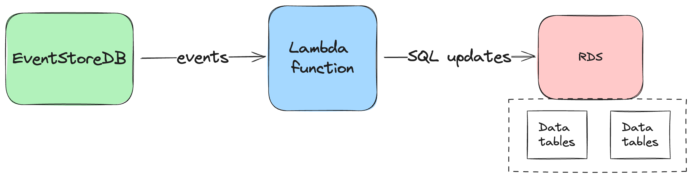

# Connectors Preview Introduction <Badge text="alpha" type="warning" vertical="middle"/>

Welcome to the Connectors Early Preview program!

::: note
The Connector plugin is pre-installed in commercial versions of EventStoreDB and is enabled by default.
:::

Connectors make it easy to integrate EventStoreDB data into other systems.

Each connector runs on the server-side and uses a catch-up subscription to receive events, filter or transform them, and push them to an external system via a [sink](https://en.wikipedia.org/wiki/Sink_(computing)).

This reduces the amount of work needed to process data from EventStoreDB instances and makes it easy to create data pipelines to implement complex use cases.

In this preview, there are three sinks:

- [Logger Sink](./sinks/logger.md) for experimentation
- [HTTP Sink](./sinks/http.md) for sending events to an HTTP endpoint
- [Kafka Sink](./sinks/kafka.md) for sending events to a Kafka topic

## Motivation

Currently, a pain point that users experience is that, on one hand, they have a convenient EventStoreDB cloud service, on the other hand, they have a convenient downstream database or processing engine, but there's nothing in between. As a result, users need to host and maintain their own
solution in their own infrastructure for subscribing to EventStoreDB and
sending the events to a downstream service. This solution in the middle often needs to be highly available and needs to manage its own checkpoints: this quickly becomes cumbersome.

EventStore Connectors remove the need for users to develop, host and maintain such a solution.

As an example, a developers want to send events to a lambda function, which projects events to an RDS instance.

Without connectors, it requires to implement a subscription service. Such service then needs to be hosted, observed, and maintained. It also needs to manage its own checkpoints.

In addition, the subscription service that uses a catch-up subscription would need to run as a single instance to ensure ordered event processing. As a consequence, it becomes a single point of failure.

With connectors, the subscription service is provided by EventStoreDB, and the lambda function can be the sink. For this particular example, the lambda function would need an accessible HTTP endpoint, or be exposed via the AWS API Gateway.

## Preview goals

We will collect your input and feedback during the connectors preview program to:

* Validate the approach
* Identify important areas for improvement
* Allow EventStoreDB users to collaborate and contribute to the product
* Iteratively improve and gather more feedback

## Further plans

Although the Connectors plugin will be available to everyone running on the
leader node, some sinks, such as the Kafka one, will be made commercial. We will open
up the preview program to a wider audience in the coming months.

Further, we plan to:
* Add more sinks
* Allow concurrent processing of events
