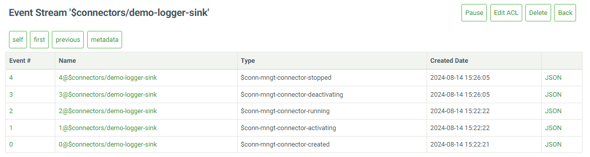
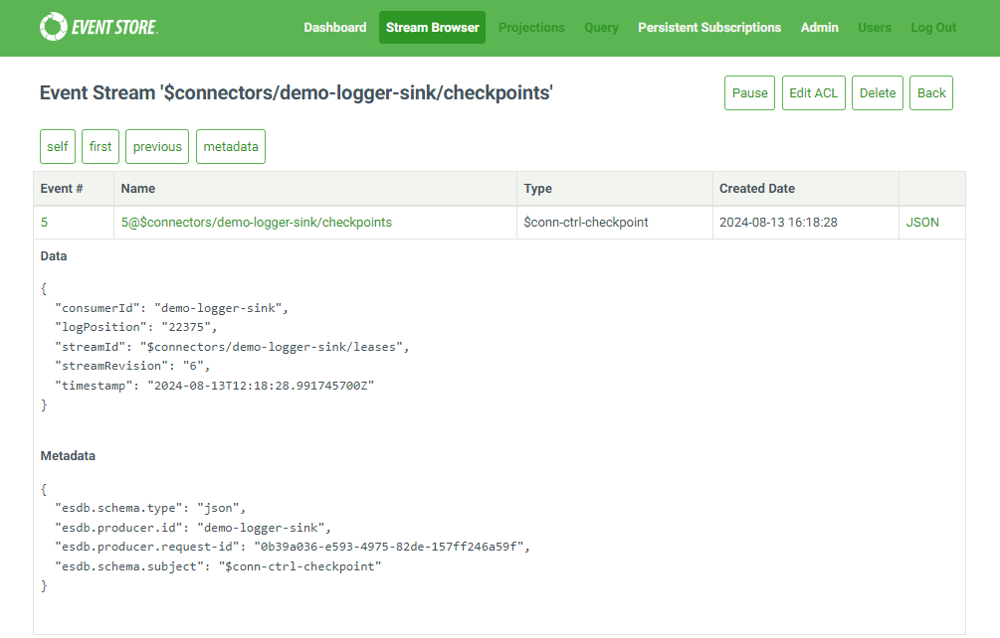
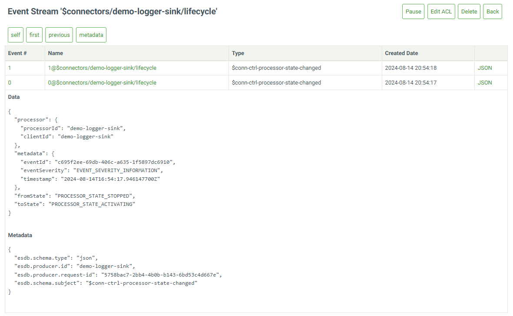
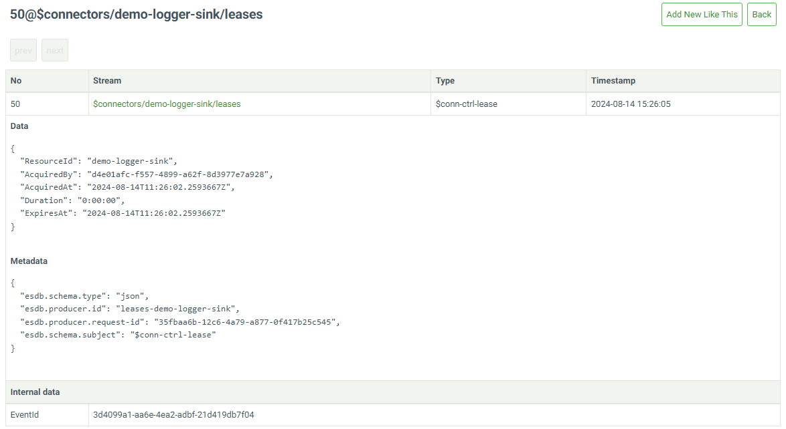

# Technical Details

## Delivery guarantees

Currently, connectors only support _at least once_ delivery guarantees, meaning
that events may be delivered more than once. Events are delivered _in order_,
ensuring that event `x` is not delivered until all preceding events have been
delivered.

Often, the system receiving the events will keep track of the position and the
ID of the last event it has received. This allows the system to easily identify
and discard any duplicate deliveries.

#### Resilience Mechanism

All connectors are have a built-in resilience mechanism to ensure the reliable
delivery of data and messages, preserving system integrity and minimizing
downtime during unexpected disruptions.

The default resilience strategy has key features that include:

1. **Automatic Retries**: Connectors are configured to automatically retry
   failed operations due to transient errors. By default, retries are indefinite,
   but developers can specify a limit based on application needs.

2. **Exponential Backoff**: To prevent system overload during retries, an
   exponential backoff strategy is used with three distinct phases:

   - **Phase 1**: Initial retries have a 5-second delay, continuing for up to 1
     minute, aimed at resolving short-lived issues quickly.
   - **Phase 2**: If the problem persists, the delay increases to 10 minutes,
     extending up to 1 hour to allow time for more significant issues to resolve.
   - **Phase 3**: For prolonged errors, retries occur with a fixed 1-hour delay
     to address persistent issues that require more time to resolve.

3. **Checkpointing**: Connectors periodically save the position of the last
   successfully processed event so that it can resume from the last successful
   point in the event of a restart or failure. See [Checkpointing](#checkpointing-stream)
   for more details.

> **Note:** You can find how to configure resilience for each sink in the
> the [individual sink documentation](./sinks.md#built-in-sinks).

## Lifecycle Management

When a connector is created in EventStoreDB, it automatically creates 4 system streams.

The following system streams are created for every connector:

1. `$connectors/{connector-id}`
2. `$connectors/{connector-id}/checkpoints`
3. `$connectors/{connector-id}/lifecycle`
4. `$connectors/{connector-id}/leases`

### Management Stream

The `$connectors/{connector-id}` stream captures and stores events related to
the operational state of the connector. These events provide a detailed log of
the connector's status and transitions, making it easier to understand its
current state and historical behavior.

### Checkpointing Stream

Connectors periodically store the position of the last event that they have
successfully processed. Then, if the connector host is restarted, the connectors
can continue from close to where they got up to. The checkpoint information is
stored in the `$connectors/{connector-id}/checkpoints` system stream in
EventStoreDB.

Each connector has its own dedicated stream for storing checkpoints.

### Lifecycle Stream

The `$connectors/{connector-id}/lifecycle` stream tracks the state transitions
and significant lifecycle events of a connector within EventStoreDB. It records
the `$conn-ctrl-processor-state-changed` event, which document every change
in the connector’s operational state from starting and stopping to encountering
errors or other critical transitions.

### Leases Stream

The `$connectors/{connector-id}/leases` stream is used for managing leases in
the connectors plugin. Leases are a mechanism to ensure that only one instance
of a connector is active at a time, preventing multiple instances from
processing the same data concurrently. 

## High availability

Connectors are hosted on EventStoreDB nodes with high availability, but they
currently only operate on leader nodes. In the event of a node failure, the
connectors will be restarted on the newly elected leader node. Future releases
will enhance this functionality by supporting the deployment of
connectors across multiple nodes.

## Performance

The preview version of connectors will be optimized even further. We are
committed to enhancing the performance and scalability of our connectors. One of
the key improvements will be the introduction of sharded writes on every sink,
which will enable more efficient data distribution and processing.
