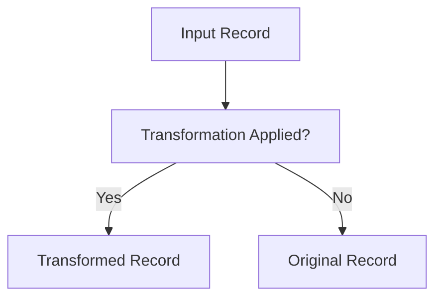
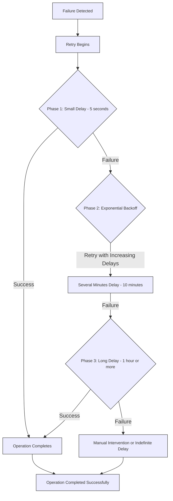

## Filters

All sink connectors supports filtering events using regular expressions, JsonPath expressions, or prefixes. The expression is first checked as a JsonPath, then as a regex, and if neither, it's used as a prefix for filtering.

::: info
By default, if no filter is specified, the system will consume from the `$all` stream, excluding system events.
:::

#### KurrentDB Record

When a connector consumes events from KurrentDB, you have access to the following objects that represent KurrentDB records:

```json
{
  "recordId": "string",
  "position": {
    "streamId": "string",
    "partitionId": "number"
  },
  "sequenceId": "number",
  "isRedacted": "boolean",
  "schemaInfo": {
    "subject": "string",
    "type": "string"
  },
  "headers": {},
  "value": {},
  "streamId": "string",
  "partitionId": "number"
}
```

::: details Click here to see an example of KurrentDB record

```json
{
  "recordId": "46ed7c22-38c9-4a62-bbaf-e40f3d5b84c9",
  "position": {
    "streamId": "VehicleRegistration-5b27b19d80814adeb13471c7a6a1e285",
    "partitionId": -1
  },
  "sequenceId": 1,
  "isRedacted": false,
  "schemaInfo": {
    "subject": "VehicleRegistered",
    "type": "json"
  },
  "headers": {},
  "value": {
    "registrationId": "5b27b19d-8081-4ade-b134-71c7a6a1e285",
    "registrationNumber": 4474795452,
    "vehicle": {
      "make": "Audi",
      "model": "A6",
      "year": 2018,
      "engineType": "petrol"
    }
  },
  "streamId": "VehicleRegistration-5b27b19d80814adeb13471c7a6a1e285",
  "partitionId": -1
}
```

:::

You can use this schema as a reference when creating your filters. The `value` object contains the actual event data, while the `schemaInfo` object contains the event type and subject. The `streamId` and `partitionId` properties are used to identify the stream and partition from which the event originated.

### Stream ID Filter

The stream ID filter allows you to filter events based on the stream ID. This filter is applied at the stream scope, meaning it filters events by their stream ID. An example of a stream ID filter is shown below:

```json
{
  "subscription:filter:scope": "stream",
  "subscription:filter:filterType": "streamId",
  "subscription:filter:expression": "some-stream"
}
```

In this case, the filter will only match events from the `some-stream` stream.

### Regex Filters

The simplest and fastest way to filter events is by using regular expressions.
This can be done at the stream scope, which applies to the stream ID, or at the
record scope, which applies to the event type.

An example of a Regex expression is shown below:

```json
{
  "subscription:filter:scope": "record",
  "subscription:filter:filterType": "regex",
  "subscription:filter:expression": "^eventType.*"
}
```

This filter will only match records where the event type starts with
`eventType`. This filter type can be used for both `stream` and `record` scopes.

### Prefix Filters

You can also filter records by prefix using the following configuration:

```json
{
  "subscription:filter:scope": "stream",
  "subscription:filter:filterType": "prefix",
  "subscription:filter:expression": "prefix1,prefix2"
}
```

In this case, the filter will only match events where the stream ID starts with
`prefix1` or `prefix2`. This filter type can be used for both `stream` and
`record` scopes.

### JsonPath Filters

JSONPath provides a standardized string syntax for selecting and extracting JSON values from KurrentDB records. Following the [RFC 9535](https://www.rfc-editor.org/rfc/rfc9535.html#name-introduction) standard, JSONPath allows for efficient querying of JSON data within your KurrentDB connectors. The filtering process is managed at the connector level and is applied only at the record scope. JSONPath filters apply exclusively to events with the `application/json` content type.

An example of a JsonPath filter is shown below:

```json
{
  "subscription:filter:scope": "record",
  "subscription:filter:filterType": "jsonPath",
  "subscription:filter:expression": "$[?($.value.vehicle.year==2018)]"
}
```

In this case, the filter will only match events where the year field is equal to 2018.

::: tip
You can test your JSONPath expressions using the [JsonPath Playground](https://json-everything.net/json-path/). Copy the record JSON and test your expressions to ensure they work as expected.
:::

Refer to the [Subscription Configuration](./settings.md#subscription-configuration) section in settings
page for more details on the available scopes and additional configuration
options.

## Transformations



Connectors support transformations using JavaScript, allowing you
to modify the records received from the KurrentDB stream. This feature
enables you to tailor the data to meet your specific requirements before it is
processed further. Transformations can be applied to any part of the record,
providing flexibility in how the data is handled and utilized within your
application. It takes a `base64` encoded string as input for the
transformations.

:::tip
You can use an [base64encode](https://www.base64encode.org/) to encode your JavaScript function. All sinks supports transformation.
:::

All records that are transformed will receive a property `IsTransformed` that will be set to `true`.

Below is an example of a valid JavaScript function, which will then be encoded into a base64 string:

```js
function transform(record) {
  let { make, model } = record.value.vehicle;
  record.schemaInfo.subject = 'Vehicle';
  record.value.vehicle.makemodel = `${make} ${model}`;
}
```

The transformation function must be a JavaScript function named **transform**.

Additionally, it must adhere to the KurrentDB Record structure. Otherwise, it will not start. For example, the following will **NOT** work:

```js
{
  function transform(record) {
    return {
      name: 'invalid',
    };
  }
}
```

It also doesn't support advanced Javascript syntax such as generators and tail calls.

Transformation can be configured as follows:

```json
{
  "transformer:enabled": "true",
  "transformer:function": "ZnVuY3Rpb24gdHJhbnNmb3JtKHJlY29yZCkgewogIGxldCB7IG1ha2UsIG1vZGVsIH0gPSByZWNvcmQudmFsdWUudmVoaWNsZTsKICByZWNvcmQuc2NoZW1hSW5mby5zdWJqZWN0ID0gJ1ZlaGljbGUnOwogIHJlY29yZC52YWx1ZS52ZWhpY2xlLm1ha2Vtb2RlbCA9IGAke21ha2V9ICR7bW9kZWx9YDsKfQ=="
}
```

## Checkpointing

Connectors periodically store the position of the last event that they have
successfully processed. Then, if the connector host is restarted, the connectors
can continue from close to where they got up to. The checkpoint information is
stored in the `$connectors/{connector-id}/checkpoints` system stream in
KurrentDB. Each connector has its own dedicated stream for storing
checkpoints.

By default, when the connector is started and there are no checkpoints, it will
begin from the latest position in the stream. You can configure this behavior
using the `initialPosition` property in the settings. If you need to start from
a specific position, you can use the [Start API](./manage.md#start) with the
`position` parameter.

## Resilience

Currently, connectors only support _at least once_ delivery guarantees, meaning
that events may be delivered more than once. Events are delivered _in order_,
ensuring that event `x` is not delivered until all preceding events have been
delivered.

Most connectors have a built-in resilience mechanism to ensure the reliable
delivery of data and messages, preserving system integrity and minimizing
downtime during unexpected disruptions. To see if a connector supports
resilience, refer to the connector's individual page.

The default resilience strategy is as follows:



### Automatic Retries and Resilience Strategy

To help systems recover smoothly from disruptions, an automatic retry
strategy is in place. This approach uses [exponential backoff](https://en.wikipedia.org/wiki/Exponential_backoff) to manage
retry timing after a failure, gradually increasing the time between attempts to
balance quick recovery with system stability.

The retry process unfolds in three phases:

1. **Phase 1 – Rapid Retries**: Right after a failure, the system tries again every **5 seconds** for **up to 1 minute**. This phase addresses minor issues that may quickly resolve on their own.

2. **Phase 2 – Moderate Delays**: If the issue continues, retries slow to **every 10 minutes** for the next **1 hour**. This phase eases system strain by spacing out attempts, giving more time for resolution.

3. **Phase 3 – Extended Delays**: For issues that still aren’t resolved, the final phase sets retries to occur every **1 hour indefinitely**. This ensures ample recovery time while reducing unnecessary attempts, though manual intervention may eventually be required.

These phases allow the system to progressively adjust retry frequency, balancing resilience and performance. 

For more details on customizing these settings, refer to the [Resilience Configuration](./settings.md#resilience-configuration) section.

::: note
Some connectors have their own resilience mechanisms and configurations. Refer to the specific connector's page for details.
:::

## Data Protection

KurrentDB Connectors implement automatic data protection for sensitive
configuration fields. This security feature ensures that confidential
information, such as passwords and access tokens, is encrypted during
transmission.

When you configure a connector, certain sensitive fields are automatically encrypted:

- The system automatically identifies sensitive keys in the configuration using predefined patterns determined internally
- These values are encrypted using a token provided by you
- The encrypted values are stored securely in KurrentDB instead of plaintext
- This protection happens automatically without user configuration

To configure data protection, you need to set the `token` property in the KurrentDB configuration file. This token is used to encrypt and decrypt sensitive data.

Refer to the [individual documentation](./sinks/) for each connector to see which fields are _protected_.

```yaml
Connectors:
  Enabled: false
  DataProtection:
    Token: secret-token
```

::: warning
As from KurrentDB v25, data protection is enforced by default and cannot be
disabled. The connectors plugin will not start if the encryption token is not
set.
:::