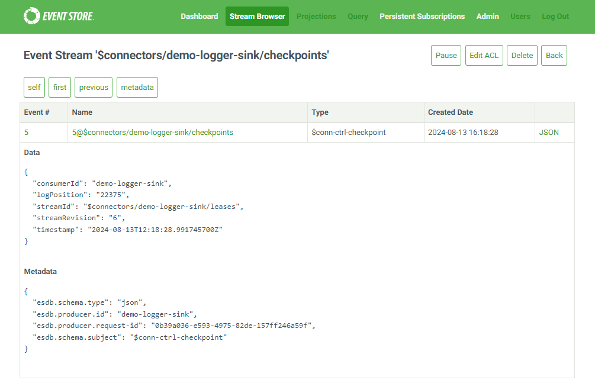

# Features

## Subscriptions

EventStoreDB connectors support subscriptions, allowing clients to receive real-time updates as events are written to the database. Subscriptions can be configured to deliver events to various endpoints, ensuring that your applications stay synchronized with the latest data changes. This feature is essential for building reactive systems and maintaining data consistency across distributed systems.

All sink connectors supports filtering events using regular expressions, JsonPath expressions, or prefixes. The expression is first checked as a regex, then as JsonPath, and if neither, it's used as a prefix for filtering.

::: note
By default, if no filter is specified, the system will consume from the `$all` stream, excluding system events.
:::

#### Record

When filtering events from EventStoreDB, you have access to the following objects, which represent how EventStoreDB records look:

```json
{
  "recordId": "string",
  "position": {
    "streamId": "string",
    "partitionId": "number"
  },
  "sequenceId": "number",
  "isRedacted": "boolean",
  "schemaInfo": {
    "subject": "string",
    "type": "string"
  },
  "headers": {},
  "value": {},
  "streamId": "string",
  "partitionId": "number"
}
```

::: details Click here to see an example of EventStoreDB record

```json
{
  "recordId": "46ed7c22-38c9-4a62-bbaf-e40f3d5b84c9",
  "position": {
    "streamId": "VehicleRegistration-5b27b19d80814adeb13471c7a6a1e285",
    "partitionId": -1
  },
  "sequenceId": 1,
  "isRedacted": false,
  "schemaInfo": {
    "subject": "VehicleRegistered",
    "type": "json"
  },
  "headers": {},
  "value": {
    "registrationId": "5b27b19d-8081-4ade-b134-71c7a6a1e285",
    "registrationNumber": 4474795452,
    "vehicle": {
      "make": "Audi",
      "model": "A6",
      "year": 2018,
      "engineType": "petrol"
    }
  },
  "streamId": "VehicleRegistration-5b27b19d80814adeb13471c7a6a1e285",
  "partitionId": -1
}
```

:::

### Regex Filters

The simplest and fastest way to filter events is by using regular expressions. This can be done at the Record or Stream scope and is applied to the stream ID or event type.

An example of a Regex expression is shown below:

```json
{
  "subscription:filter:scope": "Stream",
  "subscription:filter:expression": "^eventType.*"
}
```

This filter will only match events where the stream ID starts with `eventType`.

You can also filter records by prefix using the following configuration:

```json
{
  "subscription:filter:scope": "Stream",
  "subscription:filter:expression": "prefix-"
}
```

Refer to the [Subscription Configuration](./settings.md#subscription-configuration) section in settings page for more details on the available instance types.

### JsonPath Filters

JSONPath provides a standardized string syntax for selecting and extracting JSON values from EventStoreDB records. Following the [RFC 9535](https://www.rfc-editor.org/rfc/rfc9535.html#name-introduction) standard, JSONPath allows for efficient querying of JSON data within your EventStoreDB connectors. The filtering process is managed at the connector level and is applied only at the record scope. JSONPath filters apply exclusively to events with the `application/json` content type.

An example of a JsonPath filter is shown below:

```json
{
  "Subscription:Filter:Expression": "$[?($.value.vehicle.year==2018)]"
}
```

In this case, the filter will only match events where the year field is equal to 2018.

::: tip
You can test your JSONPath expressions using the [JsonPath Playground](https://json-everything.net/json-path/). Copy the record JSON and test your expressions to ensure they work as expected.
:::

Refer to the [Subscription Configuration](./settings.md#subscription-configuration) section in settings page for more details on the available instance types.

## Transformations

EventStoreDB connectors support transformations using JavaScript, allowing you
to modify the records received from the EventStoreDB stream. This feature
enables you to tailor the data to meet your specific requirements before it is
processed further. Transformations can be applied to any part of the record,
providing flexibility in how the data is handled and utilized within your
application. It takes a `base64` encoded string as input for the
transformations. You can use an [base64encode](https://www.base64encode.org/) to
encode your JavaScript function. All sinks supports transformation.

All records that are transformed will receive a property `IsTransformed` that will be set to `true`.

Below is an example of a valid JavaScript function, which will then be encoded into a base64 string:

```js
function transform(record) {
  let { make, model } = record.value.vehicle;
  record.schemaInfo.subject = 'Vehicle';
  record.value.vehicle.makemodel = `${make} ${model}`;
}
```

The transformation function must be a JavaScript function named **transform**.

Additionally, it must adhere to the EventStore Record structure; otherwise, it will not start. For example, the following will **NOT** work:

```js
{
  function transform(record) {
    return {
      name: 'invalid',
    };
  }
}
```

It also doesn't support advanced Javascript syntax such as generators and tail calls.

Transformation can be enabled as follows:

```js
{
  "transformer:enabled": "true",
  "transformer:function": "ZnVuY3Rpb24gdHJhbnNmb3JtKHJlY29yZCkgewogIGxldCB7IG1ha2UsIG1vZGVsIH0gPSByZWNvcmQudmFsdWUudmVoaWNsZTsKICByZWNvcmQuc2NoZW1hSW5mby5zdWJqZWN0ID0gJ1ZlaGljbGUnOwogIHJlY29yZC52YWx1ZS52ZWhpY2xlLm1ha2Vtb2RlbCA9IGAke21ha2V9ICR7bW9kZWx9YDsKfQ=="
}
```

## Checkpointing

Connectors periodically store the position of the last event that they have
successfully processed. Then, if the connector host is restarted, the connectors
can continue from close to where they got up to. The checkpoint information is
stored in the `$connectors/{connector-id}/checkpoints` system stream in
EventStoreDB.

Each connector has its own dedicated stream for storing checkpoints.



## Resilience

Currently, connectors only support _at least once_ delivery guarantees, meaning
that events may be delivered more than once. Events are delivered _in order_,
ensuring that event `x` is not delivered until all preceding events have been
delivered.

Most connectors have a built-in resilience mechanism to ensure the reliable
delivery of data and messages, preserving system integrity and minimizing
downtime during unexpected disruptions. To see if a connector supports
resilience, refer to the connector's individual page.

The default resilience strategy has key features that include:

### Automatic retries

[Exponential backoff](https://en.wikipedia.org/wiki/Exponential_backoff) strategy will be used to manage the timing of retries after a failure.

In the first phase, the delay between retries starts with a small value, (5 seconds). If the operation continues to fail, the delay increases exponentially, moving to the second phase where the delay might be several minutes, (10 minutes). This gradual increase helps to balance the need for quick recovery with the risk of overwhelming the system.

The third phase is reached if the operation still fails after several retries with increasing delays. In this phase, the delay can become quite long, potentially up to 1 hour or more. This phase ensures that the system has ample time to recover from any underlying issues before another retry is attempted. If necessary, the delay can be set to an indefinite period, allowing for manual intervention if required.

Refer to the [Resilience Configuration](./settings.md#resilience-configuration) section on the settings page for more details on how to configure these settings.