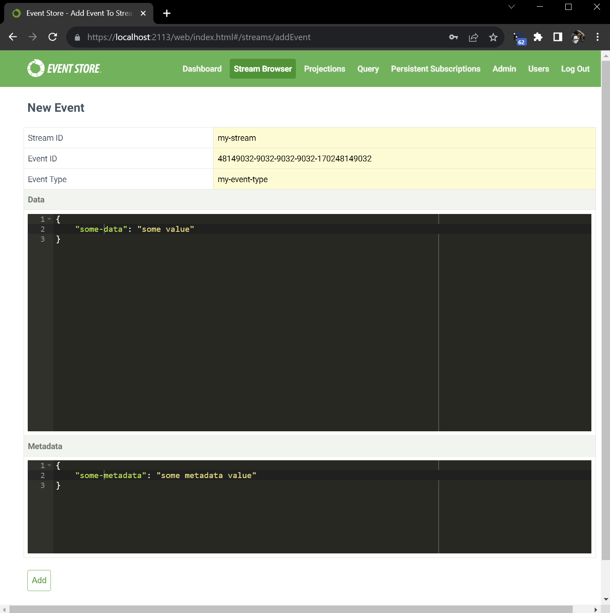
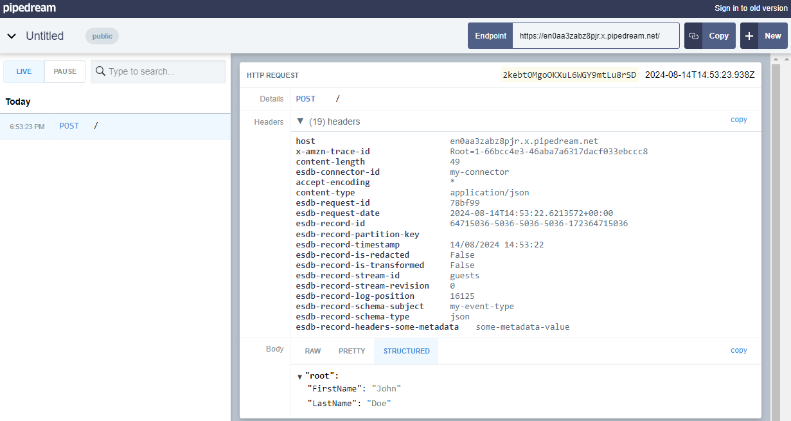
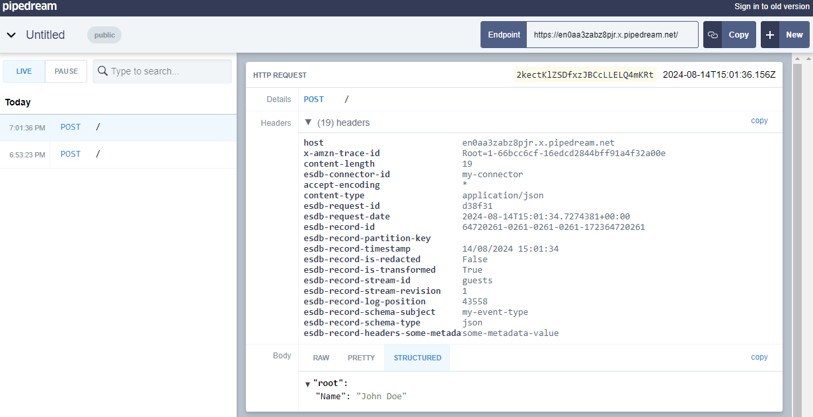

# Quick start

The Connectors plugin is included in the EventStoreDB binaries. Anyone can use the [HTTP sink](./sinks/http.md), but a [valid license key](../../quick-start/installation.md#license-keys) is required to use the other sinks.

## Enable the plugin

Refer to the [configuration guide](../../configuration/README.md) for configuration mechanisms other than YAML.

> **Note:** By default, the connectors plugin is already enabled.

```yaml
Connectors:
  Enabled: true
```

Let's create a connector and send events to it.

## Set up an external system

For example, create a `public bin` by visiting [Requestbin](https://public.requestbin.com/r). This is only suitable for test data. It will present you with a unique endpoint such as: `https://en0aa3zabz8pjr.x.pipedream.net/`.

When you create a public request bin, it will start waiting for requests. You can then use the bin URL as the sink endpoint for the connector.

## Create a connector instance

Use `curl` or a similar utility to issue a `POST` request as follows. This will create a connector instance called `my-connector`, configure it to send events to our external system, and enable the connector instance.

::: tabs
@tab Powershell
```powershell
$JSON = @"
{
  "settings": {
    "InstanceTypeName": "EventStore.Connectors.Http.HttpSink",
    "Url": "https://en0aa3zabz8pjr.x.pipedream.net/",
    "Subscription:Filter:Scope": "Stream",
    "Subscription:Filter:Expression": "guests"
  }
}
"@ `

curl.exe -X POST `
  -H "Content-Type: application/json" `
  -d $JSON `
  http://localhost:2113/connectors/my-connector
```
@tab Bash
```bash
JSON='{
  "settings": {
    "InstanceTypeName": "EventStore.Connectors.Http.HttpSink",
    "Url": "https://en0aa3zabz8pjr.x.pipedream.net/",
    "Subscription:Filter:Scope": "Stream",
    "Subscription:Filter:Expression": "guests"
  }
}'

curl -X POST \
  -H "Content-Type: application/json" \
  -d "$JSON" \
  http://localhost:2113/connectors/my-connector
```
:::

- The sink URL is where the sink will POST to. Adjust it to be your own URL created in the first step.
- Ensure to use the correct URL for your EventStoreDB instance or cluster.

## Start the connector

Start the connector by sending a `POST` request to `connectors/my-connector/start`.

::: tabs
@tab Powershell
```powershell
curl.exe -i -X POST http://localhost:2113/connectors/my-connector/start
```
@tab Bash
```bash
curl -i -X POST -H http://localhost:2113/connectors/my-connector/start
```
:::

## Append an event

Visit the EventStoreDB web UI and append an event to a stream via the Stream Browser. You will find the `Add Event` button in the top right corner of the Stream Browser.
Appending a new event will trigger the connector to send the event to the sink.



In this example, we are appending an event to the `guests` stream with event type `guest-check-in`

The event data is:

```json
{
  "FirstName": "John",
  "LastName": "Doe"
}
```

and the metadata is:

```json
{
  "some-metadata": "some-metadata-value"
}
```

## Check the event was received

Visit the public bin webpage and check that the event was received.



## Applying transformations

Now, let's apply a transformation to an event before it is sent to the sink.

In order to apply transformations, you will need to pass a base64 encoded
JavaScript function to the connector. Since we have already created a connector
instance, we will need to stop it, update the settings with the transformation
function, and then start it again.

### Create a transformation function

Create a JavaScript function that will transform the event data. The
`transformRecord` object provided to the function contains `Value` and `Headers`
properties. For example:

```javascript
function transform(transformRecord) {
  let { Value, Headers } = transformRecord;
  return {
    ...transformRecord,
    Value: {
      Name: Value.FirstName + ' ' + Value.LastName,
    },
  };
}
```

In this example, the function takes the `FirstName` and `LastName` fields from the
event's Value and combines them into a new `Name` field. The `Headers` property is
also available for use if needed.

**Base64 encode the transformation function**

In order to pass the transformation function to the connector, you must base64
encode it. You can use a tool like [Base64 Encode](https://www.base64encode.org/)
to encode your JavaScript function to a base64 string.

### Stop and Reconfigure the connector with the transformation function

Stop the connector by sending a `POST` request to `/connectors/my-connector/stop`

::: tabs
@tab Powershell
```powershell
curl.exe -i -X POST http://localhost:2113/connectors/my-connector/stop
```
@tab Bash
```bash
curl -i -X POST http://localhost:2113/connectors/my-connector/stop
```
:::

Update the connector instance with the transformation function. You can do this by sending a `PUT` request to the connector instance.

::: tabs
@tab Powershell
```powershell
$JSON = @"
{
  "InstanceTypeName": "EventStore.Connectors.Http.HttpSink",
  "Url": "https://en0aa3zabz8pjr.x.pipedream.net/",
  "Subscription:Filter:Scope": "Stream",
  "Subscription:Filter:Expression": "guests",
  "Transformer:Enabled": "true",
  "Transformer:FunctionName": "transform",
  "Transformer:Function": "ZnVuY3Rpb24gdHJhbnNmb3JtKHRyYW5zZm9ybVJlY29yZCkgewogIGxldCB7IFZhbHVlLCBIZWFkZXJzIH0gPSB0cmFuc2Zvcm1SZWNvcmQ7CiAgcmV0dXJuIHsKICAgIC4uLnRyYW5zZm9ybVJlY29yZCwKICAgIFZhbHVlOiB7CiAgICAgIE5hbWU6IFZhbHVlLkZpcnN0TmFtZSArICcgJyArIFZhbHVlLkxhc3ROYW1lCiAgICB9CiAgfTsKfQo="
}
"@ `

curl.exe -X PUT `
  -H "Content-Type: application/json" `
  -d $JSON `
  http://localhost:2113/connectors/my-connector/settings
```
@tab Bash
```bash
JSON='{
  "InstanceTypeName": "EventStore.Connectors.Http.HttpSink",
  "Url": "https://en0aa3zabz8pjr.x.pipedream.net/",
  "Subscription:Filter:Scope": "Stream",
  "Subscription:Filter:Expression": "guests",
  "Transformer:Enabled": "true",
  "Transformer:FunctionName": "transform",
  "Transformer:Function": "ZnVuY3Rpb24gdHJhbnNmb3JtKHRyYW5zZm9ybVJlY29yZCkgewogIGxldCB7IFZhbHVlLCBIZWFkZXJzIH0gPSB0cmFuc2Zvcm1SZWNvcmQ7CiAgcmV0dXJuIHsKICAgIC4uLnRyYW5zZm9ybVJlY29yZCwKICAgIFZhbHVlOiB7CiAgICAgIE5hbWU6IFZhbHVlLkZpcnN0TmFtZSArICcgJyArIFZhbHVlLkxhc3ROYW1lCiAgICB9CiAgfTsKfQo="
}'

curl -X PUT \
  -H "Content-Type: application/json" \
  -d "$JSON" \
  http://localhost:2113/connectors/my-connector/settings
```
:::

::: note
Although it's possible to create a connector instance with the transformation function from the beginning, in this scenario, we're updating an existing connector instance instead.
:::

Start the connector again and append the same event to the `guests` stream. The
event will now be transformed before being sent to the sink. You can check the
transformation by viewing the event in the public bin.

You can find other configuration options in the [settings](./settings.md#transformation-configuration) documentation.



As you can see, the event data has been transformed by the transformation function and shows the `Name` field with the combined `FirstName` and `LastName` fields.

Congratulations! You have successfully set up and used the Connectors functionality in EventStoreDB.
