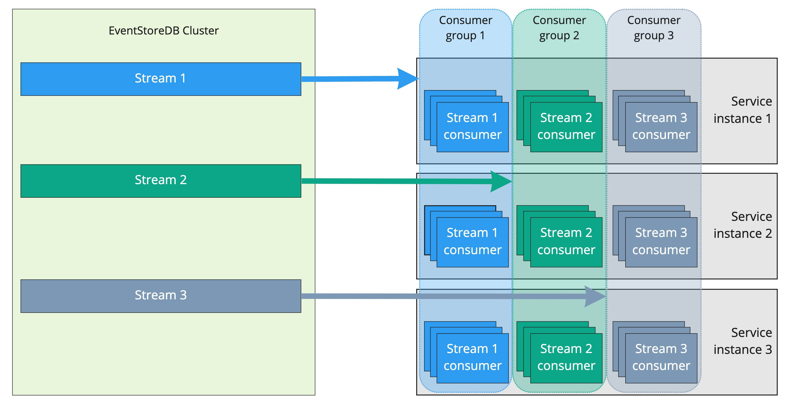

## Persistent subscription

A common operation is to subscribe to a stream and receive notifications for changes. As new events arrive, you continue following them. 

You can only subscribe to one stream or the `$all` stream. You can use server-side projections for linking events to new aggregated streams. System projections create pre-defined streams that aggregate events by type or by category and are available out-of-the box. Learn more about system and user-defined projections [here](projections/custom.md).

Persistent subscriptions run on the Leader node and are not dropped when the connection is closed. Moreover, this subscription type supports the "[competing consumers](https://www.enterpriseintegrationpatterns.com/patterns/messaging/CompetingConsumers.html)" messaging pattern and are useful when you need to distribute messages to many workers. KurrentDB saves the subscription state server-side and allows for at-least-once delivery guarantees across multiple consumers on the same stream. It is possible to have many groups of consumers compete on the same stream, with each group getting an at-least-once guarantee.

::: tip
The Administration UI includes a _Persistent Subscriptions_ section where a user can create, update, delete and view subscriptions and their statuses. However, persistent subscriptions to the $all stream have to be created through a gRPC client.
:::

## Concepts

Persistent subscriptions serve the same purpose as catch-up or volatile subscriptions, but in a different way. All subscriptions aim to deliver events in real-time to connected subscribers. But, unlike other subscription types, persistent subscriptions are maintained by the server. In a way, catch-up and persistent subscriptions are similar. Both have a last known position from where the subscription starts getting events. However, catch-up subscriptions must take care about keeping the last known position on the subscriber side and persistent subscriptions keep the position on the server.

Since it is the server who decides from where the subscription should start receiving events and knows where events are delivered, subscribers that use a persistent subscription can be load-balanced and process events in parallel. In contrast, catch-up subscriptions, which are client-driven, always receive and process events sequentially and can only be load-balanced on the client side. Therefore, persistent subscriptions allow using the competing consumers pattern that is common in the world of message brokers.

In order for the server to load-balance subscribers, it uses the concept of consumer groups. All clients that belong to a single consumer group will get a portion of events, and that's how load balancing works inside a group. It is possible to create multiple consumer groups for the same stream and they will be completely independent of each other, receiving and processing events at their own pace and having their own last known position handled by the server.



::: warning
Just as in the world of message brokers, processing events in a group of consumers running in parallel processes will most likely get events out of order within a certain window. For example, if a consumer group has ten consumers, ten messages will be distributed among the available consumers, based on the [strategy](#consumer-strategies) of the group. Even though some strategies make an attempt to consistently deliver ordered events to a single consumer, it's done on the best effort basis and there is no guarantee of events coming in order with any strategy.
:::

## Acknowledging messages

Clients must acknowledge (or not acknowledge) messages as they are handled. If messages aren't acknowledged before they time out on the server, then the server will retry the messages. If a message has been retried more than the `maxRetryCount` setting for the persistent subscription, then the message will be parked and processing will continue.

## Parked messages

Messages that have been retried too will often be parked in the persistent subscription's parked message stream. This stream is named `$persistentsubscription-{groupname}::{streamname}-parked`. You can easily see the number of parked events in the persistent subscription statistics or browse the parked messages in the admin UI.

If you want to retry the parked messages, you can `Replay` the parked messages for that subscription. This will push the parked messages to subscribers before any new events on the subscription.

You can also specify the number of parked messages to replay over the HTTP endpoint. This can be done by providing the `stopAt` parameter when requesting to replay messages through the HTTP url. For example:

```bash:no-line-numbers
curl -i -X POST -d {} https://localhost:2113/subscriptions/{stream}/{groupnanme}/replayParked?stopAt={numberofevents} -u "admin:changeit"
```

If you don't want to replay any of the parked messages for a subscription and want to clear them out, you can do this by deleting the parked stream like a normal stream.

## Checkpointing

Once a persistent subscription has handled enough events, it will write a checkpoint. If the subscription is restarted, for example due to a Leader change, then the persistent subscription will continue processing from the last checkpoint. This means that some events my be received multiple times by consumers.

If a persistent subscription has a filter, then the persistent subscription will checkpoint when enough events are either handled or skipped by the filter.

Checkpoints are events written to system streams with event type `$SubscriptionCheckpoint`. Checkpoint stream name is composed using the subscribed stream name and consumer group name:

`$persistentsubscription-STREAMNAME::GROUPNAME-checkpoint`

For example, if you have a persistent subscription `LoanProcessing` on top of the stream `$et-LoanRequested`, the checkpoints stream name would be:

`$persistentsubscription-$et-LoanRequested::LoanProcessing-checkpoint`

::: note
Persistent Subscriptions won't write a new checkpoint if there's one already in the process of being written. This means that even if you configure the subscription with a max checkpoint count of 1, it's not guaranteed to write a checkpoint after every event.
:::

## Consumer strategies

When creating a persistent subscription, you can choose between a number of consumer strategies. These strategies determine how the server pushes events to subscribed clients.

### RoundRobin (default)

Distributes events to all clients evenly. If the client `bufferSize` is reached, the client is ignored until events are acknowledged/not acknowledged.

This strategy provides equal load balancing between all consumers in the group.

### DispatchToSingle

Distributes events to a single client until the `bufferSize` is reached. After that, the next client is selected in a round-robin style, and the process is repeated.

This option can be seen as a fall-back scenario for high availability, when a single consumer processes all the events until it reaches its maximum capacity. When that happens, another consumer takes the load to free up the main consumer resources.

### Pinned

For use with an indexing projection such as the [system](projections/system.md#by-category) `$by_category` projection.

KurrentDB inspects the event for its source stream id, hashing the id to one of 1024 buckets assigned to individual clients. When a client disconnects its buckets are assigned to other clients. When a client connects, it is assigned some existing buckets. This naively attempts to maintain a balanced workload.

The main aim of this strategy is to decrease the likelihood of concurrency and ordering issues while maintaining load balancing. This is not a guarantee, and you should handle the usual ordering and concurrency issues.

::: warning
This strategy behaves differently depending on whether `ResolveLinkTos` is enabled. If you want to use this strategy with an indexing projection such as `$by_category` then you should have `ResolveLinkTos` enabled.
:::

### PinnedByCorrelation

This is similar to the `Pinned` strategy, but instead of using the source stream id to bucket the messages, it distributes the events based on the event's correlationId.

## Considerations

Persistent subscriptions are a powerful tool, but they are not always appropriate for every situation. Here are some things to consider before deciding whether you should use them:

### Persistent subscriptions run on leader

Persistent subscriptions only run on the Leader node.
This means that more pressure will be put on the Leader node, and there is no option to balance the load to a follower like with a Catch-up subscription.

It also means that the subscriptions will reload from the last checkpoint whenever the Leader changes.

### Ordering is not guaranteed

Ordering is not guaranteed with persistent subscriptions due to the possibility of messages being retried, or consumers handling events before others.
While some strategies do attempt to mitigate this, it is still on a best-effort basis and messages may still arrive to consumers out of order.

If you need an ordering guarantee then you should use a Catch-up subscription instead and handle the checkpointing in your client code.
