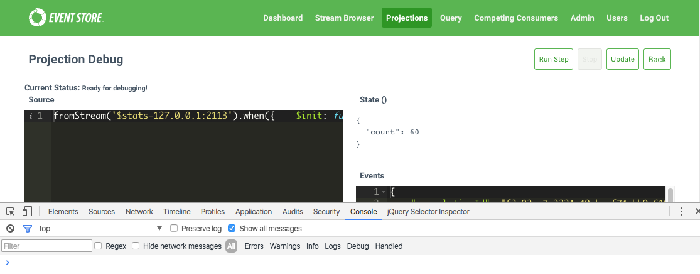
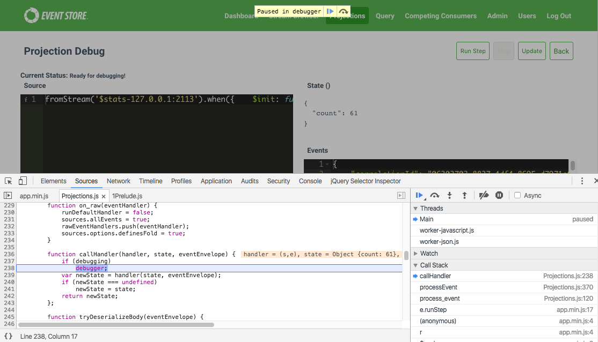
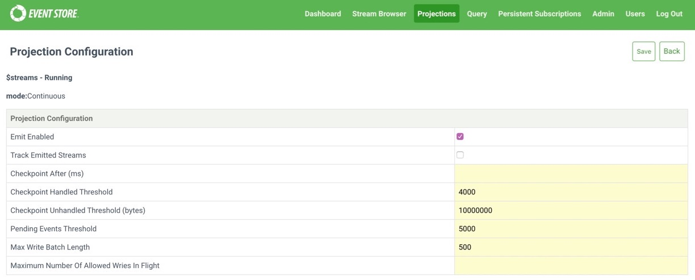

# User-defined projections

You create user defined projections using JavaScript. For example, the `my_demo_projection_result` projection
below counts the number of `myEventType` events from the `account-1` stream. It then uses the `transformBy`
function to change the final state:

```javascript
options({
    resultStreamName: "my_demo_projection_result",
    $includeLinks:    false,
    reorderEvents:    false,
    processingLag:    0
})

fromStream('account-1')
    .when({
        $init: function () {
            return {
                count: 0
            }
        },
        myEventType: function (state, event) {
            state.count += 1;
        }
    })
    .transformBy(function (state) {
        return {Total: state.count}
    })
    .outputState()
```

## Projections API

Below, you can find the JavaScript API for user defined projections.

### Options

| Name               | Description                                                                                                                                                                                                                                                  | Notes                                                     |
|:-------------------|:-------------------------------------------------------------------------------------------------------------------------------------------------------------------------------------------------------------------------------------------------------------|:----------------------------------------------------------|
| `resultStreamName` | Overrides the default resulting stream name for the `outputState()` transformation, which is `$projections-{projection-name}-result`.                                                                                                                        |                                                           |
| `$includeLinks`    | Configures the projection to include/exclude link to events.                                                                                                                                                                                                 | Default: `false`                                          |
| `processingLag`    | When `reorderEvents` is enabled, this value is used to compare the total milliseconds between the first and last events in the buffer and if the value is equal or greater, the events in the buffer are processed. The buffer is an ordered list of events. | Default: `500ms`. Only valid for `fromStreams()` selector |
| `reorderEvents`    | Process events by storing a buffer of events ordered by their prepare position                                                                                                                                                                               | Default: `false`. Only valid for `fromStreams()` selector |

### Selectors

| Selector                                                                                                | Description                                      | Notes |
|:--------------------------------------------------------------------------------------------------------|:-------------------------------------------------|:------|
| `fromAll()`                                                                                             | Selects events from the `$all` stream.           | **    |
| Provides** <ul><li>`partitionBy`</li><li>`when`</li><li>`foreachStream`</li><li>`outputState`</li></ul> |                                                  |       |
| `fromCategory({category})`                                                                              | Selects events from the `$ce-{category}` stream. | **    |
| Provides** <ul><li>`partitionBy`</li><li>`when`</li><li>`foreachStream`</li><li>`outputState`</li></ul> |                                                  |       |
| `fromStream({streamId})`                                                                                | Selects events from the `streamId` stream.       | **    |
| Provides** <ul><li>`partitionBy`</li><li>`when`</li><li>`outputState`</li></ul>                         |                                                  |       |
| `fromStreams(streams[])`                                                                                | Selects events from the streams supplied.        | **    |
| Provides**<ul><li>`partitionBy`</li><li>`when`</li><li>`outputState`</li></ul>                          |                                                  |       |

### Filters and transformations

| Filter/Partition                                                                                                                           | Description                                                                                                                                               | Notes |
|:-------------------------------------------------------------------------------------------------------------------------------------------|:----------------------------------------------------------------------------------------------------------------------------------------------------------|:------|
| `when(handlers)`                                                                                                                           | Allows only the given events of a particular to pass through the projection.                                                                              | **    |
| Provides** <ul><li>`$defines_state_transform` </li><li>`transformBy`</li><li>`filterBy`</li><li>`outputTo`</li><li>`outputState`</li></ul> |                                                                                                                                                           |       |
| `foreachStream()`                                                                                                                          | Partitions the state for each of the streams provided.                                                                                                    | **    |
| Provides** <ul><li>`when`</li></ul>                                                                                                        |                                                                                                                                                           |       |
| `outputState()`                                                                                                                            | If the projection maintains state, setting this option produces a stream called `$projections-{projection-name}-result` with the state as the event body. | **    |
| Provides** <ul><li>`transformBy`</li><li>`filterBy`</li><li>`outputTo`</li></ul>                                                           |                                                                                                                                                           |       |
| `partitionBy(function(event))`                                                                                                             | Partitions a projection by the partition returned from the handler.                                                                                       | **    |
| Provides** <ul><li>`when`</li></ul>                                                                                                        |                                                                                                                                                           |       |
| `transformBy(function(state))`                                                                                                             | Provides the ability to transform the state of a projection by the provided handler.                                                                      | **    |
| Provides** <ul><li>`transformBy`</li><li>`filterBy`</li><li>`outputState`</li><li>`outputTo`</li></ul>                                     |                                                                                                                                                           |       |
| `filterBy(function(state))`                                                                                                                | Causes projection results to be `null` for any `state` that returns a `false` value from the given predicate.                                             | **    |
| Provides** <ul><li>`transformBy`</li><li>`filterBy`</li><li>`outputState`</li><li>`outputTo`</li></ul>                                     |                                                                                                                                                           |       |

### Handlers

Each handler is provided with the current state of the projection as well as the event that triggered the
handler. The event provided through the handler contains the following properties.

- `isJson`: true/false
- `data`: {}
- `body`: {}
- `bodyRaw`: string
- `sequenceNumber`: integer
- `metadataRaw`: {}
- `linkMetadataRaw`: string
- `partition`: string
- `eventType`: string
- `streamId`: string

| Handler        | Description                                                                                                                                                                                                                                                                                                              | Notes                                                                          |
|:---------------|:-------------------------------------------------------------------------------------------------------------------------------------------------------------------------------------------------------------------------------------------------------------------------------------------------------------------------|:-------------------------------------------------------------------------------|
| `{event-type}` | When using `fromAll()` and 2 or more event type handlers are specified and the `$by_event_type` projection is enabled and running, the projection starts as a `fromStreams($et-event-type-foo, $et-event-type-bar)` until the projection has caught up and moves to reading from the transaction log (i.e. from `$all`). |                                                                                |
| `$init`        | Provide the initialization for a projection.                                                                                                                                                                                                                                                                             | Commonly used to setup the initial state for a projection.                     |
| `$initShared`  | Provide the initialization for a projection where the projection is possibly partitioned.                                                                                                                                                                                                                                |                                                                                |
| `$any`         | Event type pattern match that match any event type.                                                                                                                                                                                                                                                                      | Commonly used when the user is interested in any event type from the selector. |
| `$deleted`     | Called upon the deletion of a stream.                                                                                                                                                                                                                                                                                    | Can only be used with `foreachStream`                                          |

### Functions

| Handler                                          | Description                                     |
|:-------------------------------------------------|:------------------------------------------------|
| `emit(streamId, eventType, eventBody, metadata)` | Appends an event to the designated stream       |
| `linkTo(streamId, event, metadata)`              | Writes a link to event to the designated stream |


## Debugging

User projections have a bonus that debugging is easier
via any browser that ships with debugging capabilities. The screenshots in this document show the use of
Chrome, but we have tested debugging with all major browsers including Firefox, Edge and Safari.

### Logging from a projection

For debugging purposes, projections includes a log method which, when called, sends messages to the configured
EventStoreDB logger (the default is `NLog`, to a file, and `stdout`).

You might find printing out the structure of the event body for inspection useful.

For example:

```javascript
fromStream('$stats-127.0.0.1:2113')
    .when({
        $any: function (s, e) {
            log(JSON.stringify(e));
        }
    })
```

#### Creating a projection for debugging

Filename: _stats-counter.json_

Contents:

```javascript
fromStream('$stats-127.0.0.1:2113')
    .when({
        $init: function () {
            return {
                count: 0
            }
        },
        $any:  function (s, e) {
            s.count += 1;
        }
    })
```

You create the projection by making a call to the API and providing it with the definition of the projection.

```bash
curl -i -d@stats-counter.json \
  http://localhost:2113/projections/continuous?name=stats-counter%26type=js%26enabled=true%26emit=true%26trackemittedstreams=true \
  -u admin:changeit
```

### Debugging your first projection

Once the projection is running, open your browser and enable the developer tools. Once you have the developer
tools open, visit your projection URL and you should see a button labelled _Debug_.


After clicking the projection "Debug" button, you see the debugging interface with the definition of the
projection and information about the events the projection is processing on the right-hand side.

At the top there are a couple of buttons to take note of, specifically the _Run Step_ and _Update_ buttons.
You use _Run Step_ to step through the event waiting in the queue, placing you in projection debugging mode.
The _Update_ button provides you with a way to update the projection definition without having to go back to
the projection itself and leave the context of the debugger.



If the _Run Step_ button is not greyed out, and you click it, the browser has hit a breakpoint.



You are now able to step through the projection, the important method to step into is
the `handler(state, eventEnvelope)` method.

## Configuring projections

By changing these settings, you can lessen the amount of pressure projections put on an EventStoreDB node or
improve projection performance. You can change these settings on a case-by-case basis, and monitor potential
improvements.

::: warning
You can only change the configuration of a stopped projection.
:::

You change the configuration of a projection by setting the relevant key and value in a request, or when you
create a projection with the web admin interface.



<!-- TODO: Further explanation here -->

### Emit options

These options control how projections append events.

In busy systems, projections can put a lot of extra pressure on the master node. This is especially true for
EventStoreDB servers that also have persistent subscriptions running, which only the master node can process.
If you see a lot of commit timeouts and slow writes from your projections and other clients, then start with
these settings.

#### Emit enabled

The `emit` boolean setting determines whether a projection can emit events and any projection that
calls `emit()` or `linkTo()` requires it. If this option is not set and a projection attempts to emit events,
you see an error message like the following:

<!-- TODO: Is it emit or emitenabled? Or are .NET and HTTP different -->

```
'emit' is not allowed by the projection/configuration/mode
```

EventStoreDB disables this setting by default, and is usually set when you create the projection and if you
need the projection to emit events.

#### Track emitted streams

The `trackemittedstreams` boolean setting enables tracking of a projection's emitted streams. It only has an
affect if the projection has `EmitEnabled` enabled.

Tracking emitted streams enables you to delete a projection and all the streams that it has created. You
should only the setting if you intend to delete a projection and create new ones that project to the same
stream.

::: warning
By default, EventStoreDB disables the `trackemittedstreams` setting for projections. When enabled,
an event appended records the stream name (in `$projections-{projection_name}-emittedstreams`) of each event
emitted by the projection. This means that write amplification is a possibility, as each event that the
projection emits appends a separate event. As such, this option is not recommended for projections that emit a
lot of events, and you should enable only where necessary.
:::

::: tip
Between EventStoreDB versions 3.8.0 and 4.0.2, this option was enabled by default when a projection
was created through the UI. If you have any projections created during this time frame, it's worth checking
whether this option is enabled.
:::

#### Max allowed writes in flight

<!-- TODO: Why is this not in the GUI for new projection? -->

The `MaxAllowedWritesInFlight` setting sets the maximum number of writes to allow for a projection. Because a
projection can write to multiple different streams, it's possible for the projection to send multiple writes
at the same time. This option sets the number of concurrent writes that a projection can perform.

By default, projections try to perform writes as quickly as they come. This can add a lot of pressure to a
node, especially for projections that emit to different streams. If you see your projections causing frequent
commit timeouts or slow reads, you can try lowering this value to see if there is any improvement.

::: tip
Lower values may cause the projection to slow down as the number of writes are throttled, but the
trade-off for this is cleaner logs and fewer commit timeouts.
:::

By default, this is unbounded, allowing a projection to write as fast as it can.

#### Max write batch length

<!-- TODO: Why is this not in the GUI for new projection? -->

The `MaxWriteBatchLength` setting sets the maximum number of events the projection can write in a batch at a
time.

**Default:** `500` (events).

### Checkpoint options

Checkpoints store how far along a projection is in the streams it is processing from. There is a performance
overhead with writing a checkpoint, as it does more than append an event, and writing them too often can slow
projections down.

We recommend you try other methods of improving projections before changing these values, as checkpoints are
an important part of running projections.

#### Checkpoint after Ms

The `CheckpointAfterMs` setting prevents a new checkpoint from being written within a certain time frame from
the previous one. The setting is to keep a projection from writing too many checkpoints too quickly, something
that can happen in a busy system.

The default setting is 0 seconds, which means there is no limit to how quickly checkpoints can be written.

#### Checkpoint handled threshold

The `CheckpointHandledThreshold` setting controls the number of events that a projection can handle before
attempting to write a checkpoint. An event is considered handled if it actually passed through the
projection's filter. If the projection is set to checkpoint every 4,000 events, but it only reads from
the `foo` stream, the projection only checkpoints every 4,000 `foo` events.

**Default:** `4000` (events).

#### Checkpoint unhandled bytes threshold

The `CheckpointUnhandledBytesThreshold` setting specifies the number of bytes a projection can process before
attempting to write a checkpoint. Unhandled bytes are the events that are not processed by the projection
itself.

For example, if the projection reads from the `foo` stream, but writes from the `bar` stream comes through, a
checkpoint is written after this number of bytes have been processed. This prevents the projection from having
to read through a potentially large number of unrelated events again because none of them passed its filter.

**Default:** `10` (MiB).

### Processing options

#### Pending events threshold

The `PendingEventsThreshold` setting determines the number of events that can be pending before the projection
is paused. Pausing the projection stops the projection from reading, allowing it to finish with the current
events that are waiting to be processed. Once the pending queue has drained to half the threshold, the
projection starts reading again.

**Default:** `5000` (events).

#### Projection Execution Timeout

The `ProjectionExecutionTimeout` setting determines how long a projection has to process an event. If an event is not processed within the specified duration, the projection will fault and won't process further events. This setting applies to all projections unless a specific timeout is set for a particular projection.

::: tip
Increase value of this setting if projection handler is compute intensive or server is under heavy load
:::

**Default:** `250` (ms).

Settings in this section concern projections that are running on the server.

::: warning
Server-side projections impact the performance of the EventStoreDB server. For example, some
standard [system projections](system.md) like Category or Event Type projections produce new (link)
events that are stored in the database in addition to the original event. This effectively doubles or triples
the number of events appended and therefore creates pressure on the IO of the server node. We often call this
effect "write amplification".
:::

#### Per Event Projection Processing Timeout

This setting works like ProjectionExecutionTimeout but applies to individual projections. If both timeouts are configured for a projection, the Per Event Projection Processing Timeout takes precedence.

### Projection runtime

An Interpreted runtime was introduced in 21.6.0 to replace the existing V8 runtime.

The `ProjectionRuntime` option can be used to select which runtime the Projection Subsystem should use. We
only recommend changing this setting if you observe a difference in behaviour between running an existing
projection on the Legacy runtime versus the Interpreted runtime.

| Format               | Syntax                          |
|:---------------------|:--------------------------------|
| Command line         | `--projection-runtime`          |
| YAML                 | `ProjectionRuntime`             |
| Environment variable | `EVENTSTORE_PROJECTION_RUNTIME` |

**Default**: `Interpreted`, use the new Interpreted runtime by default.

Accepted values are `Interpreted` and `Legacy`.

### Run projections

The `RunProjections` option tells the server if you want to run all projections, only system projections or no
projections at all. Keep in mind that the `StartStandardProjections` setting has no effect on custom
projections.

The option accepts three values: `None`, `System` and `All`.

When the option value is set to `None`, the projections subsystem of EventStoreDB will be completely disabled
and the Projections menu in the Admin UI will be disabled.

By using the `System` value for this option, you can instruct the server to enable system projections when the
server starts. However, system projections will only start if the `StartStandardProjections` option is set
to `true`. When the `RunProjections` option value is `System` (or `All`) but the `StartStandardProjections`
option value is `false`, system projections will be enabled but not start. You can start them later manually
via the Admin UI or via an API call.

Finally, you can set `RunProjections` to `All` and it will enable both system and custom projections.

| Format               | Syntax                       |
|:---------------------|:-----------------------------|
| Command line         | `--run-projections`          |
| YAML                 | `RunProjections`             |
| Environment variable | `EVENTSTORE_RUN_PROJECTIONS` |

**Default**: `None`, all projections are disabled by default.

Accepted values are `None`, `System` and `All`.

### Projection threads

Projection threads are used to make calls in to the V8 JavaScript engine, and coordinate dispatching
operations back into the main worker threads of the database. While they carry out none of the operations
listed directly, they are indirectly involved in all of them.

The primary reason for increasing the number of projection threads is projections which perform a large amount
of CPU-bound processing. Projections are always eventually consistent - if there is a mismatch between egress
from the database log and processing speed of projections, the window across which the latest events have not
been processed promptly may increase. Too many projection threads can end up with increased context switching
and memory use, since a V8 engine is created per thread.

There are three primary influences over projections lagging:

- Large number of writes, outpacing the ability of the engine to process them in a timely fashion.
- Projections which perform a lot of CPU-bound work (heavy calculations).
- Projections which result in a high system write amplification factor, especially with latent disks.

Use the `ProjectionThreads` option to adjust the number of threads dedicated to projections.

| Format               | Syntax                          |
|:---------------------|:--------------------------------|
| Command line         | `--projection-threads`          |
| YAML                 | `ProjectionThreads`             |
| Environment variable | `EVENTSTORE_PROJECTION_THREADS` |

**Default**: `3`

### Fault out of order projections

It is possible that in some cases a projection would get an unexpected event version. It won't get an event
that precedes the last processed event, such a situation is very unlikely. But, it might get the next event
that doesn't satisfy the `N+1` condition for the event number. The projection expects to get an event
number `5` after processing the event number `4`, but eventually it might get an event number `7` because
events `5` and `6` got deleted and scavenged.

The projections engine can keep track of the latest processed event for each projection. It allows projections
to guarantee ordered handling of events. By default, the projections engine ignore ordering failures like
described above. You can force out of order projections to fail by setting the `FailOutOfOrderProjections`
to `true`.

| Format               | Syntax                                      |
|:---------------------|:--------------------------------------------|
| Command line         | `--fault-out-of-order-projections`          |
| YAML                 | `FaultOutOfOrderProjections`                |
| Environment variable | `EVENTSTORE_FAULT_OUT_OF_ORDER_PROJECTIONS` |

**Default**: `false`

### Impact of resetting projections
Resetting a projection in EventStore will soft-delete the output streams associated with the projection. If 'TrackEmittedStreams' is enabled when the projection is created, it will also allow the projection subsystem to truncate all streams created by the projection.

The checkpoint will also be reset. This means that the projection will start processing events from the beginning of the event stream and not from the latest checkpoint.