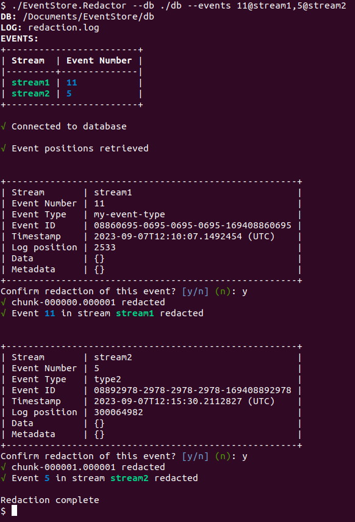
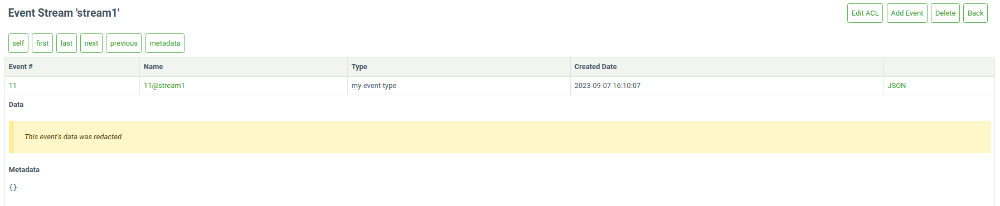

# Redaction

<Badge text="License Required" type="info" vertical="middle"/>

In KurrentDB, events are immutable and cannot be changed after they are written. Usually, when you have an event with data that needs to be deleted you should take the following steps:

- Rewrite the stream to a new stream without the data to be removed.
- Delete the old stream.
- Run a scavenge to remove the data from disk on each node in turn.

If this procedure is impractical for your use case, then you can use the redaction tool (the "redactor") to blank out the data of specific events.

::: warning
Use the redactor as a last resort and only if you know what you're doing. Redacting events may lead to unintended consequences in your subscriptions and projections!
:::

## Prerequisites

Using redaction has the following prerequisites:

- A valid [license key](../quick-start/installation.md#license-keys).
- If running on Windows, Windows Server 2019 or above is required.
- Server configuration option: `EnableUnixSocket: True`.
- The redactor tool (see steps below on how to get it).

## Getting the redactor

Redaction requires a license key. Due to its sensitive nature, the tool is available only upon request. Please [contact us here](https://www.kurrent.io/talk_to_expert) if you do not have a support contract, or reach out to our support team if you do.

## Running the redactor

The binary needs to be extracted and run locally on a KurrentDB node. Similar to scavenging, redaction affects only the node where it's running. Thus, it must be run once on each node of the cluster.

The redactor takes two mandatory parameters as input:

| Parameter  | Description                                                                             |
|:-----------|-----------------------------------------------------------------------------------------|
| `--db`     | The path to the database directory containing the chunk files.                          |
| `--events` | A comma-separated list of events to be redacted in the format: `eventNumber@streamName` |

Specify `--help` to see the full list of options.

The redactor will blank out the data section of the specified events with one bits (0xFF bytes) keeping the data size exactly the same as it was before. It will also set a flag (`IsRedacted`) on the event's record to indicate that the event has been redacted. All other properties of the event such as the event type, event metadata, and timestamp will remain unchanged.

If you read the data of a redacted event from an external client, you should see data composed of only 0xFF bytes. The UI will also label redacted events.

::: tip
The redactor is not an offline tool. The KurrentDB server must be running, as the redactor needs to communicate with it to obtain information about the events to be redacted and replace the chunk files with the redacted ones.
:::

## How the redactor works

The redactor follows these steps:

1. It establishes a connection to the database via a unix domain socket located in the database directory.

2. It then fetches information about the events to be redacted from the server via an RPC call. This information includes the chunk file the event is in and the event's position in the chunk.

3. A list is built of chunk files containing events to be redacted.

4. For each chunk in the list:
    - It is copied to a file with a .tmp extension in the database directory.
    - The requested event(s) are redacted in the .tmp chunk file.
    - The .tmp chunk is atomically switched into the database via an RPC call on the server.
