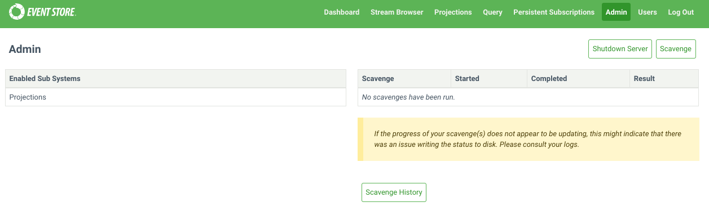

# Scavenging

In KurrentDB, events are no longer present in stream reads or subscriptions after they have been deleted or they have expired according to the metadata of the stream.

The events are, however, still present in the database and will be visible in reads and subscriptions to the `$all` stream.

To remove these events from the database, which may be necessary for GDPR, you need to run a 'scavenge' on each of your nodes.

A scavenge operation removes events and reclaims disk space by creating a copy of the relevant chunk, minus those events, and
then deleting the old chunk. The scavenged events are also removed from the index.

::: warning
Scavenging is destructive. Once a scavenge has run, you cannot recover any deleted events except from a backup.
:::

## Starting a scavenge

You start a scavenge by issuing an empty `POST` request to the HTTP API with the credentials of an `admin`
or `ops` user:

@[code{curl}](@samples/scavenge.sh)

You can also start scavenges from the _Admin_ page of the Admin UI.



Each node in a cluster has its own independent copy of the database. As such, when you run a scavenge, you need to issue a
scavenge request to each node. The scavenges can be run concurrently, but can also be run in series to spread the load.

## Getting the current scavenge ID

Get the ID of the currently running scavenge, if there is one, by issuing a `GET` request to the following HTTP API endpoint with the `admin` or `ops` credentials.

```bash
curl -i -X GET http://127.0.0.1:2113/admin/scavenge/current -u "admin:changeit"
```

## Stopping a scavenge

Stop a running scavenge operation by issuing a `DELETE` request to the HTTP API with the credentials of
an `admin` or `ops` user and the ID of the scavenge you want to stop:

```bash
curl -i -X DELETE http://localhost:2113/admin/scavenge/{scavengeId} -u "admin:changeit"
```

Or stop the currently running scavenge by specifying an ID of `current`:

```bash
curl -i -X DELETE http://localhost:2113/admin/scavenge/current -u "admin:changeit"
```

A 200 response is returned after the scavenge has stopped.

You can also stop scavenges from the _Admin_ page of the Admin UI.

::: tip
A scavenge can be stopped at any time. The next time a scavenge is started, it will resume from the place the previous scavenge stopped.
:::

## Viewing progress

The logs contain detailed information about the progress of the scavenge.

The current state of the scavenge can also be tracked in the [metrics](../diagnostics/metrics.md).

The [execution phase](#execution-phase) of the scavenge emits events into streams.
Each scavenge operation will generate a new stream and the stream will contain events related to that
operation.
Refer to the `$scavenges` [stream documentation](../features/streams.md#scavenges) to learn how you can use it to observe
the scavenging operation progress and status.

## Scavenging best practices

### Backups

Do not take [file-copy](backup.md#types-of-backups) backups while scavenge is running. Stop the scavenge and resume it after the backup.

[Disk snapshot](backup.md#types-of-backups) backups can be taken while scavenge is running.

### How often to scavenge

This depends on:

- How often you delete streams.
- How you set `$maxAge`, `$maxCount` or `$tb` metadata on your streams.
- How important freeing the disk space is to you.
- Your requirements around GDPR.

You can tell from the scavenge output in the logs and streams how much data it is removing. This can help guide how frequently to scavenge.

You can set up a scheduled task, for example using cron on Linux or [Windows Task Scheduler](https://learn.microsoft.com/en-us/windows/win32/taskschd/task-scheduler-start-page), to trigger a scavenge as often as you need.

### Spreading the load

Scavenging does place extra load on the server, especially in terms of disk IO. If this is a concern, consider spreading the load with the following:

- Run scavenge on one node at a time.
- Run scavenge on the Follower nodes to avoid adding load on the Leader. Then resign the Leader node and perform scavenging on that node.
- Stop the scavenge during peak times and resume it afterwards.
- Use the [throttle](#throttle-percent) and [threshold](#threshold) options.

## Scavenging algorithm

Central to the scavenging process is the concept of _scavenge points_. Physically, these are log records in the transaction log, each containing the following information:

- the position in the log that the scavenge will run up to
- a number unique to the scavenge point (counting from 0)
- the time (`EffectiveNow`) used to determine whether the `maxAge` of an event has been exceeded
- the threshold that a chunk's weight must reach to be executed

Any run of the scavenge process is associated with a single scavenge point, and it scavenges the log up to that point.
Log records after that scavenge point do not exist as far as that scavenge is concerned.

In this way, a scavenge can be run on the first node, creating a scavenge point. Then it can be run (potentially later) on other nodes, to scavenge up to the same point, producing the same effect on the log.

The scavenging algorithm itself consists of several phases:

### Beginning

When a scavenge is started, it first checks to see if a previous scavenge was stopped. If so, it resumes from where the previous scavenge stopped. Otherwise, it begins a fresh scavenge.

When beginning a fresh scavenge, it checks to see if a scavenge point already exists that has not been reached by previous scavenges. If so, it begins scavenging up to that point. Otherwise, it writes a new scavenge point to the log (which is replicated to the other nodes) and then begins a scavenge up to there. Writing a new scavenge point also causes the active chunk to be completed so that it can be scavenged.

### Accumulation phase

During the accumulation phase, the scavenging process reads through the chunks that have been added since the previous scavenge, up to the current scavenge point.
It finds necessary information (such as tombstones and metadata records) and stores it in the scavenge database.

In this way, any particular chunk is only accumulated once, regardless of how many times scavenge is run.

::: tip
The first time the scavenge is run it needs to accumulate all the chunks. Typically, this makes the first scavenge take longer than subsequent scavenges.
:::

### Calculation phase

During the calculation phase, the scavenging process calculates which events can be discarded and which chunks they are located in for each stream that it accumulated tombstones or metadata for. It assigns weight to those chunks.

### Execution phase

The execution phase uses the data from the calculation phase to remove events from the chunks and indexes. Small chunks are then merged together.

Only chunks whose weight meets the threshold will be executed.

### Cleaning phase

This final phase removes data from the scavenge database that is no longer needed.

## Starting a scavenge

When starting a scavenge with an HTTP POST request, the following options are available.

### Threads

Specify the number of threads to use for running the scavenging process. The default value is 1.

Example:

```bash
curl -i -X POST http://127.0.0.1:2113/admin/scavenge?threads=2 -u "admin:changeit"
```

### Threshold

By default, all chunks that have events to be removed are scavenged.

Setting this option allows you to scavenge only the chunks that have a sufficiently large number of events expected to be removed. This allows scavenge to run more quickly by focusing on the chunks that would benefit from it most. The weights of the chunks that are being scavenged or skipped can be found in the log files by searching for the term "with weight". The weight of a chunk is approximately twice the number of records that can be removed from it.

Possible values for the threshold:

- `-1`: Scavenge all chunks, even if there are no event to remove. This should not be necessary in practice.
- `0`: Default value. Scavenges every chunk that has events to remove.
- `> 0`: The minimum weight a chunk must have in order to be scavenged.

Example:

```bash
curl -i -X POST http://127.0.0.1:2113/admin/scavenge?threshold=2000 -u "admin:changeit"
```

::: tip
Setting a positive threshold means that not all deleted and expired events will be removed. This may be important to consider with respect to GDPR.
:::

### Throttle percent

The scavenging process can be time-consuming and resource-intensive. You can control the speed and resource usage of the scavenge process using the `throttlePercent` option. When set to 100 (default value), the scavenge process runs at full speed. Setting it to 50 makes the process take twice as long by pausing regularly.

A scavenge can be stopped and restarted with a different `throttlePercent`.

For `throttlePercent` values:

- Throttle percent must be between 1 and 100.

- Throttle percent must be 100 for a multi-threaded scavenge.

Example:

```bash
curl -i -X POST http://127.0.0.1:2113/admin/scavenge?throttlePercent=50 -u "admin:changeit"
```

### Sync-only

The `syncOnly` option is a boolean value and is false by default. When true, it prevents the creation of a new scavenge point and will only run the scavenge if there is an existing scavenge point that has not yet been reached in a previous scavenged. After running a scavenge on one node, this flag can be used to ensure that a subsequent node scavenges to that same point.

Example:

```bash
curl -i -X POST http://127.0.0.1:2113/admin/scavenge?syncOnly=true -u "admin:changeit"
```

### Start from chunk

<Badge text="Deprecated" type="warning" vertical="middle"/>

This option is deprecated. It is ignored and will be removed.

## Scavenging database options

Below you can find some options that change the way how scavenging works on the server node.

### Disable chunk merging

Scavenged chunks may be small enough to be merged into a single physical chunk file of approximately 256 MB. This behaviour can be disabled with this option.

| Format               | Syntax                                |
|:---------------------|:--------------------------------------|
| Command line         | `--disable-scavenge-merging`          |
| YAML                 | `DisableScavengeMerging`              |
| Environment variable | `KURRENTDB_DISABLE_SCAVENGE_MERGING`  |

**Default**: `false`, small scavenged chunks are merged together.

### Scavenge history

Each scavenge operation gets an ID and creates a stream. You might want to look at these streams to see the
scavenge history, how much time each operation took, and how much disk space was reclaimed. However, you
might not want to keep this history forever. Use the following option to limit how long the scavenge history
stays in the database:

| Format               | Syntax                                |
|:---------------------|:--------------------------------------|
| Command line         | `--scavenge-history-max-age`          |
| YAML                 | `ScavengeHistoryMaxAge`               |
| Environment variable | `KURRENTDB_SCAVENGE_HISTORY_MAX_AGE`  |

**Default**: `30` (days)

### Scavenge backend page size

Specify the page size of the scavenge database. The default value is 16 KiB.

| Format               | Syntax                                  |
|:---------------------|:----------------------------------------|
| Command line         | `--scavenge-backend-page-size`          |
| YAML                 | `ScavengeBackendPageSize`               |
| Environment variable | `KURRENTDB_SCAVENGE_BACKEND_PAGE_SIZE`  |

**Default**: `16` (KiB)

### Scavenge backend cache size

Specify the amount of memory, in bytes, to use for backend caching during scavenging. The default value is 64 MiB.

| Format               | Syntax                                   |
|:---------------------|:-----------------------------------------|
| Command line         | `--scavenge-backend-cache-size`          |
| YAML                 | `ScavengeBackendCacheSize`               |
| Environment variable | `KURRENTDB_SCAVENGE_BACKEND_CACHE_SIZE`  |

### Scavenge hash users cache capacity

Specify the number of stream hashes to remember when checking for collisions.
If the accumulation phase is reporting a lot of cache misses, it may benefit from increasing this number.

The default value is 100000.

| Format               | Syntax                                          |
|:---------------------|:------------------------------------------------|
| Command line         | `--scavenge-hash-users-cache-capacity`          |
| YAML                 | `ScavengeHashUsersCacheCapacity`                |
| Environment variable | `KURRENTDB_SCAVENGE_HASH_USERS_CACHE_CAPACITY`  |
