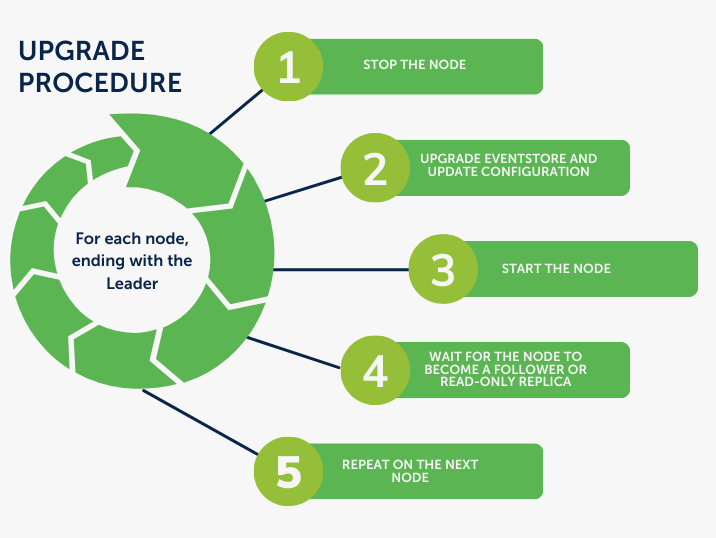

## Upgrade guide for EventStoreDB 22.10

Packages are available on our [website](https://www.eventstore.com/downloads) and can be installed via [Packagecloud](https://packagecloud.io/EventStore/EventStore-OSS), [Chocolatey](https://chocolatey.org/packages/eventstore-oss), or [Docker](https://hub.docker.com/r/eventstore/eventstore/tags?page=1&name=22.10). See detailed commands/instructions for each platform.

### Upgrade procedure

An online rolling upgrade can be done from these versions of EventStoreDB, directly to 22.10.4:
- Previous versions of 22.10.x
- 22.6
- 21.10
- 20.10

Follow the upgrade procedure below on each node, starting with a follower node:

1. Stop the node.
2. Upgrade EventstoreDB to 22.10 and update configuration.
3. Start the node.
4. Wait for the node to become a follower or read-only replica.
5. Repeat on the next node. 

As illustrated below:

Upgrading the cluster in this manner keeps the cluster online and able to service requests. There may still be disruptions to your services during the upgrade, namely:
- Client connections may be disconnected when nodes go offline, or when elections take place.
- The cluster is less fault-tolerant while a node is offline for an upgrade because the cluster requires a quorum of nodes to be online to service write requests.
- Replicating large amounts of data to a node can have a performance impact on the Leader in the cluster.

### Breaking changes from version 21.10

If you are upgrading from 21.10 or earlier, then you need to be aware of a breaking change in the TCP proto.

#### Proto2 upgraded to Proto3 (TCP)

The server now uses Proto3 for messages sent over TCP. This affects both replication and the legacy dotnet client.

EventStoreDB nodes on version 22.10 cannot replicate data to version 21.10 and below, but older nodes can still replicate to version 22.10 and above.
Follow the [upgrade procedure](#upgrade-procedure) and ensure that the Leader node is the last node to be upgraded to avoid any issues.

### Breaking changes from version 20.10

If you are upgrading from 20.10, then you need to be aware of the following breaking changes:

#### Log files rotation

Proper log rotation to on disk logging was added in 21.10. To accomplish this, the file names for both the stats and regular logs now include a date-stamp. i.e., log-statsYYYYMMDD.json and logYYYYMMDD.json, respectively.

#### Intermediate Certificates

Support for intermediate certificates was added in EventStoreDB version 21.10. If you are using intermediate certificates on a previous version and rely on the AIA URL to build the full chain, the configuration will no longer work and will print the following error on startup: 

> Failed to build the certificate chain with the node's own certificate up to the root
