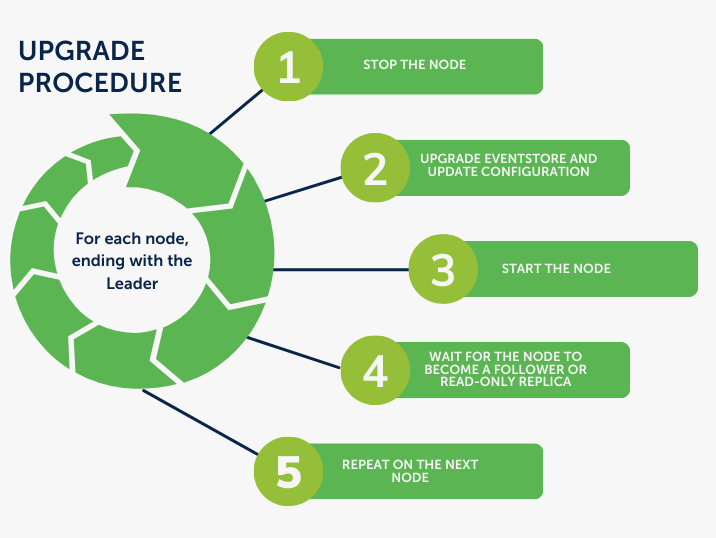

# Upgrade guide for EventStoreDB 24.2

EventStoreDB 24.2 is now available for download. You can install it using [Packagecloud](https://packagecloud.io/EventStore/EventStore-OSS), [Chocolatey](https://chocolatey.org/packages/eventstore-oss), or [Docker](https://hub.docker.com/r/eventstore/eventstore/tags?page=1&name=24.2).  Packages are available on our [website](https://www.eventstore.com/downloads) with detailed instructions for each platform.

### Should you upgrade?

Version 24.2 is an interim release that will be supported until the launch of version 24.6 in June 2024.
We recommend upgrading to 24.2 if you are interested in using the new features introduced in this release.

::: warning
Do not upgrade to version 24.2 if your applications rely on the external TCP API. This has been removed in 24.2.0. See the [breaking changes](#external-tcp-api-removed) for more information. You can prevent automatic upgrades by pinning the version in your package manager. Find out about package holding on Linux [here](https://askubuntu.com/questions/18654/how-to-prevent-updating-of-a-specific-package).
:::

### Security update

If you are not upgrading to 24.2, please ensure that you are running a patch of EventStoreDB with the security release addressing [CVE-2024-26133](https://www.eventstore.com/blog/eventstoredb-security-release-23.10-22.10-21.10-and-20.10-for-cve-2024-26133):

- **Version 23.10.0:** Upgrade to at least 23.10.1.
- **Versions 22.10.x:** Upgrade to at least 22.10.5 or 23.10.1.
- **Versions 21.10.x:** Upgrade to at least 21.10.11 for the security fix, or 22.10.5 for ongoing support.
- **Versions 20.10.x:** Upgrade to at least 20.10.6 for the security fix, or 22.10.5 for ongoing support.

### Upgrade procedure

You can perform an online rolling upgrade directly to 24.2.x from these versions of EventStoreDB:
- 23.10
- 22.10
- 21.10

Follow the upgrade procedure below on each node, starting with a follower node:

1. Stop the node.
2. Upgrade EventstoreDB to 24.2 and update configuration.
3. Start the node.
4. Wait for the node to become a follower or read-only replica.
5. Repeat the process for the next node.

As illustrated below:

::: card

:::

Upgrading the cluster in this manner keeps the cluster online and able to service requests. There may still be disruptions to your services during the upgrade, namely:
- Client connections may be disconnected when nodes go offline, or when elections take place.
- The cluster is less fault-tolerant while a node is offline for an upgrade because the cluster requires a quorum of nodes to be online to service write requests.
- Replicating large amounts of data to a node can have a performance impact on the Leader in the cluster.

::: warning
If you modified the Linux service file to increase the open files limit, those changes will be overridden during the upgrade. You will need to reapply them after the upgrade.
:::

### Breaking changes

#### From version 23.10 and earlier

##### External TCP API removed

The external TCP API has been removed in 24.2.0. This affects external clients using the TCP API and configurations related to it.

A number of configuration options have been removed as part of this. EventStoreDB will not start by default if any of the following options are present in the database configuration:
- `AdvertiseTcpPortToClientAs`
- `DisableExternalTcpTls`
- `EnableExternalTcp`
- `ExtHostAdvertiseAs`
- `ExtTcpHeartbeatInterval`
- `ExtTcpHeartbeatTimeout`
- `ExtTcpPort`
- `ExtTcpPortAdvertiseAs`
- `NodeHeartbeatInterval`
- `NodeHeartbeatTimeout`
- `NodeTcpPort`
- `NodeTcpPortAdvertiseAs`

##### Stricter node certificate requirements

EventStoreDB 24.2.0 has stricter requirements for Key Usages in node certificates.

These requirements are:
- The certificate Extended Key Usages (EKUs) either:
  - Contains both the ClientAuth EKU and the ServerAuth EKU, or
  - Is empty.
- The certificate Key Usages contains either:
  - DigitalSignature and KeyEncipherment, or
  - DigitalSignature and KeyAgreement.

If a node certificate does not meet these requirements, the nodes in the cluster will be unable to make gossip and election requests.
In this case, you will see the following logs:

```
[16480,21,14:57:06.209,WRN] Failed authorization check for "(anonymous)" in 00:00:00.0000826 with "node/gossip : update Deny : Policy : Legacy 1 9999-12-31 11:59:59 PM +00:00 : default:denied by default:Deny, $"
```

You can correct this by regenerating the certificates with the correct key usages. See the [Certificate Configuration](./security.md#certificates-configuration) documentation for more information about configuring and generating certificates.

#### From version 22.10 and earlier

The updates to anonymous access described in the [release notes](https://www.eventstore.com/blog/23.10.0-release-notes) have introduced some breaking changes. We have also removed, renamed, and deprecated some options in EventStoreDB.

None of these changes will prevent you from performing an online rolling upgrade of the cluster, but you will need to take them into account before you perform an upgrade.

When upgrading from 22.10 and earlier, you will need to account for the following breaking changes:

##### Clients must be authenticated by default

We have disabled anonymous access to streams by default in this version. This means that read and write requests from clients need to be authenticated.

If you see authentication errors when connecting to EventStoreDB after upgrading, please ensure that you are either using default credentials on the connection, or are providing user credentials with the request itself.

If you want to revert back to the old behavior, you can enable the `AllowAnonymousStreamAccess` and `AllowAnonymousEndpointAccess` options in EventStoreDB.
Requests to the HTTP API must be authenticated by default.
Like with anonymous access to streams, anonymous access to the HTTP and gRPC endpoints has been disabled by default. The exceptions are the `/gossip`, `/info`, and `/ping` endpoints.

Any tools or monitoring scripts accessing the HTTP endpoints (e.g. `/stats`) will need to make authenticated requests to EventStoreDB.

If you want to revert back to the old behavior, you can enable the `AllowAnonymousStreamAccess` and `AllowAnonymousEndpointAccess` options in EventStoreDB.

##### PrepareCount and CommitCount options have been removed

We have removed the `PrepareCount` and `CommitCount` options from EventStoreDB. EventStoreDB will now fail if these options are present in the config on startup.

These options did not have any effect and can be safely removed from your configuration file if you have them defined.

##### Persistent subscriptions config event has been renamed

We have renamed the event type used to store a persistent subscriptions configuration from `PersistentConfig1` to `$PersistentConfig`. This event type is a system event, so naming it as such will allow certain filters to exclude it correctly.

If you have any tools or clients relying on this event type, then you will need to update them before you upgrade.

#### From 21.10 and earlier

If you are upgrading from version 21.10 and earlier, then you need to be aware of a breaking change in the TCP proto:

##### Proto2 upgraded to Proto3 (TCP)

The server now uses Proto3 for messages sent over TCP. This affects replication between servers in a cluster.

EventStoreDB nodes on version 22.10 cannot replicate data to version 21.10 and below, but older nodes can still replicate to version 22.10 and above.
Follow the [upgrade procedure](#upgrade-procedure) and ensure that the Leader node is the last node to be upgraded to avoid any issues.

##### Deprecated configuration options

Several options are deprecated and slated for removal in future releases. See the table below for guidance.

| Deprecated Option           | Use Instead                   |
|:----------------------------|:------------------------------|
| ExtIp                       | NodeIp                        |
| ExtPort                     | NodePort                      |
| HttpPortAdvertiseAs         | NodePortAdvertiseAs           |
| ExtHostAdvertiseAs          | NodeHostAdvertiseAs           |
| AdvertiseHttpPortToClientAs | AdvertiseNodePortToClientAs   |
| IntIp                       | ReplicationIp                 |
| IntTcpPort                  | ReplicationTcpPort            |
| IntTcpPortAdvertiseAs       | ReplicationTcpPortAdvertiseAs |
| IntHostAdvertiseAs          | ReplicationHostAdvertiseAs    |
| IntTcpHeartbeatTimeout      | ReplicationHeartbeatTimeout   |
| IntTcpHeartbeatInterval     | ReplicationHeartbeatInterval  |
